# 6장 AOP

- **AOP**는 **IoC/DI**, **서비스 추상화**와 더불어 스프링의 3대 기반ㅇ기술임
- AOP를 바르게 이용하려면 OOP를 대체하려고 하는 것처럼 보이는 AOP라는 이름 뒤에 감춰진 내용을 알아야함..
- 스프링에 적용된 가장 인기있는 AOP의 적용대상은 바로 **선언적 트랜잭션 기능**
- -> 서비스 추상화를 통해 해결했던 트랜잭션 경계설정 기능을 AOP를 이용해 바꿔보기..

## 트랜잭션 코드의 분리

- 스프링이 제공한 트랜잭션 인터페이스를 썼음에도 비즈니스 로직 클래스에 트랜잭션 코드가 많은 자리를 차지함

```java
class ex {
    public void upgradeLevels() throws Exception {
        TransactionStatus status = this.transactiobnManager
                .getTransaction(new DefaultTransactionDefinition()); // 트랜잭션 경계설정 시작
        try {
            List<User> users = userDao.getAll();
            for (User user : users) {
                if (canUpgradeLevel(user)) {
                    upgradeLevel(user);
                }
            }
            this.transactionManage.commit(status);
        } catch (Exception e) {
            this.transactionManager.rollback(status); //트랜잭션 경계설정 끝
            throw e;
        }
    }
}
```

- 위 코드의 특징은 트랜잭션 경계설정의 코드와 비즈니스 로직 코드 간에 서로 주고받는 정보가 없다는 점
- 두 코드는 성격이 다를 뿐 아니라 주고받는 것도 없는 완벽하게 독립적인 코드...

### 트랜잭션 코드 / 비즈니스 코드 메소드로 추출 및 분리 해보기..

```java
class ex {
    public void upgradeLevels() throws Exception {
        TransactionStatus status = this.transactiobnManager
                .getTransaction(new DefaultTransactionDefinition()); // 트랜잭션 경계설정 시작
        try {
            upgradeLevelsInternal();
            this.transactionManage.commit(status);
        } catch (Exception e) {
            this.transactionManager.rollback(status); //트랜잭션 경계설정 끝
            throw e;
        }
    }

    private void upgradeLevelsInternal() {
        List<User> users = userDao.getAll();
        for (User user : users) {
            if (canUpgradeLevel(user)) {
                upgradeLevel(user);
            }
        }
    }
}
```

### DI를 이용한 클래스의 분리

- 여전히 트랜잭션 담당하는 기술적 코드가 서비스 클래스에 자리잡고 있음..
- 트랜잭션 코드를 클래스 밖으로 뽑아버리기...

#### DI 적용을 이용한 트랜잭션 분리

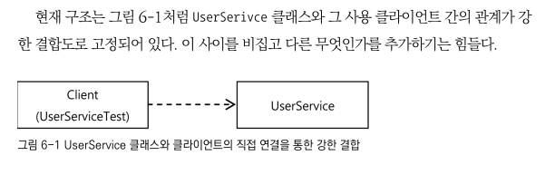

- UserService를 인터페이스로 만들고 기존 코드는 UserService 인터페이스의 구현 클래스를 만들어 넣기
  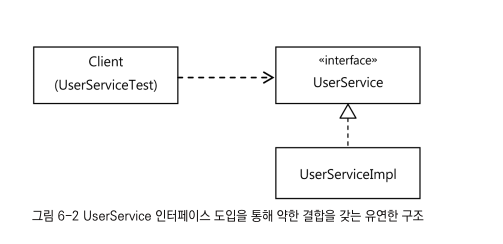
- 단 번에 두개의 UserService 인터페이스를 구현클래스로 동시에 이용하기..?
- 해결하려고 하는 문제는 UserService에는 순수하게 비즈니스 로직을 담고 있는 코드만 놔두고
- 트랜잭션 경계설정을 담당하는 코드를 외부로 뺴내려는 것
- -> 하지만 클라이언트가 UserService의 기능을 제대로 이요하려면 트랜잭션이 적용돼야함.
  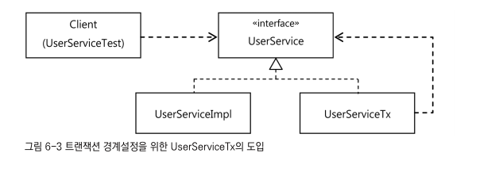
- UserService를 구현한 또 다른 구현클래스를 만들기 -> 트랜잭션의 경계설정이라는 책임을 맡음

#### UserService 인터페이스 도입

```java
public interface UserService {
    void add(User user);

    void upgradeLevels();
}
```

- 구현클래스에서 트랜잭션 관련 코드는 제거

```java
class ex {
    public void upgradeLevels() throws Exception {
        List<User> users = userDao.getAll();
        for (User user : users) {
            if (canUpgradeLevel(user)) {
                upgradeLevel(user);
            }
        }
    }
}
```

#### 분리된 트랜잭션 기능

- 트랜잭션 처리를 담은 UserServiceTx 만들기
- UserServiceTx는 UserService를 구현하게 만든 후,
- 비즈니스 로직을 구현한 구현클래스에게 작업을 위임하게 만들기 !

```java
public class UserServiceTx implements UserService {
    UserService userService;

    public void setUserService(UserService userService) {
        this.userService = userService;
    }

    @Override
    public void add(User user) {
        userService.add(user);
    }

    @Override
    public void upgradeLevels() {
        userService.upgradeLevels();
    }
}
```

- 트랜잭션 경계설정 작업 추가해주기

```java
public class UserServiceTx implements UserService {
    UserService userService;
    PlatformTransactionManager transactionManager;

    public void setTransactionManager(
            PlatformTransactionManager transactionManager) {
        this.transactionManager = transactionManager;
    }

    public void setUserService(UserService userService) {
        this.userService = userService;
    }

    @Override
    public void add(User user) {
        userService.add(user);
    }

    @Override
    public void upgradeLevels() {
        TransactionStatus status = this.transactionManager
                .getTransaction(new DefaultTransactionDefinition());
        try {
            userService.upgradeLevels();
            this.transactionManager.commit(status);
        } catch (RuntimeException e) {
            this.transactionManager.rollback(status);
            throw e;
        }
    }
}
```

#### 트랜잭션 적용을 위한 DI 설정

- 클라이언트가 UserService라는 인터페이스를 통해 사용자 관리 로직을 이용하려고할 때
- 먼저 트랜잭션을 담당하는 오브젝트가 사용돼서 트랜잭션에 관련된 작업을 진행해주고,
- 실제 사용자 관리 로직을 담은 오브젝트가 이후에 호출됨.
  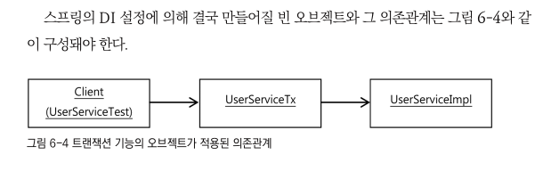

```java
class ex {
    @Bean
    public UserServiceTx userService() {
        UserServiceTx userServiceTx = new UserServiceTx();
        userServiceTx.setUserService(userServicImpl());
        userServiceTx.setTransactionManager(transactionManager());
    }

    @Bean
    public UserServiceImpl userServicImpl() {
        UserServiceImpl userServiceImpl = new UserServiceImpl();
        userServiceImpl.setUserDao(userDao());
        userServiceImpl.setMailSender(mailSender());
        return userServiceImpl;
    }
}
```

- 클라이언트는 UserServiceTx빈을 호출해서 사용하도록
- -> userService라는 대표적인 빈 아이디에 UserServiceTx클래스로 정의

#### 트랜잭션 분리에 따른 테스트 수정

- UserService클래스가 인터페이스와 두개의 클래스로 분리된 만큼 테스트에서도 변경
- @Autowired는 같은 타입의 빈이 여러개라면 필드 일므을 이용해 빈을 찾음

```
@Autowired UserService userService; //UserServiceTx를 DI 
```

- 그러나 UserServeImpl을 테스트해야하는 경우 중에서
- MailSender 목 오브젝트를 이용한 테스트 같이 직접 DI 해줘야할 경우 직접 UserServiceImpl 클래스의 오브젝트를 가져올 필요가 읬음

```java
import org.springframework.beans.factory.annotation.Autowired;

class exTest {
    @Autowired
    UserServiceImpl userServiceImpl;

    @Test
    public void upgradedLevels() throws Exception {
        //.. 
        MockMailSender mockMailSender = new MockMailSender();
        userServiceImpl.setMailSender(mockMailSender);
    }
}
```

- 트랜잭션 기능을 테스트하는 upgradeAllOrNothing() 메소드도 변경 필요

```java
class exTest {
    // 트랜잭션 테스트용 정의한 TestUserService는 UserServiceImpl을 상속하도록 수정
    static class TestUserService extends UserServiceImp {

    }

    @Test
    public void upgradeAllOrNothing() throws Exception {
        UserService testUserService = new TestUserService(users.get(3).getId());
        testUserService.setUserDao(this.userDao); // 수동 DI
        testUserService.setTransactionManager(transacionManager);
        testUserService.setMailSender(mailSender);

        UserServiceTx txUserService = new UserServiceTx();
        txUserService.setTransactionManager(transacionManager);
        txUserService.setUserService(txUserService);

        userDao.deleteAll();
        for (User user : users) {
            userDao.add(user);
        }
        try {
            txUserService.upgradeLevels();
            fail("TestUserServiceException expected"); // 예외 테스트이므로 정상종료라면 실패
        } catch (TestUserServiceException e) {
            //...    
        }
        //...
    }
}
```

#### 트랜잭션 경계썰정 코드 분리의 장점

- 비즈니스 로직을 담당하는 UserServiceImp의 코드를 작성할 때는 트랜잭션과 같은 기술적인 내용에 신경 쓰지 않아도 됨
- 비즈니스 로직에 대한 테스트를 손쉽게 만들어낼 수 있다는 것.

## 고립된 단위 테스트

- 테스트는 작은 단위로 하면 좋지만 테스트 대상이 다른 오브젝트와 환경에 의존하고 있다면 작은 단위 테스트가 주는 장점을 얻기 힘듬

### 복잡한 의존관계 속의 테스트

### 테스트 대상 오브젝트 고립시키기

- 테스트 대상이 환경이나, 외부서버, 다른 클래스의 코드에 종속되고 영향을 받지 않도록 고립 시킬 필요가 있음.
- -> 테스트 대상을 의존 대상으로부터 분리해서 고립시키는 방법은 테스트 대역을 사용하는 것..

#### 테스트를 위한 UserServiceImple 고립

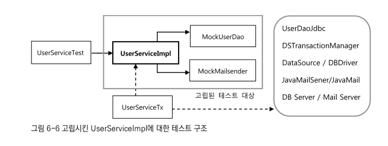

- 고립된 테스트 방식으로 만든 UserServiceImpl은 결과가 DB 등에 남지 않으므로
- upgradeLevels()처럼 결과가 리턴되지 않는 경우는 더더욱 어려움
- -> 협력 오브젝트인 UserDao에게 어떤 요청을 했는지 확인하는 작업 필요하므로 Mock 객체로 생성
- -> UserDao의 update() 메소드를 호출하는 것을 확인할 수 있다면 DB에 그 결과가 반영될 것으로 결론 내릴 수 있기 때문

```java
class exTest {
    static class MockUserDao implements UserDao {
        private List<User> users; // 레벨 업그레이드 후보 User 오브젝트 목록
        private List<User> updated = new ArrayList<>(); // 업그레이드 대상 오브젝트를 저장해둘 목록

        private MockUserDao(List<User> users) {
            this.users = users;
        }

        public List<User> getUpdated() {
            return this.updated;
        }

        public List<User> getAll() { // 스텁기능 제공
            return this.users;
        }

        public void update(User user) { // 목 오브젝트 기능 제공.
            updated.add(user);
        }
    }
}
```

### 단위테스트와 통합테스트

- 사용자 관리 기능 전체를 하나의 단위로 볼 수도 있고 하나의 클래스나 하나의 메소드를 단위로 볼 수도 있음
- 책에서는 테스트 대역을 이용해 고립시켜서 테스트 하는 것을 단위테스트라고 부름
- 두개 이상의 오브젝트 연동이나 외부 리소스가 참여하는 테스트는 통합 테스트

#### 단위 VS 통합 고려사항

- 항상 단위테스트를 먼저 고려하기
- 하나 또는 긴밀한 클래스 몇개를 모아서 외부와의 의존관계를 모두 차단하고 대역을 이용하여 단위 테스트 만들기
- 외부 리소스 사용해야만 하는 테스트는 통합테스트로 만들기
- 단위테스트로 만들기 어려운 코드 예시 - DAO
- -> DAO는 자체로 로직을 담고 있다기 보다는 DB를 통해 로직을 수행하는 인터페이스 같은 역할
- DAO테스트는 통합텡스트이지만, 코드에서 보자면 하나의 기능 단위 테스트하는 것이기도 함
- -> DAO를 검증한 후, DAO를 이용하는 코드는 대역 오브젝트로 단위 테스트 가능.
- 단위테스트가 복잡하다고 판단되는 코드는 처음부터 통합 테스트 고려 가능
- 스프링 테스트 컨텍스트 프레임워크 이요하는 테스트는 통합테스트다

### 목 프레임워크

- 단위테스트를 만들기 위해서는 대역 오브젝트가 필수적임
- 직접 목 오브젝트를 만들기 위해서는 인터페이스도 모두 일일이 구현해줘야함.
- -> 특히 테스트 메소드별로 다른 검증 기능이 필요하다면, 같은 의존 인터페이스를 구현한 여러 목 클래스를 선언해줘야함.

#### Mockito

- 간단한 메소드 호출만으로 특정 인터페이스 구현한 테스트용 목 오브젝트 만들 수 있음.

```
UserDao mockUserDao = mock(UserDao.class);
```

- mock()은 org.mockito.Matchers 클래스에 정의된 스태틱 메소드

```
when(mockUserDao.getAll()).thenReturn(this.users);
```

- mockUserDao.getAll()이 호출됐을 때, users 리스트를 리턴해주라는 스텁기능 추가.
- Mockito를 통해 만들어진 목 오브젝트는 메소드의 호출과 관련된 모든 내용을 자동으로 저장해두고, 이를 간단한 메소드로 검증할 수 있게 해줌.

```
verify(mockUserDao, time(2)).update(any(User.class));
```

- 테스트를 진행하는 동안 mockUserDao의 update() 메소드가 두 번 호출됐는지 확인하고 싶다면, 위 같은 검증코드 추가
- -> User타입의 오브젝트를 파라미터로 받으며 update() 가 두 번 호출됐는지 호가인

##### Mock 오브젝트 사용 단계

- 1 인터페이스를 이용해 목 오브젝트를 만듦
- 2 목 오브젝트가 리턴할 값이 있으면 이를 지정해줌. 메소드가 호출되면 예외를 강제로 던지게 만들 수도 있음
- 3 테스트 대상 오브젝트에 DI해서 목 오브젝트가 테스트 중에 사용되도록 만듦
- 4 테스트 대상 오브젝트를 사용한 후에 목 오브젝트의 특정 메소드가 호출됐는지, 어떤 값을 가지고 몇번 호출됐는지를 검증
- -? 2, 4는 각각 필요한 경우메나 사용할 수 있음

```java
class exTest {
    @Test
    public void mockUpgradeLevel() throws Exception {
        UserServiceImpl userService = new UserServiceImpl();

        UserDao mockUserDao = mock(UserDao.class);
        when(mockUser.Dao.getAll()).thenReturn(this.users);
        userServiceImpl.setUserDao(mockUserDao);

        MailSender mockMailSender = mock(MailSender.class);
        userServiceImpl.setMailSender(mockMailSender);

        userServiceImpl.upgradeLevels();

        verify(mockUserDao, times(2)).update(any(User.class));
        verify(mockUserDao, times(2)).update(any(User.class));
        verify(mockUserDao).update(users.get(1));
        assertThat(users.get(1).getLevel(), is(Level.SILVER));
        verify(mockUserDao).update(users.get(3));
        assertThat(users.get(3).getLevel(), is(Level.GOLD));

        ArgumentCaptor<SimpleMailMessgae> mailMessageArg = //ArgumentCaptor -> 목오브젝트에 전달된 파라미터 가져와 검증
                ArgumentCaptor.forClass(SimpleMailMessage.class);
        verify(mockMailSender, times(2)).send(mailMessageArg.capture());
        List<SimpleMailMessage> mailMessages = mailMessageArg.getAllValues(); // 파라미터 내부 정보 확인
        assertThat(mailMessages.get(0).getTo()[0], is(users.get(1).getEmail()));
        assertThat(mailMessages.get(1).getTo()[0], is(users.get(3).getEmail()));
    }
}
```

- any()를 사용하면 파라미터의 내용은 무시하고 호출 횟숨나 확인할 수 있음
- -> UserDao의 update() 메소드가 두번 호출됐고, 그 때의 파라미터가 getAll()에서 넘겨준 User목록의 두번쨰와 네번쨰여야함
- verify(mockUserDao).update(users.get(1))은 users.get(1)을 파라미터로 update()가 호출된 적이 있는지 확인해줌.
- 레벨의 변화는 파라미터의 직접 비교로는 직접 확인이 되지 않음 -> getAll()을 통해 전달했던 User 목록의 내용을 가지고 레벨 변경 직접 확인.
- MailSender의 경우는 **ArgumentCaptor**라는 것을 사용해서 실제 MailSender **목 오브젝트에 전달된 파라미터를 가져와 내용을 검증**하는 방법을 사용
- -> 파라미터의 내부 정보를 확인해야하는 경우 유용함.

## 다이나믹 프록시와 팩토리 빈

### 프록시와 프록시 패턴, 데코레이터 패턴

- 트랜잭션 기능에는 추상화 작업을 통해 이미 전략 패턴이 적용되어 있음.
- 하지만 **전략패턴으로는 트랜잭션 기능의 구현 내용을 분리해냈을 뿐 트랜잭션 적용한다는 사실은 코드에 남아있음**
- -> 위임을 통해 기능을 사용하는 코드는 아직 남아있음
  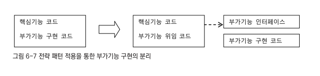
- -> 트랜잭션 기능은 비즈니스로직과 성격이 다르기 때문에 아예 그 적용 사실을 밖으로 분리할 수 있음
- 아래와 같이 부가기능 전부를 핵심 코드가 담긴 클래스에서 독립시킬 수 있음 (UserServiceTx와 UserServiceImpl 분리)
  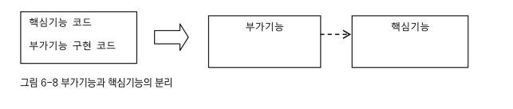
- -> 핵심 기능 클래스는 부가기능 클래스 존재를 모름
- -> 부가 기능이 핵심 기능을 사용하는 구조가 됨
- --> 클라이언트가 핵심기능을 가진 클래스를 직접 사용해버리면 부가기능 적용 기회가 없어짐
- -> 부가기능은 마치 자신이 핵심기능을 가진 클래스인것처럼 꾸며서,
- -> 클라이언트가 자신을 거쳐서 핵심기능을 사용하도록 만들어야하고,
- --> 부가기능 자신도 같은 인터페이스를 구현한 뒤에 자신이 그 사이에 끼어들어야함.
- --> 클라이언트는 인터페이스만 보고 사용하기 때문에, 자신은 핵심기능 가진 클래스 사용할 것이라 생각하지만,
- -> 사실은 아래처럼 부가기능을 통해 핵심기능을 이용하게 되는 것임
  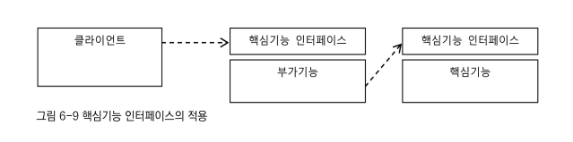
- 이렇게 마치 자신이 클라이언트가 사용하려고 하는 실제 대상인 것처럼 위장해서 클라의 요청을 받아주는 것을
- -> **프록시**라고 부름
- 프록시를 통해 최종적으로 요청을 위임받아 처리하는 실제 오브젝트를 타겟, 또는 실체(real subject)라고 부름
- 아래는 클라이언트가 프록시를 통해 타겟을 사용하는 구조
  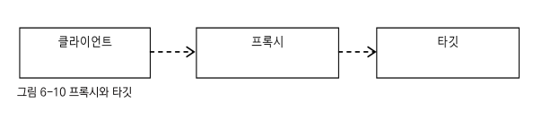
- **프록시의 특징**은 **타겟과 같은 인터페이스를 구현**했다는 것과, **프록시가 타겟을 제어할 수 있는 위치**에 있다는 것
- **프록시 두가지 사용 목적**
- -> 첫째는 클라이언트가 **타겟에 접근하는 방법**을 제어 (프록시 패턴)
- -> 두번쨰는 타겟에 **부가적인 기능**을 부여 (데코데이터 패턴)
- -> 두가지 모두 대리 오브젝트라는 개념의 프록시를 두고 사용한다는 점은 동일하지만 목적에 따라 다른 디자인 패턴으로 분류됨.

#### 데코레이터 패턴

- **데코레이터 패턴**은 타겟에 **부가적인 기능을 런타임 시 다이나믹하게 부여**해주기 위해 **프록시 패턴을 사용**하는 패턴
- **다이나믹하게 기능을 부여**한다는 의미는 -> 컴파일 시점, 즉 코드상에서는 어떤 방법과 순서로 프록시와 타겟이 연결되어 사용되는지 **정해져 있지 않다**는 뜻..
- 데코레이터라고 불리는 이유는 내용물은 동일하지만 부가적인 효과를 부여해줄 수 있기 때문.
- -> 데코레이터 패턴에서는 프록시가 꼭 한개로 제한되지 않음.
- -> 프록시가 직접 타깃을 사용하도록 고정시킬 필요도 없음
- --> 같은 인터페이스를 타겟과 여러개의프록시를 사용할 수 있음. -> 순서를 정해서 단곚넉으로 위임하는 구조
  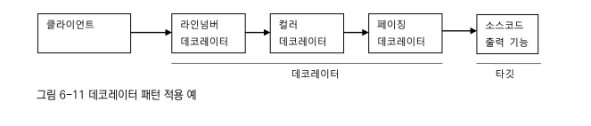
- 프록시로 동작하는 각 데코레이터는 위임하는 대상에도 인터페이스로 접근하기 때문에,
- 자신이 최종 타깃으로 위임하는지, 아니면 다음 단계의 데코레이터 프록시로 위임하는지 알지 못함
- (DI 설정 관리 주체, 혹은 클라이언트가 관계를 알고 있음)
- -> 그래서 데코레이터의 다음 위임 대상은 인터페이스로 선언하고,
- -> 생성자나 수정자 메소드를 통해 위임 대상을 외부에서 런타임 시에 주입받을 수 있도록 만들어야함.

##### 데코레이터 패턴 예시 (InputStream, OuputStream)

```
InputStream is = new BufferedInputStream(new FileInputStream("a.txt"));
```

-> InputStream이라는 인터페이스를 구현한 타깃인 FileInputStream에 버퍼 읽기 기능을 제공해주는 BufferedInputStream이라는 데코레이터를 적용 한 예

#### 프록시 패턴

- 일반적인 프록시 : 클라이언트와 사용 대상 사이에 대리 역할을 맡은 오브젝트를 두는 방법을 총칭
- **프록시 패턴** : 프록시를 사용하는 방법 중에서 **타깃에 대한 접근 방법을 제어**하려는 목적을 가진 경우
- -> 프록시 패턴의 프록시는 타깃의 기능을 확장하거나 추가하지 않음
- -> 대신 **클라이언트가 타깃에 접근하는 방식을 변경**해줌.
- 사용 경우 :
- -> 타겟 오브젝트를 생성하기가 복잡하거나, 당장 필요하지 않는 경우 꼭 필요한 시점까지 오브젝트를 생성하지 않는 편이 좋음
- -> 그런데 **타겟 오브젝트에 대한 레퍼런스가 미리 필요**한 경우
- -> 이럴 때 프록시 패턴을 적용함
- 클라이언트에게 타깃에 대한 레퍼런스를 넘겨야하는데, 실제 타겟 오브젝트를 만드는 대신 프록시를 넘겨 주는 것.
- -> 그리고 프록시의 메소드를 통해 실제 타겟을 사용하려고 시도하면, 그때 프록시가 타겟 오브젝트를 생성하고 요청을 위임해주는 식.
- ex) 원격 오브젝트를 이용하는 경우
- -> 원격 오브젝트에 대한 프록시를 만들어두고, 프록시는 요청을 받으면 네트워크를 통해 원격 오브젝트 실행하고 결과 돌려줌..
- ex) 특별한 상황에서 타겟에 대한 접근 권한을 제어하기 위해
- -> 만약 수정하능한 오브젝트가 있는데, 특정 레이어로 넘어가서는 읽기전용으로만 강제해야할 때, 프록시를 만들어서 특정 메소드에 대한 접근 예외를 발생
- -> Collections.unmodifiableCollection()을 통해 만들어지는 오브젝트가 접근권한 제어용 프록시임.

##### 프록시 패턴과 데코레이터 패턴 차이점

- 구조적으로 유사
- 프록시 패턴은 타겟의 기능 자체에 관여X, 접근방법만 제어
- -> **프록시 패턴은 코드에서 자신이 만들거나 접근할 타겟 클래스의 정보를 알고 있는 경우**가 많음..
- (데코레이터는 어떤 방법과 순서로 프록시와 타겟이 연결되어 사용되는지 모름)
- -> 생성 지연 프록시라면 구체적인 생성방법을 알아야 하기 떄문에 타겟 클래스에 대한 직접적인 정보를 알아야함.
- -> 프록시라고 하더라도 인터페이스를 통해 위임하도록 만들수 있음
- -> 인터페이스를 통해 다음 호출 대상으로 접근 하면 그 사이 다른 프록시나 데코레이터가 계속 추가될 수 있음.
  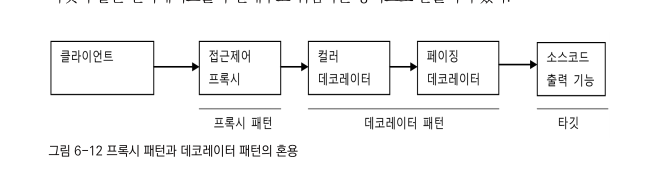
- 책에서는 데코레이터, 프록시 모두 프록시라고 함.

### 다이내믹 프록시

- 프록시는 기존 코드에 영향을 주지 않으면서 타깃의 기능 확장이나 접근 방법 제어 유용한 방법
- 프록시를 만드는게 번거롭게 느껴지기에 개발자가 직접 만들지 않는 편
- -> java.lang.reflect 안에 프록시를 손쉽게 만들 수 있도록 지원해주는 클래스들이 있음.

#### 프록시 구성과 프록시 작성의 문제점

- 프록시는 다음의 두가지 기능으로 구성됨
- -> 타겟과 같은 메소드를 구현하고 있다가 메소드가 호출되면 타겟 오브젝트로 위임함
- -> 지정한 요청에 대해서는 부가기능을 수행
- 트랜잭션 부가기능을 위한 UserServiceTx는 기능 부가를 위한 프록시임. 위의 두 기능을 구분해보기.

```java
public class UserServiceTx implements UserService {
    UserService userService; // 타겟 오브젝트
    //..

    @Override
    public void add(User user) { // 메소드 구현과 위임
        userService.add(user);
    }

    @Override
    public void upgradeLevels() { //구현
        TransactionStatus status = this.transactionManager
                .getTransaction(new DefaultTransactionDefinition()); // *부가기능 수행
        try {

            userService.upgradeLevels(); // 위임

            this.transactionManager.commit(status); // *부가기능 수행
        } catch (RuntimeException e) {
            this.transactionManager.rollback(status); // *부가기능 수행
            throw e;
        }
    }
}
```

- 위처럼 프록시의 역할은 위임과 부가작업이라는 두가지로 구분할 수 있음

##### 프록시가 만들기 번거로운 이유 두가지

- 1 모든 메소드를 일일이 구현해야함
- 2 부가기능 코드가 중복될 가능성이 많음 -> add, update 등에 트랜잭션 경계설정 유사 코드가 여러 곳에 있게 됨
- -> 이런 문제를 해결하는데 유용한것이 바로 JDK의 다이내믹 프록시

#### 리플렉션

- 다이내믹 프록시는 리플렉션 기능을 이용해서 프록시를 만들어줌
- 리플렉션은 자바의 코드 자체를 추상화해서 접근하도록 만든 것.

##### Class 타입

- 자바의 모든 클래스는 그 클래스 자체의 구성정보를 담은 Class 타입의 오브젝트를 하나씩 갖고 있음.
- 클래스이름.class하거나 오브젝트의 getClass()메소드를 호출하면 클래스코드에 대한 메타정보를 가져오거나 오브젝트를 조작할 수 있음
- -> 클래스 이름이 무엇이고,어떤 클래스를 상속하고, 어떤 인터페이스를 구현했는지, 어떤 필드를 갖고 있고, 각각의 타입은 무엇인지, 메소드를 어떤 것을 정의했고
- -> 메소드의 파라미터와 리턴타입은 무엇인지 알아낼 수 있음.
- -> 오브젝트의 필드값을 읽고 수정할 수 있고, 원하는 파라미터 값을 이용해 메소드를 호출할 수도 있음.

##### Method 인터페이스

- 리플렉션 API 중 메소드에 대한 정의를 담은 Method라는 인터페이스를 이용해 메소드를 호출하는 방법
- 다음과 같은 간단한 스트링 타입의 오브젝트가 있다고 할 떄

```
String name = "Spring";
```

- String 클래스의 정보를 담은 Class 타입의 정보는 String.class라고 하면 가져올 수 있음.
- 또는 스트링 오브게트가 있으면 name.getClass()라고 해도 됨
- String의 length()라면

```
Method lengthMethod = String.class.getMethod("length");
```

- String 클래스가 가진 메소드 중에서 length라는 이름을 갖고 있고, 파라미터는 없는 메소드의 정보를 가져오는 것.
- Method 인터페이스의 invoke()를 사용하여 특정 오브젝트의 메소드를 실행시킬 수도 있음.
- **invoke()** 메소드는 메소드를 실행시킬 **대상 오브젝트와 파라미터 목록을 받아서 메소드를 호출한 뒤에 그 결과를 Object 타입으로 돌려줌**.

```
public Obejct invoke(Object obj, Object... agrs)
// legnth() 실행
int length = lengthMethod.invoke(name); // int length = name.length();
```

#### 프록시 클래스

```java
public interface Hello { // 인터페이스
    String sayHello(String name);

    String sayHi(String name);

    String sayThankYou(String name);
}
```

```java
public class HelloTarget implements Hello { // 타깃 클래스
    @Override
    public String sayHello(String name) {
        return "Hello " + name;
    }

    @Override
    public String sayHi(String name) {
        return "Hi " + name;
    }

    @Override
    public String sayThankYou(String name) {
        return "Thank You " + name;
    }
}
```

```java
class exTest {
    @Test
    public void simpleProxy() {
        Hello hello = new HelloTarget(); // 타킷은 인터페이스를 통해 접근
        assertThat(hello.sayHello("Toby"), is("Hello Toby"));
        assertThat(hello.sayHi("Toby"), is("Hi Toby"));
        assertThat(hello.sayThankYou("Toby"), is("Thank You Toby"));
    }
}
```

##### Hello 인터페이스 구현한 프록시 만들어보기

- 프록시에는 데코레이터 패턴을 적용해서 타깃에 부가기능을 추가.

```java
public class HelloUppercase implements Hello {
    Hello hello; // 다른 프록시 추가할 수도 있으므로 인터페이스로 접근

    public HelloUppercase(Hello hello) {
        this.hello = hello;
    }

    @Override
    public String sayHello(String name) {
        return hello.sayHello(name).toUpperCase();
    }

    @Override
    public String sayHi(String name) {
        return hello.sayHi(name).toUpperCase();
    }

    @Override
    public String sayThankYou(String name) {
        return hello.sayThankYou(name).toUpperCase();
    }
}
```

- 위 프록시는 프록시 적용의 일반적인 문제점 두가지를 갖고 있음
- 인터페이스의 모든 메소드 구현해 위임하도록 코드 만들어야하고, 부가기능이 모든 메소드에 중복되서 나타남

#### 다이나믹 프록시 적용

- 클래스로 만든 프록시인 HelloUppercase를 다이나믹 프록시를 이용해 만들어보기.
  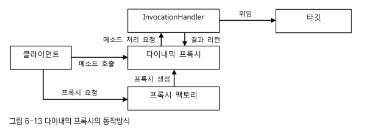
- **다이내믹 프록시**는 **프록시 팩토리에 의해 런타임 시 다이내믹하게 만들어지는 오브젝트**
- 다이나믹 프록시 오브젝트는 타깃의 인터페이스와 같은 타입으로 만들어짐
- -> 클라이언트는 다이내믹 프록시 오브젝트를 타깃 인터페이스를 통해 사용할 수 있음.
- -> 팩토리 사용하기 떄문에, 프록시를 만들 때 인터페이스 모두 구현하면서 클래스 정의하지 않아도 됨!
- -> **프록시 팩토리**에게 **인터페이스 정보만 제공**해주면 해당 인터페이스를 구현한 클래스의 오브젝트를 자동으로 만들어줌..
- 다이나믹 프록시가 인터페이스 구현 클래스의 오브젝트는 만들어주지만, 프록시로서 필요한 **부가기능 제공 코드는 직접 작성**해야함.
- **프록시의 부가기능**은 프록시 오브젝트와 독립적으로 **InvocationHandler를 구현한 오브젝트에 담음**

##### InvocationHandler 인터페이스

- InvocationHandler 인터페이스는 다음과 같은 메소드 한 개만 가진 간단한 인터페이스
- 프로시의 부가기능을 담을 목적으로 사용

```
public Obejct invoke(Object proxy, Method mehtod, Object[] args)
```

- invoke() 메소드는 리플렉션의 Method 인터페이스를 파라미터로 받음
- 메소드를 호출할 때 전달되는 파라미터도 arges 받음
- **다이내믹 프록시 오브젝트는 클라이언트의 모든 요청을 리플렉션 정보로 변환**해서
- **InvocationHandler 구현 오브젝트의 invoke() 메소드로 넘기는 것**.
- -> 타깃 인터페이스의 모든 메소드 요청이 하나의 메소드로 집중되어 중복 기능을 효과적으로 제공할 수 있음.
- 각 메소드 요청을 어떻게 처리할지 결정하기
- -> 리플렉션으로 메소드와 파라미터 정보를 모두 갖고 있으므로 타깃 오브젝트의 메소드를 호출하게 할수도 있음
- -> InvocationHandler 구현 오브젝트가 타깃 오브젝트 레퍼런스를 갖고 있다면 리플렉션을 이용해 간단히 위임 코드를 만들어낼 수 있음.
  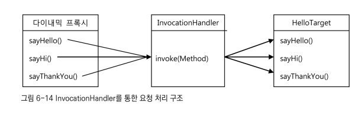
- Hello 인터페이스를 제공하면서 프록시 팩토리에게 다이나믹 프록시를 만들어달라고 요청하면 Hello 인터페이스의 모든 메소드를 구현한 오브젝트를 생성해줌
- InvocationHandler 인터페이스를 구현한 오브젝트를 제공해주면 **다이나믹 프록시가 받는 모든 요청을 InvocationHandler의 invoke() 메소드로 보내줌**.
- Hello 인터페이스의 메소드가 아무리 많더라도 invoke() 메소드 하나로 처리할 수 있음.
- 다이나믹 프록시 만들어보기
- 먼저 다이나믹 프록시로부터 메소드 호출 정보를 받아 처리하는 InvocationHandler 만들기

##### InvocationHandler 구현 클래스 만들기

```java
public class UppercaseHandler implements InvocationHandler {
    Hello target;

    public UppercaseHandler(Hello target) {
        this.target = target;
    }

    @Override
    public Object invoke(Object proxy, Method method, Object[] args) throws Throwable {
        String ret = (String) method.invoke(target, args); //타겟으로 위임. 인터페이스으 모든 메소드 호출에 적용됨
        return ret.toUpperCase(); // 부가기능 제공
    }
}
```

- 다이나믹 프록시가 클라이언트로부터 받는 모든 요청은 InvocationHandler 구현 클래스의 invoke() 메소드로 전달됨
- 다이나믹 프록시를 통해 요청이 전달되면 리플렉션 API를 이용해 타깃 오브젝트의 메소드를 호출.
- -> 타깃 오브젝트의 메소드 호출이 끝났으면 프록시의 부가기능을 수행하고 결과 리턴
- -> 리턴값은 다이내믹 프록시가 받아서 최종적으로 클라이언트에게 전달됨

##### 다이나믹 프록시 만들기

- InvocationHandler를 사용하고 Hello 인터페이스를 구현하는 프록시를 만들기
- 다이나믹 프록시의 생성은 Proxy 클래스의 newProxyInstance() 스태틱 팩토리 메소드를 이용하면 됨

```java
class ex {
    // 생성된 다이나믹 프록시 오브젝트는 Hello 구현하고 있으므로 타입 캐스팅 안전 
    Hello proxiedHello = (Hello) Proxy.newProxyInstance(
            getClass().getClassLoader(), // 동적으로 생성되는 다이나믹 프록시 클래스의 로딩에 사용할 클래스 로드
            new Class[]{Hello.class}, // 구현할 인터페이스
            new UppercaseHandler(new HelloTarget())); //부가기능과 위임코드를 담은 InvocationHandler
}
```

- 첫 번째 파라미터는 클래스 로더를 제공 -> 다이나믹 프록시가 정의되는 **클래스 로더를 지정**
- 두 번째 파라미터는 다이나믹 프록시가 구현해야할 인터페이스 -> 한 번에 하나 이상 인터페이스 구현 가능
- 세 번쨰 파라미터는 부가기능과 위임 관련 코드를 담고 있는 InvocationHandler 구현 오브젝트 제공

#### 다이나믹 프록시의 장점 및 확장

- 메소드가 추가되어도 다이나믹 프록시 사용 코드는 추가 작성할 것이 없음. -> 메소드는 오브젝트 생성시 자동 포함되고 부가기능은 invoke()로 처리되기 때문
- InvocationHanlder 방식의 장점은 타깃에 종류에 상관없이 적용 가능하다는 것. -> 리플렉션의 Method 인터페이스를 이용해 메소드 호출하는 것이기 때문
- ex) 메소드의 이름으로 invoke() 메소드의 조건 추가

```java
class ex {
    public Obejct invoke(Object proxy, Method method, Object[] args) throws Throwable {
        Object ret = method.invoke(target, args);
        if (ret instanceof STring && method.getName().startsWith("say")) { // 메소드 이름으로 조건 추가
            return ((String) ret).toUpperCase();
        } else {
            return ret;
        }
    }
}
```

### 다이나믹 프록시를 이용한 트랜잭션 부가기능

- UserServiceTx를 다이나믹 프록시 방식으로 변경해보기
- UserServiceTx는 서비스 인터페이스의 메소드를 모두 구현해야하고, 트랜잭션이 필요한 메소드마다 트랜잭션 처리 코드가 중복됨
- -> 트랜잭션 부가기능 제공하는 다이나믹 프록시가 효과적 -> 다이나믹 프록시와 연동해 트랜잭션 기능 부가해주는 InvocationHandler하나만 정의하면 되기 때문

#### 트랜잭션 InvocationHanlder

- 트랜잭션 부가기능을 가진 핸들러 코드

```java
public class TransactionHandler implements InvocationHandler {
    private Object target; //부가기능을 제공할 타겟 오브젝트
    private PlatformTransactionManager transactionManager; //트랜잭션 기능을 제공할 트랜잭션 매니저
    private String pattern; // 트랜잭션을 적용할 메소드 이름의 패턴

    public void setTarget(Object target) {
        this.target = target;
    }

    public void setTransactionManager(PlatformTransactionManager transactionManager) {
        this.transactionManager = transactionManager;
    }

    public void setPattern(String pattern) {
        this.pattern = pattern;
    }

    @Override
    public Object invoke(Object proxy, Method method, Object[] args) throws Throwable {
        if (method.getName().startsWith(pattern)) { // 트랜잭션 적용 대산 메소드 선별
            return invokeInTransaction(method, args);
        } else {
            return method.invoke(target, args);
        }
    }

    private Object invokeInTransaction(Method method, Object[] args) throws Throwable {
        TransactionStatus status =
                this.transactionManager.getTransaction(new DefaultTransactionDefinition());
        try {
            Object ret = method.invoke(target, args);
            this.transactionManager.commit(status);
            return ret;
        } catch (InvocationTargetException e) { // 예외 주의 !
            this.transactionManager.rollback(status);
            throw e.getTargetException();
        }
    }
}
```

- 요청할 타깃을 DI로 제공받기
- 타깃 타입 Object로 선언하여 트랜잭션 필요한 어떤 타깃 오브젝트에도 적용 가능
- 차이점은 롤백 적용 예외에서 **InvocationTargetException**을 잡도록 해야 한다는 점.
- 리플렉션 메소드인 Method.invoke()를 이용해 타깃 오브젝트의 메소드를 호출할 때는
- -> **타깃 오브젝트에서 발생하는 예외가 InvocationTargetException으로 한 번 포장돼서 전달**됨
- -> InvocationTargetException으로 받은 후 getTargetException()으로 중첩되어 있는 예외를 가져와야함.

#### TransactionHandler와 다이내믹 프록시를 이용하는 테스트

```java
class exTest {
    @Test
    public void upgradeAllOrNothing() throws Exception {
        //..
        TransactionHandler txHandler = new TransactionHandler(); //InvocationHandler구현 클래스 생성
        txHandler.setTarget(testUserService); //타겟 설정
        txHandler.setTransactionManager(transacionManager);
        txHandler.setPattern("upgradeLevels");

        UserService txUserService = (UserService) Proxy.newProxyInstance(
                getClass().getClassLoader(),
                new Class[]{UserService.class},
                txHandler); //UserService 인터페이스 타입의 다이내믹 프록시 생성
        //..
    }
}
```

### 다이나믹 프록시를 위한 팩토리빈

- TransactionHandler와 다이나믹 프록시를 스프링의 DI를 통해 사용할 수 있도록 만들기...
- 다이나믹 프록시는 일반적인 스프링의 빈으로 등록할 방법이 없다는 것이 문제점 ..
- -> **스프링 빈**은 기본적으로 **클래스 이름과 프로퍼티로 정의**됨
- -> 스프링은 지정된 클래스 이름을 가지고 **리플렉션을 이용해서 해당 클래스의 오브젝트**를 만듬
- -> **클래스의 이름**을 갖고 있다면 다음과 같은 방법으로 새로운 오브젝트를 생성할 수 있음
- -> **Class의 newInstance()는 해당 클래스의 파라미터가 없는 생성자를 호출**하고, 그 결과 생성되는 오브젝트를 돌려주는 리플렉션 API임.

```
Date now = (Date) Class.forName("java.util.Date").newInstance(); // 해당 클래스의 파라미터가 없는 생성자를 호출 
```

- -> 스프링은 내부적으로 리플랙션 API를 이용해서 빈 정의에 나오는 클래스 이름을 가지고 빈 오브젝트를 생성함
- 사전에 프록시 클래스 정보를 미리 알아내서 스프링의 빈에 정의할 방법이 없음.
- -> **다이나믹 프록시는 위의 빈 생성 과정과는 다르게, Proxy 클래스의 newProxyInstance()라는 스태틱 팩토리 메소드를 통해서만** 만들 수 있음.

#### 팩토리 빈

- 사실 스프링은 위처럼 클래스정보를 가지고 디폴트 생성자를 통해 오브젝트를 만드는 방법 외에도 빈을 만들 수 있는 여러가지 방법을 제공함.
- 대표적으로 **팩토리 빈을 이용한 빈 생성 방법**을 들 수 있음.
- 팩토리 빈이란 스프링을 대신해서 오브젝트의 생성로직을 담당하도록 만들어진 특별한 빈
- 팩토리 빈을 만드는 방법 중 가장 간단한 방법은 스프링의 FactoryBean이라는 인터페이스 구현하는 것.

```java
package org.springframework.beans.factory;

public interface FactoryBean<T> {
    T getObject() throws Exception; // 빈오브젝트를 생성해서 돌려줌

    Class<? extends T> getObjectType(); // 생성되는 오브젝트의 타입을 알려줌

    boolean isSingleton(); // getObject()가 돌려주는 오브젝트가 항상 같은 싱글통 오브젝트인지 알려줌. 
}
```

- **FactoryBean 인터페이스를 구현한 클래스를 스프링의 빈으로 등록하면 팩토리 빈으로 동작**.

##### 팩토리빈 학습 테스트

- 생성자가 private하여 스프링이 빈 오브젝트로 등록하지 못하는 상황

```java
public class Message {
    String text;

    private Message(String text) { //생성자가 private으로 선언되어 있음 -> 스프링 빈 오브젝트로 생성 불가..
        this.text = text;
    }

    public String getText() {
        return text;
    }

    public static Message newMessage(String text) { //생성자 대신 스태틱 팩토리 메소드를 통해서만 오브젝트 생성 가능
        return new Message(text);
    }
}
```

- 사실 스프링은 private 생성자를 가진 클래스도 빈으로 등록해주면 리플렉션을 이용해 오브젝트를 만들어줌.
- 리플렉션은 private 으로 선언된 접근 규약을 위반할 수 있는 강력한 기능이 있음
- -> 하지만 위험하므로 private 생성자 클래스 빈으로 등록은 지양, 올바르게 동작하지 않을 가능성 있음.
- -> Message 클래스의 오브젝트를 생성해주는 팩토리 빈 클래스 만들기

```java
public class MessageFactoryBean implements FactoryBean<Message> {
    String text;

    public void setText(String text) { // 오브젝트 생성할 때 필요한 정보를 팩토리 빈의 프로퍼티로 설정해서 대신 DI 받을 수 있게 함.
        this.text = text;              // 주입된 정보는 오브젝트 생성 중에 사용된다..
    }

    @Override
    public Message getObject() throws Exception { // 실제 빈으로 사용될 오브젝트를 직접 생성한다. 
        return Message.newMessage(this.text);     // 코드를 이용하기 때문에 복잡한 방식의 오브젝트 생성과 초기화 작업도 가능
    }

    @Override
    public Class<?> getObjectType() {
        return null;
    }

    @Override
    public boolean isSingleton() {  // getObject() 메소드가 돌려주는 오브젝트가 싱글톤이지 알려줌
        return false;               // 이 팩토리 빈은 매번 요청할 때마다 새로운 오브젝트를 만들므로 false로 설정
    }                               // -> 팩토리 빈의 동작방식에 관한 설정. 만들어진 빈 오브젝트는 싱글톤으로 스프링이 관리해줄 수 있음..
}
```

- -> **FactoryBean인터페이스를 구현한 클래스가 빈의 클래스로** 지정되면
- -> **스프링**이 팩토리 빈 클래스의 오브젝트의 getObject()를 이용해 오브젝트를 가져오고, 리턴된 **오브젝트를 빈으로 사용**함
- -> **팩토리빈은 빈 오브젝트를 생성하는 이 과정에서만 사용됨 !**

#### 팩토리빈의 설정 방법

- 팩토리 빈의 설정을 인반 빈과 다르지 않음.

```java

@Configuration
public class Config {
    @Bean
    public MessageFactoryBean message() {
        MessageFactoryBean messageFactoryBean = new MessageFactoryBean();
        messageFactoryBean.setText("Factory Bean");
        return messageFactoryBean;
    }
}
```

```java
class exTests {
    @Autowired
    ApplicationContext context;

    @Test
    public void getMessageFromFactoryBean() {
        Object message = context.getBean("message"); //빈설정 메소드에는 팩토리빈을 반환하도록 해누었지만, 반환되는것은 팩토리빈의 getObject() 리턴 오브젝트!
        assertThat(message.getClass()).isEqualTo(Message.class);
        assertThat(((Message) message).getText()).isEqualTo("Factory Bean");
    }
}
```

- message 오브젝트의 타입은 @Bean에 정릐해둔 MessageFactoryBean이 아니라,
- MessageFactoryBean이.getObject() 리턴 타입인 Message 타입!
- -> FactoryBean 인터페이스를 구현한 클래스를 스프링 빈으로 만들어두면 getObject()라는 메소드가 생성해주는 오브젝트가
- -> 실제 빈의 오브젝트로 대치된다는 사실을 알 수 있음.
- 팩토리빈 자체를 가져오고 싶은 경우 &를 빈이름 앞에 붙여주면 패곹리 빈 자체 돌려줌

```java
import org.learningtest.jdk.MessageFactoryBean;

class exTest {
    @Test
    public void getFactoryBean() throws Exception {
        Object factory = context.getBean("&message");
        assertThat(factory, is(MessageFactoryBean.class));
    }
}
```

#### 다이내믹 프록시를 만들어주는 팩토리 빈

- Proxy의 newProxyInstance() 메소드를 통해서만 생성이 가능한 다이내믹 프록시 오브젝트는 일반적인 방법으로는 스프링의 빈으로 등록할 수 없음
- 대신 팩토리 빈을 사용하면 다이내믹 프록시 오브젝트를 스프링 빈으로 만들어줄 수 있음.
  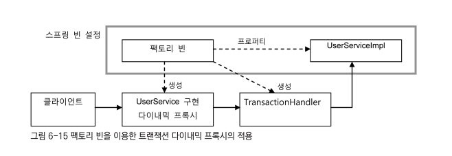
- 스프링 빈에는 팩토리 빈과 UserServiceImple만 빈으로 등록함.
- 팩토리빈은 다이내믹 프록시가 위임할 타깃 오브젝트인 UserServiceImpl에 대한 레퍼런스를 프로퍼티를 통해 DI 받아둬야함
- 다이내믹 프록시와 함께 생성할 TransactionHandler에게 타깃 오브젝트를 전달해줘야함.

#### 트랜잭션 프록시 팩토리 빈

- TransactionHandler를 이용하는 다이내믹 프록시를 생성하는 팩토리 빈 클래스

```java
public class TxProxyFactoryBean implements FactoryBean<Object> { //생성할 오브젝트 타입을 지정할 수도 있지만 범용적으로 하기 위해 Object로
    Object target;
    PlatformTransactionManager transactionManager; //TransactionHandler를 생성할 때 필요
    String pattern;
    Class<?> serviceInterface; //다이나믹 프록시를 생성할 때 필요. UserService외의 인터페이스를 가진 타깃에도 적용.

    public void setTarget(Object target) {
        this.target = target;
    }

    public void setTransactionManager(PlatformTransactionManager transactionManager) {
        this.transactionManager = transactionManager;
    }

    public void setPattern(String pattern) {
        this.pattern = pattern;
    }

    public void setServiceInterface(Class<?> serviceInterface) {
        this.serviceInterface = serviceInterface;
    }

    //FactoryBean 인터페이스 구현 메소드
    @Override
    public Object getObject() throws Exception { //DI 받은 정보를 이용해서 TransactionHandler를 사용하는 다이나믹 프록시를 생성
        TransactionHandler txHanler = new TransactionHandler();
        txHanler.setTarget(target);
        txHanler.setTransactionManager(transactionManager);
        txHanler.setPattern(pattern);
        return Proxy.newProxyInstance( //Proxy의 스태틱 메소드로 프록시 생성
                getClass().getClassLoader(),
                new Class[]{serviceInterface},
                txHanler);
    }

    @Override
    public Class<?> getObjectType() {  //DI 받은 인터페이스 타입에 따라 달라짐
        return serviceInterface;
    }

    @Override
    public boolean isSingleton() { //싱글톤 빈이 아니라는 뜻이 아니라 getObject()가 매번 같은 오브젝트를 리턴하지 않는다는 의미!
        return false;
    }
}
```

```java

@Configuration
class config {
    //..
    //    @Bean
    //    public UserServiceTx userService (){
    //        UserServiceTx userServiceTx = new UserServiceTx();
    //        userServiceTx.setUserService(userServicImpl());
    //        userServiceTx.setTransactionManager(transactionManager());
    //    }
    @Bean
    public TxProxyFactoryBean userService() {
        TxProxyFactoryBean txProxyFactoryBean = new TxProxyFactoryBean();
        txProxyFactoryBean.setTarget(userServicImpl()); //핵심기능->핸들러의invoke()메소드에서 사용하기 위함
        txProxyFactoryBean.setTransactionManager(transactionManager());
        txProxyFactoryBean.setPattern("upgradeLevels");
        txProxyFactoryBean.setServiceInterface(UserService.class); // 해당 타입으로 다이나믹 프록시를 생성하기 위해 주입시키는 인터페이스
        return txProxyFactoryBean;
    }
}
```

- 해당 타입으로 다이나믹 프록시를 생성하기 위해 주입시키는 인터페이스는 Class<?>의 타입으로 set해줌

#### 트랜잭션 프록시 팩토리 빈 테스트

- 기존 테스트 코드

```java
public class UserServiceTest {
    @Autowired
    private UserService UserService; // 이제 다이나믹 프록시가 DI 될 것임

    //..
    @Test
    public void upgradeAllOrNothing() throws Exception {
        UserService testUserService = new TestUserService(users.get(3).getId()); // 타겟으로 지정해야함
        testUserService.setUserDao(this.userDao); // 수동 DI
        testUserService.setTransactionManager(transacionManager);
        testUserService.setMailSender(mailSender);
        //.. testUserService 사용 중...
    }
}
```

- 테스트를 하기 위해서 TestUserService 오브젝트를 타깃으로 사용해야하는데
- 스프링 DI 설정에는 UserServiceImpl이 타겟으로 지정되어 있음,,

```
txProxyFactoryBean.setTarget(userServicImpl()); //핵심기능->핸들러의invoke()메소드에서 사용하기 위함
```

- -> 빈으로 등록된 TxProxyFactoryBean을 직접 가져와서 프록시 생성하기
- -> 컨텍스트 설정 변경 사항이지만 트랜잭션 학습 테스트로 특별히 만든것이므로 @DirtiesContext를 등록해주기

```java
class exTest {
    @Autowired
    ApplicationContext context; // 팩토리 빈을 가져오려면 애플리케이션 컨텍스트가 필요함.

    //..
    @Test
    @DirtiesContext
    public void upgradeAllOrNothing() throws Exception {
        TestUserService testUserService = new TestUserService(users.get(3).getId()); // 타겟
        testUserService.setUserDao(this.userDao); // 수동 DI
        testUserService.setTransactionManager(transacionManager);
        testUserService.setMailSender(mailSender);

//        UserServiceTx txUserService = new UserServiceTx(); // 직접 프록시 구현
//        txUserService.setTransactionManager(transacionManager);
//        txUserService.setUserService(txUserService);

//        TransactionHandler txHandler = new TransactionHandler(); // 핸들러 (부가기능 구현) //프록시팩토리사용
//        txHandler.setTarget(testUserService); //타겟 설정
//        txHandler.setTransactionManager(transacionManager);
//        txHandler.setPattern("upgradeLevels");
//
//        UserService txUserService = (UserService) Proxy.newProxyInstance( // 프록시
//                getClass().getClassLoader(),
//                new Class[]{UserService.class},
//                txHandler); //UserService 인터페이스 타입의 다이내믹 프록시 생성

        TxProxyFactoryBean txProxyFactoryBean = // 테스트를 위한 프록시 팩토리 가져오기
                context.getBean("&userService", TxProxyFactoryBean.class); //팩토리 빈 자체 가져오기
        txProxyFactoryBean.setTarget(testUserService);// 테스트용 타겟 주입
        UserService txUserService = (UserService) txProxyFactoryBean.getObject(); //테스트 타겟 주입된 프록시

        userDao.deleteAll();
        for (User user : users) {
            userDao.add(user);
        }
        try {
            txUserService.upgradeLevels();
            fail("TestUserServiceException expected"); // 예외 테스트이므로 정상종료라면 실패
        } catch (TestUserServiceException e) {
            //TestUserService가 던져주는 예외를 잡아서 계속 진행되도록 함.
        }
        checkLevelUpgraded(users.get(1), false);  // users.get(1)의 인스턴스는 레벨 업데이트 된 상태
    }
}
```

### 프록시 팩토리 빈 방식의 장점과 한계

#### 프록시 팩토리 빈의 재사용

- CoreService가 추가 되었을 때 기존 프록시 팩토리를 그대로 재사용 가능

```java
import org.springframework.context.annotation.Bean;
import org.user.service.TxProxyFactoryBean;

@Configuration
class ex {
    //..
    @Bean
    public CoreServiceImpl coreServiceTarget() {
        CoreServiceImpl coreService = new CoreServiceImpl();
        coreService.setCoreDao(coreDao());
    }

    @Bean
    public TxProxyFactoryBean coreService() {
        TxProxyFactoryBean txProxyFactoryBean = new TxProxyFactoryBean();
        txProxyFactoryBean.setTarget(coreServiceTarget());
        txProxyFactoryBean.setTransactionManager(transactionManager());
        txProxyFactoryBean.setServiceInterface(CoreService.class);
    }
}
```

- 핵심기능 구현 클래스를 target빈으로 설정해주고, 프록시가 구현할 인터페이스를 넣어주면 됨
  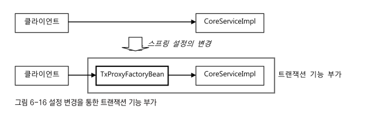

#### 프록시 팩토리 빈 방식의 장점

- 기존 데코레이터 패턴이 적용된 프록시를 사용하면 많은 장점이 있는데도 활용어려운 두가지 문제점
- 구현 프록시 클래스를 일일이 만들어야했음, 메소드에 부가기능 코드 중복
- -> 프록시 팩토리 빈으로 두가지 문제 해결
- -> 다이나믹 프록시, 팩토리빈을 이용하여 구현 클래스를 일일이 만들지 않아도 됨
- -> 핸들러 클래스를 생성하여 하나의 핸들러 메소드(invoke())를 구현하는 것으로 메소드 부가기능 해결
- -> 프록시 Proxy.newProxyInstance()로 직접 생성 -> 팩토리 빈으로 자동 DI 가능

#### 프록시 팩토리 빈의 한계 두가지..

##### 한 번에 여러개의 클래스에 부가기능 X

- 프록시를 통해 타깃에 부가기능을 제공하는 것은 메소드 단위로 일어나는 일 !
- -> 하나의 클래스에 존재하는 여러개의 메소드에 부가기능을 한번제 제공하는 것은 가능
- -> 한번에 여러개의 클래스에 공통적인 부가기능을 제공하는 일은 지금까지의 방법으로는 불가능 !
- (현재는 비슷한 프록시 팩토리 빈의 설정이 중복되는 것이 한계)

##### 하나의 타깃에 여러 개의 부가기능 적용 X

- 부가기능 마다 프록시 팩토리 빈 설정 코드가 추가됨 (서비스 클래스 x 부가기능 만큼 코드 증가)
- -> 설정파일이 너무 복잡해지는것은 피하기 어려움

##### Handler 오브젝트가 프록시 팩토리 빈 개수 만듬 만들어짐.

- TransactionHandler는 타깃 오브젝트를 갖고 있음.- > 타깃오브젝트가 달라지면 다른 팩토리빈에서 handler 오브젝트 만들어야함
- -> TransactionHandler 중복을 없애고 모든 타깃에 적용가능한 싱글톤 빈으로 만들 수는 없을까?..

## 스프링의 프록시 팩토리 빈

### ProxyFactoryBean

- 스프링은 일관된 방법으로 프록시를 만들 수 있게 도와주는 추상레이어 제공.
- -> 생성된 프록시는 스프링의 빈으로 등록돼야함.
- -> 스프링은 **프록시 오브젝트를 생성해주는 기술을 추상화한 팩토리빈**을 제공해줌.
- 스프링의 ProxyFactoryBean은 프록시를 생성해서 빈 오브젝트로 등록하게 해주는 팩토리 빈
- 기존에 만들었떤 TxProxyBean과 달리, ProxyFactoryBean은 순수하게 프록시를 생성하는 작업만을 담당
- -> 프록시를 통해 제공해줄 부가기능은 별도의 빈에 둘 수 있음.

#### MethodInterceptor -> 핸들러가 싱글톤으로 가능해짐

- InvocationHandler의 invoke() 메소드는 타깃 오브젝트에 대한 정보를 제공하지 않아 InvocationHandler를 구현한 클래스가 타깃을 알고 있어야함.
- 반면에, **MethodInterceptor의 invoke()**는** ProxyFactoryBean으로부터 타깃 오브젝트에 대한 정보까지도 함꼐 제공 받음**.
- -> **MethodInterceptor는 타깃에 독립적**으로 만들어질 수 있음
- -> MethodInterceptor 오브젝트는 **타깃이 다른 프록시에서 함께 사용**할 수 있고, **싱글톤빈**으로 등록 가능

```java
public class DymanicProxyTest {
    @Test
    public void simpleProxy() { //JDK 다이나맥 프록시 생성
        Hello proxiedHello = (Hello) Proxy.newProxyInstance(
                getClass().getClassLoader(),
                new Class[]{Hello.class},
                new UppercaseHandler(new HelloTarget())); // 기존엔 핸들러마다 타겟을 설정해줘야해서 싱글톤 불가했음
    }

    @Test
    public void proxyFactoryBean() {
        ProxyFactoryBean pfBean = new ProxyFactoryBean();
        pfBean.setTarget(new HelloTarget()); // 타깃 설정
        pfBean.addAdvice(new UppercaseAdvice()); // 부가기능을 담은 싱글톤 핸들러 어드바이스를 추가함. 여러개를 추가할 수도 있음.
        Hello proxiedHello = (Hello) (Hello) pfBean.getObject(); //FactoryBean을 구현했으므로 getObject()로 생성된 프록시 가져옴
        assertThat(proxiedHello.sayHello("Toby"), is("HELLO TOBY"));
        assertThat(proxiedHello.sayHi("Toby"), is("HI TOBY"));
        assertThat(proxiedHello.sayThankYou("Toby"), is("THANK YOU TOBY"));
    }

    static class UppercaseAdvice implements MethodInterceptor { //ProxyFactoryBean에 addAdvice()에 넣으면 알아서 타겟의 정보도 전달됨.. 
        @Override
        public Object invoke(MethodInvocation invocation) throws Throwable {
            String ret = (String) invocation.proceed(); // 리플렉션 Method와 달리 메소드 실행시 타겟오브젝트 전달 필요 없음
            return ret.toUpperCase(); //부가기능 적용     // MethodInvocation은 메소드 정보와함께 타겟 오브젝트를 알고 있기 때문.. 
        }
//        @Override // InvocationHandler와 비교용
//        public Object invoke(Object proxy, Method method, Object[] args) throws Throwable {
//            String ret = (String) method.invoke(target, args); //타겟으로 위임. 인터페이스으 모든 메소드 호출에 적용됨
//            return ret.toUpperCase(); // 부가기능 제공
//        }
    }
}
```

- MethodInterceptor 구현 클래스를 ProxyFactoryBean의 addAdvice()에 넣으면 알아서 타겟의 정보도 전달됨.. -> 싱글톤 가능

#### 어드바이스 : 타깃이 필요없는 순수한 부가기능

- MethodInterceptor로는 **메소드 정보와 함께 타깃 오브젝트가 담긴 MethodInvocation 오브젝트**가 전달됨.
- MethodInvocation은 타깃 오브젝트의 메소드 실행 기능이 있기 때문에 부가기능을 제공하는 데만 집중 가능

##### MethodInterceptor & MethodInvocation

- MethodInvocation은 일종의 콜백 오브젝트
- **proceed()를 실행하면 타깃 오브젝트의 메소드를 내부적으로 실행**해주는 기능이 있음.
- MethodInvocation 구현클래스는 일종의 공유가능한 템플릿처럼 동작
- -> ProxyFactoryBean은 이렇게 작은 단위의 템플릿/콜백 구조를 응요해서 적용했기 때문에 템플릿 역할을 하는 MethodInterceptor을 싱글톤으로 두고 공유 가능
- -> addAdvice()를 통해 ProxyFactoryBean에는 여러 개의 MethodInterceptor를 추가 가능.
- -> ProxyFactoryBean하나만으로 여러 개의 부가기능을 제공해주는 프록시를 만들 수 있다는 뜻.
- -> 커스텀 프록시 팩토리 빈의 단점 중 하나였던 새로운 부가기능 추가할 때마다 프록시와 프록시 팩토리 빈도 추가해줘야했던 문제 해결

###### 어드바이스?

- 그런데, MethodInterceptor가 오브젝트를 추가하는 메소드 이름은 addMethodInterceptor가 아니라 addAdvice임.
- -> MethodInterceptor는 Advice 인터페이스를 상속하고 있는 서브인터페이스이기 떄문.
- -> MethodInterceptor처럼 **타깃 오브젝트에 적용하는 부가기능을 담은 오브젝트를 스프링에서는 어드바이스**라고 부름!!
- -> my) 데코레이터와 어드바이스 차이점은?

##### ProxyFactoryBean에서 프록시 인터페이스 제공 부분은?

- JDK 다이나믹 프록시에서 프록시 오브젝트를 만들 때 필요했지만 ProxyFacotryBean을 적용한 후에 없어진 것이 있음
- ProxyFactoryBean을 적용한 코드에는 프록시가 구현해야하는 Hello라는 인터페이스 제공 부분이 없음.

```
  @Override
  public Object getObject() throws Exception { //DI 받은 정보를 이용해서 TransactionHandler를 사용하는 다이나믹 프록시를 생성
      TransactionHandler txHanler = new TransactionHandler(); //싱글톤이 아님.. 타겟 설정 필요..
      txHanler.setTarget(target);
      txHanler.setTransactionManager(transactionManager);
      txHanler.setPattern(pattern);
      return Proxy.newProxyInstance(
              getClass().getClassLoader(),
              new Class[]{serviceInterface},
              txHanler);
  }
```

- 스프링의 ProxyFactoryBean은 어떻게 인터페이스 타입을 제공받지도 않고 Hello 인터페이스를 구현한 프록시를 만들어 낼 수 있을까?
- -> setInterfaces()를 통해 직접 지정도 가능하지만
- -> 알려주지 않아도 타깃오브젝트가 구현하고 있는 인터페이스 정보를 알아냄. -> 알아낸 인터페이스를 모두 구현하는 프록시를 만들어줌.
- -> 타깃 오브젝트가 구현하는 인터페이스 중에서 일부만 프록시에 적용하기를 원한다면 인터페이스 정보를 직접 제공해도 됨.
- 정리 : 어드바이스는 타깃 오브젝트에 종속되지 않은 순수한 부가기능을 담은 오브젝트

#### 포인트컷 : 부가기능 적용 대상 메소드 선정 방법

- 스프링의 ProxyFactoryBean과 MethodInterceptor를 사용하는 방식에서도 메소드 선정 기능을 넣을 수 있을까?
- -> 불가능
- -> MethodInterceptor 오브젝트는 여러 프록시가 공유해서 사용할 수 있음.
- -> 그러기 위해서 MethodInterceptor오브젝트는 타깃 정보를 갖고 있지 않도록 만들었음 -> 싱글톤 가능 이유
- -> 분리해주기
- MethodInterceptor는 InvocationHandler와 다르게 프록시가 클라이언트로부터 받는 요청을 일일이 전달받을 필요는 없음.
- -> MethodInterceptor에는 재사용 가능한 순수한 부가기능 제공 코드만 남겨주기..
- -> 대신 **프록시에 부가기능 적용 메소드를 선택하는 기능 넣기**
- -> 물론 메소드 선별 기능도 프록시로부터 다시 분리하는 편이 나음
- -> 메소드 선정하는 일도 일종의 교환가능한 알고리즘이므로 전략패턴을 적용할 수 있음.

##### 스프링 ProxyFactoryBean (포인트컷과 어드바이스) vs 커스텀 ProxyFactoryBean

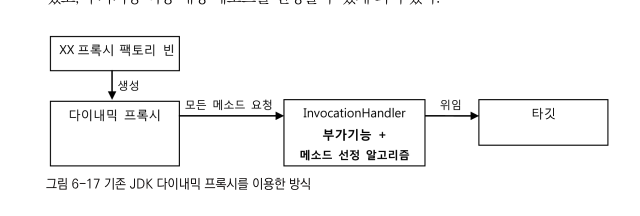

- 위에서의 문제는 부가기능을 가진 InvocationHandler가 **타깃과 메소드 선정 알고리즘 코드에 의존**하고 있다는 점
- 만약 타깃이 다르고 메소드 선정방식이 다르다면 **InvocationHandler 오브젝트를 여러 프록시가 공유할 수 없음**
- 타깃과 메소드 선정 알고리즘은 DI를 통해 분리할 수 있지만 한 번 빈으로 구성된 InvocationHandler오브젝트는
- -> 오브젝트 차원에서 특정 타깃을 위한 프록시에 제한된다는 뜻.
- -> 그래서 InvocationHandler는 굳이 빈으로 등록하는 대신 TxProxyFacotryBean 내부에서 매번 생성하도록 만들었음.
- -> **타깃 변경과 메소드 선정 알고리즘 변경 같은 확장이 필요하면 팩토리 빈 내의 프록시 생성 코드를 직접 변경**해야함.
- -> 확장에는 유연하게 열려있지 못하고 관련없는 코드의 변경이 필요할 수 있는 OCP 원칙을 잘 지키지 못하는 구조
- 반면 스프링 ProxyFactoryBean 방식은 두가지 확장 기능인 부가기능(Advice)과
- -> 메소드 선정 알고리즘(Pointcut)을 활용한 유연한 구조를 제공함!
  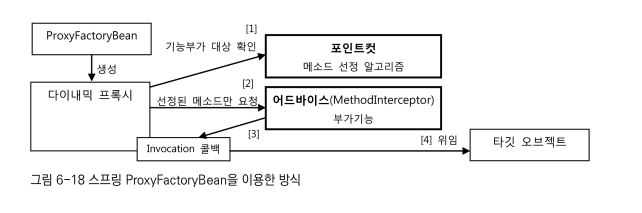
- 스프링은 부가기능을 제공하는 오브젝트를 **어드바이스**라고 하고
- -> 메소드 선정 알고리즘을 담은 오브젝트는 **포인트컷**이라고 함.
- -> 어드바이스와 포인트컷은 모두 프록시에 DI로 주입대서 사용됨.
- -> 두가지 모두 여러 프록시에서 공유 가능하도록 만들어지기 때문에 **스프링 싱글톤 빈**으로 등록 가능.

###### ProxyFactoryBean - 포인트컷

- **프록시**는 클라이언트로부터 요청을 받으면 먼저 **포인트컷에게 부가기능을 부여할 메소드인지 확인해달라고 요청**함.
- 포인트컷은 Pointcut 인터페이스를 구현해서 만들면 됨.
- 프록시는 포인트컷으로부터 부가기능 적용 대상 메소드인지 확인 받으면 -> MethodInterceptor타입의 어드바이스를 호출함.

###### ProxyFactoryBean - 어드바이스

- **어드바이스**는 JDK 다이나믹 프록시의 InvocationHandler와 달리 직접 **타깃을 호출하지 않음**.
- -> 자신이 공유되어야하므로 타깃정보라는 상태를 가질 수 없음 !
- -> 타깃에 직접 의존하지 않도록 **일종의 템플릿 구조**로 설계되어있음!
- -> 어드바이스가 부가기능 부여 중 타깃 메소드 호출이 필요하면 프록시로부터 받은 MethodInvocation 타입 콜백 오브젝트의 prodceed() 호출 해주면 됨

###### MethodInterceptor 어드바이스 & MethodInvocation 콜백

- 실제 위임 대상인 타깃 오브젝트의 레퍼런스를 갖고 있고, 이를 이용해 **타깃 메소드를 직접 호출**하는 것은
- -> **프록시가 메소드 호출에 따라 다르게 만드는 Invocation 콜백의 역할**
- 재사용 가능 기능 만들어두고 바뀌는 부분 (콜백오브젝트와 메소드호출정보)만 외부에서 주입해서 이를 작업 흐름 중에 사용하도록하는
- -> 전형적인 템플릿/콜백 구조!
- -> **어드바이스가 일종의 템플릿**이 되고, 타깃을 호출하는 기능을 갖고 있는 **MethodInvocation오브젝트가 콜백**이 되는 것
- -> 템플릿은 한 번 만들면 재사용 가능하고 려버 빈이 공유해서 사용할 수 있듯이,
- -> 어드바이스도 독립적인 싱글톤 빈으로 등록하고 DI를 주입해서 여러 프록시가 사용하도록 만들 수 있음.
- --> 프록시로부터 어드바이스와 포인트컷을 독립시키고 DI를 사용하게 한 것은 전형적인 전략패턴 구조.

```java
class exTest {
    @Test
    public void pointcutAdvisor() {
        ProxyFactoryBean pfBean = new ProxyFactoryBean();
        pfBean.setTarget(new HelloTarget());

        NameMatchMethodPointcut pointcut = new NameMatchMethodPointcut();
        pointcut.setMappedName("sayH*"); // 이름비교조건설정.

        pfBean.addAdvice(new DefaultPointcutAdvisor(pointcut, new UppercaseAdvice())); // 포인트컷과 어드바이스를 Advisor로 묶어서 한 번에 추가

        Hello proxiedHello = (Hello) pfBean.getObject();
        assertThat(proxiedHello.sayHello("Toby"), is("HELLO TOBY"));
        assertThat(proxiedHello.sayHi("Toby"), is("HI TOBY"));
        assertThat(proxiedHello.sayThankYou("Toby"), is("Thank You Toby")); //포인트컷 선정조건에 맞지않음
    }
}
```

###### 어드바이저 (Advisor) 타입

- 포인트컷과 어드바이스를 함께 프록시 팩토리빈에 등록할 떄는 Advisor타입으로 묶어서 addAdvisore() 호출
- -> 왜 굳이 별개의 오브젝트(Advisor)로 묶어서 등록?
- -> 그 이유는 ProxyFactoryBean에는 어러개의 어드바이스와 포인트컷이 추가될 수 있기 때문
- --> **포인트컷과 어드바이스를 따로 등록하면 어떤 어드바이스에 대해 어떤 포인트컷을 적용할지 애매해지기 떄문.**

```
어드바이저 = 포인트컷(메소드 선정 알고리즘) + 어드바이스(부가기능)
```

### ProxyFactoryBean 적용

#### TransactionAdvice

- 기존 TransactionHandler 코드를 TransactionAdvice로 수정하기

```java
public class TransactionAdvice implements MethodInterceptor {
    PlatformTransactionManager transactionManager;

    public void setTransactionManager(PlaformTransactionManager transactionManager) {
        this.transactionManager = transactionManager;
    }

    // 타깃을 호출하는 기능을 가진 콜백오브젝트(MethodInvocation)을 프록시로부터 받음
    // 덕분에 어드바이스는 특정 타깃에 의존하지 않고 재사용 가능 -> 빈 등록 가능
    @Override
    public Object invoke(MethodInvocation invocation) throws Throwable {
        TransactionStatus status =
                this.transactionManager.getTransaction(
                        new DefaultTransactionDefinition());
        try {
            Object ret = invocation.proceed(); //콜백이용하여 타깃호출
            this.transactionManager.commit(status);
            return ret;
        } catch (RuntimeException e) {
            this.transactionManager.rollback(status);
            throw e;
        }
    }
}
```

#### 스프링 빈 설정 수정

```java
import org.springframework.context.annotation.Configuration;

@Configuration
class config {
    //    @Bean
//    public TxProxyFactoryBean userService(){
//        TxProxyFactoryBean txProxyFactoryBean = new TxProxyFactoryBean();
//        txProxyFactoryBean.setTarget(userServicImpl()); //핵심기능->핸들러의invoke()메소드에서 사용하기 위함
//        txProxyFactoryBean.setTransactionManager(transactionManager()); //부가기능 (어드바이스)
//        txProxyFactoryBean.setPattern("upgradeLevels"); // 메소드선정(포인트컷)
//        txProxyFactoryBean.setServiceInterface(UserService.class); //Class타입인 경우
//        return txProxyFactoryBean;
//    }
    // -> TxProxyFactoryBean.getObject()에서 InvocationHandler인스턴스 생성 후 타겟과 부가기능, 메소드선정해주었기 떄문에
    // -> 타겟, 부가기능, 메소드선정 변경 시 각각 팩토리빈을 작성해줘야함..!  

    @Bean //부가기능(어드바이스)
    public TransactionAdvice transactionAdvice() {
        TransactionAdvice transactionAdvice = new TransactionAdvice();
        transactionAdvice.setTransactionManager(transactionManager());
        return transactionAdvice;
    }

    @Bean //포인트컷(메소드선정알고리즘)
    public NameMatchMethodPointcut transactionPointcut() {
        NameMatchMethodPointcut nameMatchMethodPointcut = new NameMatchMethodPointcut();
        nameMatchMethodPointcut.setMappedName("upgrade*");
        return nameMatchMethodPointcut;
    }

    @Bean // 어드바이스와 포인트컷을 담을 어드바이저 등록
    public DefaultPointcutAdvisor transactionAdvisor() {
        DefaultPointcutAdvisor defaultPointcutAdvisor = new DefaultPointcutAdvisor();
        defaultPointcutAdvisor.setAdvice(transactionAdvice());
        defaultPointcutAdvisor.setPointcut(transactionPointcut());
        return defaultPointcutAdvisor;
    }

    @Bean // 타겟과 어드바이저를 담을 프록시 팩토리 빈 등록
    public ProxyFactoryBean userService() {
        ProxyFactoryBean proxyFactoryBean = new ProxyFactoryBean();
        proxyFactoryBean.setTarget(userServicImpl());
        proxyFactoryBean.setInterceptorNames("transactionAdvisor"); // 어드바이스와 어드바이저 동시 가능 설정. 리스트에 빈 아이디값 넣어줌.
        return proxyFactoryBean;
    }
}
```

#### 테스트 적용

- 타겟 오브젝트를 테스트용 목 오브젝트 사용하기

```java
class exTest {
    @Test
    @DirtiesContext
    public void upgradeAllOrNothing() throws Exception {
        TestUserService testUserService = new TestUserService(users.get(3).getId()); // 타겟
        //..

        ProxyFactoryBean txProxyFactoryBean =
                context.getBean("&userService", ProxyFactoryBean.class);
        txProxyFactoryBean.setTarget(testUserService);
        UserService txUserService = (UserService) txProxyFactoryBean.getObject();
        //..
        try {
            txUserService.upgradeLevels();
            fail("TestUserServiceException expected"); // 예외 테스트이므로 정상종료라면 실패
        } catch (TestUserServiceException e) {
            //TestUserService가 던져주는 예외를 잡아서 계속 진행되도록 함.
        }
        checkLevelUpgraded(users.get(1), false);  // users.get(1)의 인스턴스는 레벨 업데이트 된 상태
    }
}
```

#### 어드바이스와 포인트컷의 재사용

- ProxyFactoryBean은 스프링의 DI와 템플릿/콜백 패턴, 서비스 추상화 등의 기법이 모두 적용된 것.
  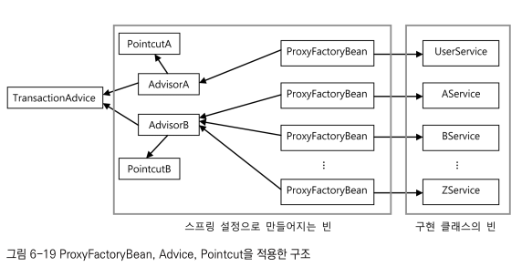

## 스프링 AOP

### 자동 프록시 생성

- 기존 FactoryBean 접근 방식의 문제점 두가지
- 1 부가기능이 타깃 오브젝트마다 새로 만들어지는 문제 -> ProxyFactoryBean 어드바이스를 통해 해결

```java
public class TxProxyFactoryBean implements FactoryBean<Object> {
    //.. 기존 부가기능 새로 만들어지는 문제점 
    @Override
    public Object getObject() throws Exception {
        TransactionHandler txHanler = new TransactionHandler(); //싱글톤이 아님.. 타겟 설정 필요..
        txHanler.setTarget(target);
        //..
    }
}
```

- -> ProxyFactoryBean은 템플릿/콜백 패턴의 Advice의 구현체를 사용하여 문제 해결..

```java
public class ex {
    @Bean // 타겟과 어드바이저를 담을 프록시 팩토리 빈 등록 
    public ProxyFactoryBean userService() {
        ProxyFactoryBean proxyFactoryBean = new ProxyFactoryBean();
        proxyFactoryBean.setTarget(userServicImpl());
        proxyFactoryBean.setInterceptorNames("transactionAdvisor"); // Advice는 탬플릿/콜백 패턴 -> 싱글톤 가능(부가기능-탬플릿/타겟-콜백)
        return proxyFactoryBean;
    }
}
```

```java
public class TransactionAdvice implements MethodInterceptor { // Advice의 구현체-> 탬플릿/콜백패턴으로 부가기능/타겟 분리
    //...
    @Override
    public Object invoke(MethodInvocation invocation) throws Throwable {
        //..
        try {
            Object ret = invocation.proceed(); //콜백이용하여 타깃호출
            this.transactionManager.commit(status);
            return ret;

        } catch (RuntimeException e) {
            this.transactionManager.rollback(status);
            throw e;
        }
    }
}
```

- 그러나 문제 2 는 아직 해결 못함 -> 타겟오브젝트마다 ProxyFactoryBean 빈 설정정보 추가해줘야함..
- target프로퍼티를 제외하면 빈클래스의 종류, 어드바이스, 포인트컷의 설정이 동일함..

```java
public class ex {
    @Bean // 타겟과 어드바이저를 담을 프록시 팩토리 빈 등록
    public ProxyFactoryBean userService() {
        ProxyFactoryBean proxyFactoryBean = new ProxyFactoryBean();
        proxyFactoryBean.setTarget(userServicImpl()); // 타겟마다 ProxyFactoryBean에 추가해줘야하는 문제 남음
        proxyFactoryBean.setInterceptorNames("transactionAdvisor");
        return proxyFactoryBean;
    }
}
```

#### 중복 문제의 접근 방법 recap

- JDBC API를 사용하는 DAO 코드 -> 바뀌는 부분과 바뀌지 않는 부분 분리하여 탬플릿/콜백 사용(전략패턴&DI)
- 프록시 클래스 코드(맨처음 인터페이스마다 직접 구현함) -> (분리및DI가 아닌) **런타임 코드 자동 생성 기법 이용.**(jdk 다이나믹 프록시)

```
UserService txUserService = (UserService) Proxy.newProxyInstance(
    getClass().getClassLoader(),
    new Class[]{UserService.class},
    txHandler); //UserService 인터페이스 타입의 다이내믹 프록시 생성 <<-- 이부분을 중복 문제 해결
```

- -> 일정한 타깃 빈의 목록을 제공하면 자동으로 각 타깃 빈에 대한 프록시를 만들어주는 방법이 없을까?

#### 빈후처리기를 이용한 자동 프록시 생성기

- 스프링은 컨테이너로서 제공하는 기능 중에서 변하지 않는 핵심적인 부분 외에는 대부분 확장할 수 있도록 확장 포인트를 제공
- -> **BeanPostProcessor 인터페이스를 구현해서 만드는 빈 후처리기**
- -> 빈후처리기는 이름 그대로 스프링 빈 오브젝트로 만들어 지고 난 후에, 빈 오브젝트를 다시 가공할 수 있게 해줌.
- **빈 후처리기를 스프링에 적용하는 방법**
- -> 빈 후처리기 자체를 빈으로 등록하기
- -> 스프링은 빈후처리기가 빈으로 등록되어 있으면 **빈 오브젝트가 생성될 때마다 빈 후처리기에 보내서 후처리 작업을 요청함.**
- 빈 후처리기는 빈 오브젝트의 프로퍼티를 강제로 수정 가능, 별도의 초기화 작업 수행 가능, 만들어진 빈 오브젝트 바꿔치기 가능
- 스프링이 설정을 참고해서 만든 오브젝트가 아닌 다른 오브젝트를 빈으로 등록시키는 것도 가능.
- -> 스프링이 생성하는 빈 오브젝트의 일부를 프록시로 포장하고, 프록시를 빈으로 대신 등록할 수도 있음
- -> **자동 프록시 생성 빈 후처리기**

##### DefaultAdvisorAutoProxyCreator

- 빈 후처리기 중 하나인 **DefaultAdvisorAutoProxyCreator**
- -> 어드바이저를 이용한 자동 프록시 생성기.
- DefaultAdvisorAutoProxyCreator 빈 후처리기가 등록되어 있으면 스프링은 빈 오브젝트를 만들 때마다 후처리기에게 빈을 보냄.
- DefaultAdvisorAutoProxyCreator는 **빈으로 등록된 모든 어드바이저 내의 포인트컷을 이용**해 전달받은 빈이 프록시 적용 대상인지 확인함.
- 프록시 적용 대상이면 그때는 내장된 프록시 생성기에게 현재 빈에 대한 프록시를 만들게 하고, 만들어진 프록시에 어드바이저를 연결해줌.
- **빈 후처리기는 프록시가 생성되면 원래 컨테이너가 전달해준 빈 오브젝트대신 프록시 오브젝트를 컨테이너에게 돌려줌**
- -> 컨테이너는 최종적으로 빈 후처리기가 돌려준 오브젝트를 빈으로 등록하고 사용함.
  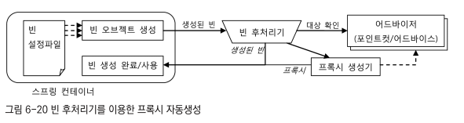
- --> 적용할 빈을 선정하는 로직이 추가된 포인트컷이 담긴 어드바이저를 등록하고
- --> 빈후처리기를 사용하면 일일이 ProxyFactoryBean 빈을 등록하지 않아도 타깃 오브젝트에 자동으로 프록시가 적용되게 할 수 있음 !

#### 확장된 포인트컷

- 이전에 포인트컷은 타깃오브젝트 메소드중에 어떤 메소드에 부가기능적용할지 선정해주는 역할
- -> **포인트컷은 등록된 빈 중에 어떤 빈에 프록시를 적용할지 선택하는 역할도 할 수 있음 !**
- Pointcut 인터페이스를 보면, 클래스 필터와 메소드 매처 두가지를 돌려주는 메소드를 갖고 있음 !
- -> 실제 포인트컷의 선별 로직은 이 두가지 타입의 오브젝트에 담겨 있음.

```java
public interface Pointcut {
    ClassFilter getClassFilter(); //프록시를 적용할 클래스인지 확인해준다.

    MethodMatcher getMethodMatecher(); //어드바이스를 적용할 메소드인지 확인해줌. 
}
```

- 이전에 사용한 NameMatchMethodPointcut은 메소드 선별 기능만 가진 특별한 포인트컷
- -> 메소드만 선별한다는 건 클래스 필터는 모든 클래스를 다 받아주도록 만들어져 있다는 뜻!
- Pointcut 선정 기능을 모두 적용한다면
- -> **먼저 프록시를 적용할 클래스인지 판단**하고 나서,
- -> 적용대상 클래스인 경우에는 **어드바이스를 적용할 메소드인지 확인**하는 식으로 동작함.
- 모든빈에 대해 프록시 자동 적용 대상을 선별해야하는 빈 후처리기인 DefaultAdvisorAutoProxyCreator는
- -> 클래스와 메소드 선정 알고리즘 모두 갖고 있는 포인트컷이 필요함. -> 그런 포인트컷과 어드바이스가 결합되어 있는 어드바이저가 필요함.

#### 포인트컷 테스트

```java
class exTest {
    @Test
    public void classNamePointcutAdvisor() {
        // 포인트컷 준비
        NameMatchMethodPointcut classMethodPoincut = new NameMatchMethodPointcut() {
            public ClassFilter getClassFilter() { // 익명 내부 클래스 방식으로 클래스 정의
                return new ClassFilter() {
                    public boolean matches(Class<?> clazz) { // 클래스 필터 포인트컷 재정의
                        return clazz.getSimpleName().startsWith("HelloT");
                    }
                };
            }
        };
        classMethodPoincut.setMappedName("sayH*"); // 메소드 매처 포인트컷
        // 테스트
        checkAdvice(new HelloTarget(), classMethodPoincut, true);

        class HelloWorld extends HelloTarget {
        }
        ;
        checkAdvice(new HelloWorld(), classMethodPoincut, false);

        class HelloToby extends HelloTarget {
        }
        ;
        checkAdvice(new HelloToby(), classMethodPoincut, true);
    }

    private void checkAdvice(Object target, Pointcut pointcut, boolean adviced) {
        ProxyFactoryBean pfBean = new ProxyFactoryBean();
        pfBean.setTarget(target);
        pfBean.addAdvisor(new DefaultPointcutAdvisor(pointcut, new UppercaseAdvice()));
        Hello proxiedHello = (Hello) pfBean.getObject();
        if (adviced) {
            assertThat(proxiedHello.sayHello("Toby"), is("HELLO TOBY"));
            assertThat(proxiedHello.sayHi("Toby"), is("HI TOBY"));
            assertThat(proxiedHello.sayThankYou("Toby"), is("Thank You Toby"));
        } else {
            assertThat(proxiedHello.sayHello("Toby"), is("Hello Toby"));
            assertThat(proxiedHello.sayHi("Toby"), is("Hi Toby"));
            assertThat(proxiedHello.sayThankYou("Toby"), is("Thank You Toby"));
        }
    }
}
```

### DefaultAdvisorAutoProxyCreator의 적용

#### 클래스 필터를 적용한 포인트컷 작성

```java
public class NameMatchClassMethodPointcut extends NameMatchMethodPointcut {
    public void setMappedClassName(String mappedClassName) {
        this.setClassFilter(new SimpleClassFilter(mappedClassName));// 클래스필터 오버라이딩
    }

    static class SimpleClassFilter implements ClassFilter {
        String mappedName;

        public SimpleClassFilter(String mappedName) {
            this.mappedName = mappedName;
        }

        @Override
        public boolean matches(Class<?> clazz) {
            return PatternMatchUtils.simpleMatch(mappedName, clazz.getSimpleName());
        }
    }
}
```

#### 어드바이저를 이용하는 자동 프록시 생성기 등록

- DefaultAdvisorAutoProxyCreator는 등록된 빈 중에서 Advisor인터페이스를 구현한 것을 모두 찾음.
- -> 생성되는 **모든 빈에 대해 어드바이저의 포인트컷을 적용해보면서 프록시 적용 대상을 선정**.
- -> 빈 클래스가 프록시 선정 대상이라면 프록시를 만들어 원래 빈 오브젝트와 바꿔치기함.
- -> 원래 빈 오브젝트는 프록시 뒤에 연결돼서 프록시를 통해서만 접근 가능하게 바뀌는 것
- -> **타깃 빈에 의존한다고 정의한 다른 빈들은 프록시 오브젝트를 대신 DI 받음 ! **
- --> DefaultAdvisorAutoProxyCreator는 config 하는 방법 찾아보기

```java
class ex {
    @Bean
    public DefaultAdvisorAutoProxyCreator defaultAdvisorAutoProxyCreator() {
        return new DefaultAdvisorAutoProxyCreator(); // 자동 프록시 생성 빈 후처리기
    }
}
```

#### 포인트컷 등록

- 클래스 필터와 메소드 매처 둘다 설정하는 포인트컷으로 수정해주기

```java
class ex {
    @Bean //포인트컷(메소드선정알고리즘)
    public NameMatchMethodPointcut transactionPointcut() {
        NameMatchClassMethodPointcut nameMatchMethodPointcut = new NameMatchClassMethodPointcut(); //setClassFilter 오버라이딩
        nameMatchMethodPointcut.setMappedClassName("*ServiceImpl"); // 클래스 이름 패턴
        nameMatchMethodPointcut.setMappedName("upgrade*"); // 메소드 이름 패턴
        return nameMatchMethodPointcut;
    }
}
```

#### 어드바이스와 어드바이저

- 자동 프록시 생성 빈 후처리기를 사용함으로써
- 명시적으로 DI 하는 빈은 존재하지 않음
- -> 어드바이저가 자동 수집되어 프록시 대상 선정 과정에 사용되어, 자동생성된 프록시에 다이나믹하게 DI됨!

#### ProxyFactoryBean 제거와 서비스 빈의 원상복구

- 타겟으로 사용되었던 userServiceImpl의 빈 아이디를 다시 userService로 되돌려놓을 수 있게 됨
- -> 명시적으로 프록시 팩토리 빈을 등록하지 않기 떄문.
- ProxyFactoryBean 빈 삭제 가능

```java
class ex {
//    @Bean // 타겟과 어드바이저를 담을 프록시 팩토리 빈 등록
//    public ProxyFactoryBean userService(){
//        ProxyFactoryBean proxyFactoryBean = new ProxyFactoryBean();
//        proxyFactoryBean.setTarget(userServicImpl());
//        proxyFactoryBean.setInterceptorNames("transactionAdvisor"); // 어드바이스와 어드바이저 동시 가능 설정. 리스트에 빈 아이디값 넣어줌.
//        return proxyFactoryBean;
//    }

    //    public UserServiceImpl userServicImpl() {
    @Bean
    public UserServiceImpl userService() {
        UserServiceImpl userServiceImpl = new UserServiceImpl();
        userServiceImpl.setUserDao(userDao());
        userServiceImpl.setMailSender(mailSender());
        return userServiceImpl;
    }
}
```

#### 자동 프록시 생성기를 사용하는 테스트

- @Autowired를 통해 컨텍스트에서 가져오는 UserSerivce 타입 오브젝트는 UserServiceImpl 오브젝트가 아니라
- -> 트랜잭션이 적용된 프록시여야함
- 기존엔 ProxyFactoryBean이 빈으로 등록되어 있었으므로 이를 가져와 타깃을 테스트용 클래스로 바꿔치기 하는 방법을 사용함.
- -> 테스트 클래스를 자동적으로 프록시로 생성해야함..?
- -> 자동 프록시 생성기라는 스프링 컨테이너에 종속적인 기법을 사용했기 때문에 예외상황을 위한 테스트 대상도 빈으로 등록해줄 필욕 ㅏ있음.
- -> 타깃을 코드에 바꿔치기 할 수 없고, 자동 프록시 생성기에 적용 되는지도 빈을 통해 확인 필요
- 기존에 만들어서 사용하던 강제 예외 발생용 TestUserService 클래스를 빈으로 등록하기 - 무넺 두가지
- -> TestUserService가 테스트 클래스 내부에 정의된 스태틱 클래스 .
- -> 포인트컷 이름 패턴이 맞지 않음.

##### 스태틱 클래스 빈으로 등록하기 & 클래스 이름 변경

- 예외 대상인 사용자 아이디를 클래스에 하드코딩 (어쩔수없는부분..?)

```java
class exTest {
    static class TestUserServiceImpl extends UserServiceImpl { // 포인트컷 클래스 필터를 위해 메이밍 수정 
        private String id = " madnite1";

        @Override
        protected void upgradeLevel(User user) {
            // 지정된 id의 User 오브젝트가 발견되면 예외를 던져서 작업을 강제로 중단.
            if (user.getId().equals(this.id)) throw new TestUserServiceException();
            super.upgradeLevel(user);
        }
    }
}
```

- 스태틱 멤버 클래스 빈등록

```java
class ex {
    @Bean
    public UserServiceTest.TestUserServiceImpl testUserService() {
        return new UserServiceTest.TestUserServiceImpl();
    }
}
```

- TestUserServiceImpl 클래스가 userService 빈을 상속하는 경우 parent 속성을 사용하지 않아도 됨.
- 상속 관계가 필요하다면 클래스 정의에서 상속을 설정하기.
- 테스트 코드 수정

```java
class exTest {
    @Autowired
    private UserService UserService; // 타겟의 프록시
    @Autowired
    private UserService testUserService; // 테스트 클래스의 프록시

    @Test
//    @DirtiesContext --> DI를 통해 테스트가 이루어지므로 컨텍스트 수정이 없어져서 불필요!
    public void upgradeAllOrNothing() throws Exception {
        // --> 프록시 설정을 위해 TestUserService를 빈등록함.
//    TestUserService testUserService = new TestUserService(users.get(3).getId()); // 타겟
//    testUserService.setUserDao(this.userDao); // 수동 DI
//    testUserService.setTransactionManager(transactionManager);
//    testUserService.setMailSender(mailSender);
        userDao.deleteAll();
        for (User user : users) {
            userDao.add(user);
        }
        try {
            this.testUserService.upgradeLevels(); // 주입된 프록시 
            fail("TestUserServiceException expected"); // 예외 테스트이므로 정상종료라면 실패
        } catch (TestUserServiceException e) {
            //TestUserService가 던져주는 예외를 잡아서 계속 진행되도록 함.
        }
        checkLevelUpgraded(users.get(1), false);  // users.get(1)의 인스턴스는 레벨 업데이트 된 상태
    }
}
```

#### 자동생성 프록시 확인

- 트랜잭션 어드바이스를 적용한 프록시 자동 생성기를 빈 후처리기 메커니즘을 통해 적용함
- -> 트랜잭션이 필요한 빈에 트랜잭션 부가기능 적용됐는가 확인 필요
- -> 아무 빈에나 트랜잭션 부가기능이 적용된 것은 아닌지 확인 필요
- --> 포인트컷의 클래스이름 패턴을 변경해서 빈에 트랜잭션 적용되지 않게 해보기

```java
class exTest {
    @Test
    public void advisorAutoProxyCreator() {
        assertThat(testUserService, is(java.lang.reflect.Proxy.class)); //주입된 빈이 Proxy의 서브 클래스인가?
    }
}
```

- DefaultAdvisorAutoProxyCreator에 의해 userService 빈이 프록시로 바꿔치기 됐다면
- -> getBean("userService")로 가져온 오브젝트는 TestUserService 타입이 아니라, JDK의 Proxy타입일 것임
- -> 모든 JDK 다이나믹 프록시 방식으로 만들어지는 프록시는 Proxy클래스의 서브 클래스

### 포인트컷 표현식을 이용한 포인트컷.

- 포인트컷의 클래스와 메소드를 선정하는 알고리즘 작성 방법 -> 포인트컷 표현식.

#### 포인트컷 표현식

- AspectExpressionPointcut 클래스

#### 포인트컷 표현식 문법

- AspectJ 포인트컷 표현식은 지시자를 이용해 작성함.
- 대표적으로 사용되는것 execution()
- []은 생략가능, |은 OR 조건

```
execution([접근제한자 패턴] 타입패턴 [타입패턴.]이름패턴 (타입패턴 | "..", ...) [throws 예외패턴])
```

```java
class exTest {
    @Test
    public void methodSignaturePointcut() throws SecurityException, NoSuchMethodException {
        AspectJExpressionPointcut pointcut = new AspectJExpressionPointcut();
        pointcut.setExpression("execution(public int " +
                "springbook.learningtest.spring.pointcut.Target.minus(int,int) " +
                "throws java.lang.RuntimeException)"); //Target 클래스 minus() 메소드 시그니처 AspectJ 작성

        // Target.minus()
        assertThat(pointcut.getClassFilter().matches(Target.class) &&
                pointcut.getMethodMatcher().matches(
                        Target.class.getMethod("minus", int.class, int.class), null), is(true));

        // Target.plus()
        assertThat(pointcut.getClassFilter().matches(Target.class) &&
                pointcut.getMethodMatcher().matches(
                        Target.class.getMethod("plus", int.class, int.class), null), is(false)); //메소드 매처에서 실패

        // Bean.method()
        assertThat(pointcut.getClassFilter().matches(Bean.class) &&
                pointcut.getMethodMatcher().matches(
                        Target.class.getMethod("method"), null), is(false)); // 클래스 필터에서 불일치
    }
}

```

- AspectJExpressionPointcut 클래스의 오브젝트를 만들고 포인트컷 표현식을 expression 프로퍼티에 넣어주면 포인트컷을 사용할 준비가 됨.
- 포인트컷 표ㅅ현식은 메소드 시그니처를 execution() 안에 넣어서 작성 -> 메소드 실행에 대한 포인트컷이라는 의미

#### 포인트컷 표현식 테스트

- 모든 선정조건을 다 없애고 모든 메소드를 다 허용하늩 포인트컷
- execution(* *(..)) //리턴타입, 파라미터, 메소드 이름에 상관없이 모든 메소드 조건을 다 허용하는 포인트컷 표현식.
- -> 포인트컷을 이용해 특정 메소드에 대한 포인트컷 적용해보고 결과 확인하는 메소드 -> 메소드를 지정하려면 클래스와 메소드 이름, 메소드 파라미터 타입 정보가 필요

#### 포인트컷 표현식을 이용하는 포인트컷 적용

- bean()
- @annotatin()
- 포인트컷 표현식을 사용하여 직접 만든 포인트컷 구현클래스는 필요 없음
- -> AspectJExpressionPointcut 빈을 등록하고 expression 프로퍼티에 넣어주면 됨.
- -> 클래스 이름은 ServiceImpl로 끝나고 메소드 이름은 upgrade로 시작하는 모든 클래스에 적용되도록 하는 표현식
- -> execution(* *..*ServiceImpl.upgrade*(..))

```java
class config {
//    @Bean //포인트컷(메소드선정알고리즘) // 포인트컷 표현식을 사용하여 직접 만든 포인트컷 구현클래스는 필요 없음
//    public NameMatchMethodPointcut transactionPointcut(){
//        NameMatchClassMethodPointcut nameMatchMethodPointcut = new NameMatchClassMethodPointcut(); //setClassFilter 오버라이딩
//        nameMatchMethodPointcut.setMappedClassName("*ServiceImpl"); // 클래스 이름 패턴
//        nameMatchMethodPointcut.setMappedName("upgrade*"); // 메소드 이름 패턴
//        return nameMatchMethodPointcut;
//    }

    // 포인트컷 표현식을 사용한 빈 설정
    @Bean
    public AspectJExpressionPointcut transactionPointcut() {
        AspectJExpressionPointcut pointcut = new AspectJExpressionPointcut();
        pointcut.setExpression("execution(* *..*ServiceImpl.upgrade*(..))");
        return pointcut;
    }
}
```

#### 포인트컷 표현식의 대상은 클래스의 이름이 아닌 타입 패턴!

- 기존 TestUserServiceImpl 클래스를 TestUserService로 변경해도 위의 포인트컷이 적용됨 !
- -> 표인트컷 표현식의 대상은 클래스의 이름이 아닌 **타입 패턴**이기 때문
- -> 상속받은 UserServiceImpl 타입을 보고 표인터컷 표현식의 대상으로 선정됨.

```java
public static class TestUserService extends UserServiceImpl {
}
```

### AOP란 무엇인가?

- 지금까지 비즈니스 로직을 담은 UserService에 **트랜잭션 적용과정 정리**.

#### 1. 트랜잭션 서비스 추상화

- 트랜잭션 적용이라는 추상적인 작업 내용은 유지한채로, 구체적인 구현방법을 바꿀 수 있도록 서비스 추상화 기법을 적용함
- 구체적인 구현 내용을 담은 의존 오브젝트는 런타임시에 다이나믹하게 연결 해줌 -> DI를 활용한 접근방법.

#### 2. 프록시와 데코레이터 패턴

- 트랜잭션을 어떻게 다룰 것인가는 DI 추상화를 통해 코드에서 제거했지만, 여전히 비즈니스 로직 코드에는 트랜잭션을 적용하고 있는 코드가 남음.
- -> DI를 이용해 데코레이터 패턴을 적용 - 부가기능 분리
- -> 클라이언트 -> 데코레이터 -> 타겟 구조를 DI를 통해 적용하여, 비즈니스 로직코드에 트랜잭션 코드 제거.
- 프록시 역할을 하는 트랜잭션 데코레이터를 거쳐서 타깃에 접근

#### 3. 다이내믹 프록시와 프록시 팩토리 빈

- 비즈니스 클래스마다 프록시 클래스를 만들어야하는 번거로움이 발생 & 부가기능 필요없는 메소드도 프록시에서 구현 해줘야했음
- -> 프록시 오브젝트를 런타임시에 만들어주는 JDK 다이내믹 프록시 기술 적용
- --> invoke()를 통해 부가기능 부여 코드가 여기저기 중복되서 나타내는 문제도 일부 해결
- 그러나, 동일 기능의 프록시를 비즈니스 오브젝트마다 중복적용해줘야하는 문제는 해결하지못함.
-
    1. JDK 프록시 방식
- -> JDK가 생성하므로 DI 불가

```
// 구현 프록시 클래스를 일일이 만들어야했음, 메소드에 부가기능 코드 중복 (invoke())
UserService txUserService = (UserService) Proxy.newProxyInstance(
    getClass().getClassLoader(),
    new Class[]{UserService.class},
    txHandler)
  ```

    2. 팩토리빈 -> 각기 생성 & 각기 설정 -> 동일 기능의 프록시를 비즈니스 오브젝트마다 중복적용해줘야하는 문제

- --> invoke()를 통해 부가기능 부여 코드가 여기저기 중복되서 나타내는 문제도 일부 해결 (팩토리 내에서 pattern적용)

```java
public class TxProxyFactoryBean implements FactoryBean<Object> {
    //..
    @Override
    public Object getObject() throws Exception { //DI 받은 정보를 이용해서 TransactionHandler를 사용하는 다이나믹 프록시를 생성
        TransactionHandler txHanler = new TransactionHandler(); //싱글톤이 아님.. 타겟 설정 필요..
        txHanler.setTarget(target);
        txHanler.setTransactionManager(transactionManager);
        txHanler.setPattern(pattern);
        return Proxy.newProxyInstance(
                getClass().getClassLoader(),
                new Class[]{serviceInterface},
                txHanler);
    }
}
```

-
    3. 프록시 팩토리빈 -> 내부적으로 탬플릿/콜백 패턴을 사용하는 스프링 프록시 팩토리 빈 덕분에 어드바이스와 포인트컷을 포록시에서 분리 가능해졌음.
-

```
@Bean
public TxProxyFactoryBean userService(){
     TxProxyFactoryBean txProxyFactoryBean = new TxProxyFactoryBean();
     txProxyFactoryBean.setTarget(userServicImpl()); //핵심기능->핸들러의invoke()메소드에서 사용하기 위함
     txProxyFactoryBean.setTransactionManager(transactionManager()); //부가기능 (어드바이스)
     txProxyFactoryBean.setPattern("upgradeLevels"); // 메소드선정(포인트컷)
     txProxyFactoryBean.setServiceInterface(UserService.class); //Class타입인 경우
     return txProxyFactoryBean;
}
```

- 탬플릿/콜백 구조 :  Advice는 탬플릿/콜백 패턴 -> 싱글톤 가능(부가기능-탬플릿/타겟-콜백)

```java
public class UppercaseAdvice implements MethodInterceptor { //ProxyFactoryBean에 addAdvice()에 넣으면 알아서 타겟의 정보도 전달됨..
    @Override
    public Object invoke(MethodInvocation invocation) throws Throwable { //탬플릿/콜백구조
        String ret = (String) invocation.proceed(); // 리플렉션 Method와 달리 메소드 실행시 타겟오브젝트 전달 필요 없음
        return ret.toUpperCase(); //부가기능 적용     // MethodInvocation은 메소드 정보와함께 타겟 오브젝트를 알고 있기 때문..
    }

//        @Override // InvocationHandler와 비교용
//        public Object invoke(Object proxy, Method method, Object[] args) throws Throwable {
//            String ret = (String) method.invoke(target, args); //타겟으로 위임. 인터페이스으 모든 메소드 호출에 적용됨
//            return ret.toUpperCase(); // 부가기능 제공
//        }
}
```

#### 자동 프록시 생성 방법과 포인트 컷

- 위는 트랜잭션 적용대상이 되는 빈마다 일일이 프록시 팩토리 빈을 설정해줘야 한다는 부담이 있음.
- -> 이를 해결하기 위해 스프링의 빈생성 후처리 기법을 활용하여 컨테이너 초기화 시점에서 자동으로 프록시 만들어줌
- -> 포인트컷 표현식사용하여 간단한 설정으로 적용대상 선택 가능

#### 부가기능의 모듈화

- 관심사가 같은 코드를 분리해 한데 모으는 것은 소프트웨어 개발의 가장 기본이 되는 원칙
- 트랜잭션 같은 부가기능은 핵심기능과 같은 방식으로는 모듈화하기 힘듬
- -> 어드바이저(어드바이스+포인트컷)를 통해 부가기능을 모듈화하였음.

#### AOP : 관점지향 프로그래밍

- 이런 부가기능 모듈화 작업은 기존 객체지향과는 다른 특성이 있다고 생각함.
- -> 애스팩트(관점지향)
- -> 애스팩트란 핵심 기능에 부가되어 의미를 갖는 특별한 모듈
- 애스팩트 > 어드바이저(단순한 형태) : 어드바이스(부가기능) + 포인트컷(선정 알고리즘)
  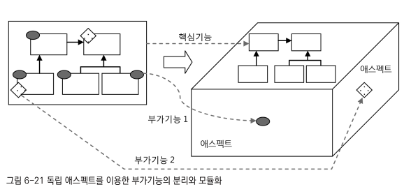
- 이렇게 애플리케이션의 핵심적인 기능에서 부가기능을 분리해서 애스팩트라는 독특한 모듈로 만들어서 설계하고 개발하는 방법을
- -> 애스팩트 지향 프로그래밍 또는 AOP라고 부름
- -> AOP는 OOP의 보조 -> AOP를 통해 핵심기능이 OOP를 집중할 수 있게 해줌.

### AOP 적용기술

#### 프록시를 이용한 AOP

- 스프링은 IoC/DI 컨테이너와 다이나믹 프록시, 데코레이터 패턴, 프록시 패턴, 자동 프록시 생성 기법, 빈 오브젝트의 후처리 조직 기법 등의 다양한 기술을 조합해 AOP를 지원함.
- 그중 핵심을 프록시를 이용했다는 것
- 어드바이스가 구현하는 **MethodInterceptor 인터페이스**는 프록시로부터 메소드 요청정보를 받아서 타깃 오브젝트의 메소드를 호출함.
- -> 호출하는 전 후에 다양한 부가기능을 제공
- -> **클라이언트가 호출할 때 사용하는 메소드에 대한 프록시 적용이라고 볼 수 있음**
- -> 스프링 AOP는 프록시 방식의 AOP라고 할 수 있음.

#### 바이트코드 생성과 조작을 통한 AOP

- AspectJ는 프록시를 사용하지 않는 대표적인 AOP 기술
- -> AspectJ는 프록시처럼 간접적인 방법이 아니라, 타깃오브젝트를 뜯어 고쳐서 부가기능을 직접 넣어주는 직접적인 방법을 사용함.
- -> 컴파일된 클래스 파일 자체를 수정하고나ㅑ, JVM에 로딩되는 시점을 가로채서 바이트 코드를 조작하는 복잡한 방법.
- 장점 두가지
- 1 스프링 컨테이너가 같은 DI 컨테이너의 도움 없이 AOP 적용가능
- 2 프록시 방식보다 강력하고 유연한 AOP 가능
- -> **프록시를 AOP의 핵심 메커니즘으로 사용하면 부가기능을 부여할 대상은 클라리언트가 호출할 때 사용하는 메소드로 제한됨**.
- -> 바이트코드 직접 조작하면 오브젝트의 생성, 필드 값의 조회와 조작, 스태틱 초기화 등의 다양한 작업에 부가기능을 부여가능.
- -> 대부분 부가기능은 프록시 방식으로 사용 가능

### AOP의 용어

- 타깃
- 어드바이스
- 조인포인트
- 포인트컷
- 프록시
- 어드바이저
- 애스팩트

#### 타깃

- 타깃은 부가기능을 부여할 대상
- 핵심기능 클래스 일수도 있지만, 다른 부가기능을 제공하는 프록시 오브젝트일 수도 있음

#### 어드바이스

- 어드바이스는 타깃에게 제공할 부가기능을 담은 모듈

#### 조인포인트

- 어드바이스가 적용될 수 있는 위치
- -> **스프링의 프록시 AOP에서 조인포인트는 메소드의 실행단계뿐임**
- -> 타깃 오브젝트가 구현한 인터페이스의 모든 메소드는 조인포인트가 됨

#### 포인트컷

- 포인트컷이란 어드바이스를 적용할 조인포인트를 선별하는 작업 또는 기 기능을 정의한 모듈
- 스프링의 조인포인트는 메소드의 실행이므로 스프링의 포인트컷은 메소드를 선정하는 기능임
- -> 그래서 포인트컷 표현식은 메소드의 실행이라는 의미인 execution으로 시작함
- 메소드는 클래스 안에 존재하는 것이기 때문에
- -> 메소드 선정이란 결국 클래스를 선정하고 그 안의 메소드를 선정하는 과정을 거치게 됨

#### 프록시

- 프록시는 클라이언트와 타깃 사이에 투명하게 존재하면서 부가기능을 제공하는 오브젝트
- **DI를 통해 타깃 대신 클라이언트에게 주입**되며, **클라이언트의 메소드 호출을 대신 받아**서 타깃에 위임해주면서, 그 과정에서 부가기능을 부여.

#### 어드바이저

- 어드바이저는 포인트컷과 어드바이스를 하나씩 갖고 있는 오브젝트
- 스프링은 자동 프록시 생성기가 어드바이저를 AOP 작업의 정보로 활용함
- #### 애스택트
- OOP의 클래스와 마찬가지로 애스택트는 AOP의 기본 모듈임
- 한개 이상 포인트컷과 어드바이스의 조합으로 만들어짐
- **보통 싱글톤 형태의 오브젝트로 존재**
- -> **따라서 클래스와 같은 모듈 정의와 오브젝트와 같은 실체(인스턴스)의 구분이 특별히 없음** -> 클래스와 오브젝트 모두 애스팩트라고 불림
- 스프링의 어드바이저는 아주 단순한 애스팩트.

### AOP 네임스페이스

- AOP를 위한 빈들은 스프링 컨테이너에 의해 자동으로 인식돼서 특별한 작업을 위해 사용됨
- -> 스프링의 프록시 방식 AOP를 적용하려면 최소한 네가지 빈 등록해야함.

#### 자동 프록시 생성기

- 스프링의 DefaultAdvisorAutoProxyCreator 클래스를 빈으로 등록.
- -> 다른 빈을 DI하지도 않고 자신도 DI되지 않으며 독립적으로 존재
- -> 애플리케이션 컨텍스트가 빈오브젝트를 생성하는 과정에 빈 후처리기로 참여
- 빈으로 등록된 어드바이저를 이용해서 프록시를 자동으로 생성하는 기능을 담당.

#### 어드바이스

- 부가기능을 구현한 클래스를 빈으로 등록
- -> AOP 관련 빈 중 유일하게 직접 구현

#### 포인트컷

- 스프링의 AspectJExpressionProincut을 빈으로 등록
- expression 프로퍼티에 포인트컷 표현식 넣어줌

#### 어드바이저

- 스프링의 DefaultPointcutAdvisor 클래스를 빈으로 등록
- 어드바이스와 포인트컷을 프로퍼티로 참조
- 자동 프록시 생성기에 의해 자동 검색되어 사용

### AOP 네임스페이스

- AOP위한 빈들을 간편하게 등록할 수 있음
- 스프링은 AOP와 관련된 태그를 정의해둔 aop 스키마 제공. (xml)

## 트랜잭션 속성

- 트랜잭션을 가져올 떄 파라미터로 트랜잭션 매니저에게 전달하는 DefaultTransactionDefinition 용도

```java
public class TransactionAdvice implements MethodInterceptor {
    //..
    public Ojbect invoke(MethodInvocation invocation) throws Throwable { //템플릿&콜백 패턴
        TransactionStatus status =
                this.transactionManage.getTrasaction(new DefaultTransactionDefinition()); // 트랜잭션 정의...
        try {
            Object ret = invocation.proceed();
            this.transactionManger.commit(status);
            return ret;
        } catch (RuntimeException e) {
            this.transactionManager.rollback(status);
            throw e;
        }
    }
}
```

### 트랜잭션 정의

- DefaultTrasactionDefinition이 구현하고 있는
- -> TrasactionDefinition 인터페이스는 트랜잭션의 동작방식에 영향을 줄 수 있는 네가지 속성을 정의
- *트랜잭션 전파, *격리수준, *제한시간, *읽기전용

#### 트랜잭션 전파

- 트랜잭션 전파란 트랜잭션의 경계에서 이미 진행중인 트랜잭션이 있을 떄 또는 없을 때 어떻게 동작할 것인가를 결정하는 방식.
  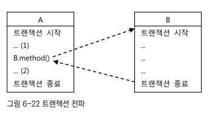
- 위처럼 각각 동립적인 트랜잭션 경계를 가진 두개의 코드가 있을 때,
- ->A의 트랜잭션이 끝나지 않은 시점에서 B를 호출했다면 B의 코드는 어떤 트랜잭션 안에서 동작해야할까?
- -> 이를 정의하는 것이 트랜잭션 전파 속성

##### PROPAGATION_REQUIRED

- 가장 많이 사용되는 트랜잭션 전파 속성
- 진행 중인 트랜잭션이 없으면 새로 시작하고, 이미 시작된 트랜잭션이 있으면 이에 참여함
- 다양한 방식으로 트랜잭션 결합 가능
- ex ) -> A, B, A->B, B->A 모두 가능
- DefaultTransactionDefinition의 트랜잭션 전파 속성이 바로 이 PROPAGATION_REQUIRED.

##### PROPAGATION_REQUIRES_NEW

- 항상 새로운 트랜잭션을 시작함.

##### PROPAGATION_NOT_SUPPORTED

- 트랜잭션 없이 동작함
- -> 트랜잭션 경계설정은 보통 AOP를 이용해 한 번에 많은 메소드를 동시에 적용 하는데,
- -> 특별한 메소드만 트랜잭션 적용에 제외할 떄 사용. (특정 메소드의 트랜잭션 전파속성만 이 속성으로.)

##### getTransaction()

- 트랜잭션 매니저를 통해 트랜잭션을 시작하려고 할 때 getTransaction()이라는 메소드를 사용하는 이유가
- -> 바로 이 트랜잭션 전파 속성이 있기 때문.
- -> getTransactino() 메소드는 항상 트랜잭션을 새로 시작하는 것이 아님!
- -> 트랜잭션 전파 속성과 현재 진행중 트랜잭션 존재 여부에 따라 새로 시작할수도, 참여할 수도.

#### 격리수준

- 모든 DB 트랜잭션은 격리수준(isolation level)을 갖고 있어야함.
- 서버환경에서는 여러개의 트랜잭션이 동시에 진행될 수 있음
- 성능을 위해 격리수준을 조정해 가능한 많은 트랜잭션을 동시에 진행 시키면서 문제 발생하지 않게 제어 필요
- 격리수준은 기본적으로 DB에 설정되어 있지만 JDBC 드라이버나 DataSource등에서 재설정 할 수 있고,
- 필요하다면 트랜잭션 단위로 격리수준을 조정할 수 있다.
- DefaultTransactionDefinition에 설정된 격리수준은 ISOLATION_DEFAULT
- -> DataSource에 설정되어 있는 디폴트 격리수준을 그대로 따른다는것.

#### 제한수준

- 트랜잭션을 수행하는 제한시간
- DefaultTrasactionDefinition의 기본 설정은 제한시간이 없는 것.
- 제한시간은 트랜잭션을 직접 시작할 수 있는 PROPAGATION_REQUIRED나 PROPAGATION_REQUIRES_NEW와 함꼐 사용해야 의미가 있음.

#### 읽기전용

- 읽기전용으로 설정해두면 트랜잭션 내에서 데이터를 조작하느 ㄴ시도를 막아줄 수 있음
- 또한 데이터 엑세스 기술에 따라 성능이 향상될 수도 있음

#### 트랜잭션 정의 수정 방법

- 트랜잭션 정의 수정하고 싶다면 DefaultTransactionDefinition을 사용하는 대신에
- -> 외부에서 정의된 TransactionDefinition 오브젝트를 DI 받아서 사용하도록 만들면 됨
- TransactionDefinition 타입의 빈을 정의해두면 프로퍼티를 통해 원하는 속성 지정할 수 있음
- -> 하지만 이 방법으로 트랜잭션 속성 변경하면 TrasacionAdvice를 사용하는 모든 트랜잭션 속성이 한꺼번에 바뀌는 문제 발생
- -> 원하는 메소드만 선택해서 독자적인 트랜잭션 정의 방법?

### 트랜잭션 인터셉터와 트랜잭션 속성

- 메소드별로 다른 트랜잭션 정의를 적용하려면 어드바이스의 기능 확장 필요
- 초기에 TransactionHandler에서 메소드 이름을 이용해 트랜잭션 적용 여부 판단 한 것처럼 메소드 이름 패턴에 따라 다른 트랜잭션 정의가 적용 되도록

#### TransactionInterceptor

- 스프링에서 제공하는 트랜잭션 경계설정 어드바이스
- TransactionInterceptor는 기존에 만들었던 TransactionAdvice와 다르지 않음
- 트랜잭션 정의 메소드 이름 패턴을 이용해서 다르게 지정할 수 있는 방법을 추가로 제공할 뿐임
- TransactionInterceptor는 **PlatformTrasactionManager와 Properties타입의 두가지 프로퍼티**를 갖고 있음

##### TransactionInterceptor.setTransactionAttributes(Properties transactionAttributes)

- TransactionInterceptor의 Properties타입의 프로퍼티의 이름 transacionAttributes
- TransactionDefinition의 네가지 기존 항목에 rollbackOn()이라는 메소드를 하나 더 갖고 있는 TransactionAttibute
- 기존 코드

```java
public class TransactionAdvice implements MethodInterceptor {
    //..
    @Override
    public Object invoke(MethodInvocation invocation) throws Throwable {
        TransactionStatus status =
                this.transactionManager.getTransaction(new DefaultTransactionDefinition()); //트랜잭션정의 네가지
        try {
            Object ret = invocation.proceed();
            this.transactionManager.commit(status);
            return ret;
        } catch (RuntimeException e) { // 롤백 대상 예외 종류 (런타임 예외)
            this.transactionManager.rollback(status);
            throw e;
        }
    }
}
```

- -> 체크 예외를 던지는 경우에 문제가 될 수 있음
- -> 하지만 체크 예외 중 일부 체크 예외의 경우 DB 트랜잭션 커밋시켜야하는 경우가 있음
- 스프링이 제공하는 **TransactionInterceptor에는 기본적으로 두가지 종류의 예외처리 방식** 있음
- -> 기본적으로 런타임예외에서 트랜잭션 롤백, 체크예외에서는 트랜젝션 커밋
- -> rollbackOn()이라는 속성을 둬서 기본 원칙과 다른 예외처리를 추가적으로 가능하게 해줌.
- -> TransactionInterceptor는 이런 TransactionAttribute를 Properties라는 일종의 맵 타입 오브젝트로 전달받음.
- -> 메소드 패턴에 따라 각기 다른 트랜잭션 속성을 부여할 수 있게 컬렉션이 사용됨.

#### 메소드 이름 패턴을 이용한 트랜잭션 속성 지정

- Properties타입의 tranasactionAttributes 프로퍼티는 메소드 패턴과 트랜잭션 속성을 키와 값으로 값는 컬렉션
- 트랜잭션 속성은 다음과 같은 문자열로 정의 가능

```
ex)
트랜잭션 전파방식    격리수준         읽기전용    제한시간     체크예외 중 롤백 대상  런타임 예외 중 롤백 제외 대상
PROPAGATION_NAME, ISOLATION_NAME, readOnly, timeout_NNNN, -Excetpion1, +Exception2
```

- 위에서 트랜잭션 전파 항목만 필수고 나머지 생략 가능.
- 생략하면 DefaultTransactionDefinition에 설정된 디폴트 속성이 부여됨
  = +, -로 기본 원칙 따르지 않는 예외를 정해주는 것.
- 아래는 메소드 이름 패턴과 문자열로 된 트랜잭션 속성을 이용해서 정의한 TransactionInterceptor 타입 빈의 예.

```xml

<bean id="transacionAdvice" class="org.springframework.transaction.interceptor.TransactionInterceptor">
    <property name="trasactiopManager" ref="transactionManager"/>
    <property name="trasactionAttributes">
        <props>
            <prop key="get*">PROPAGATION_REQUIRED, readOnly, timout_30</prop>
            <prop key="upgrade*">PROPAGATION_REQUIRES_NEW, ISOLATION_SERIALIZABLE</prop>
            <prop key="*">PROPAGATION_REQUIRED</prop>
        </props>
    </property>
</bean>
```

```java
class ex {
    // 스프링에서 제공하는 트랜잭션 경계설정 어드바이스로 대체
    @Bean
    public TransactionInterceptor transactionAdvice() { // 전파속성에 따른 트랜잭션 적용방식 결정.
        TransactionInterceptor transactionInterceptor = new TransactionInterceptor();
        transactionInterceptor.setTransactionManager(transactionManager());
        Properties transactionAttributes = new Properties();
        // get* 메소드에 대한 설정
        transactionAttributes.setProperty("get*", "PROPAGATION_REQUIRED, readOnly, timeout_30");
        // upgrade* 메소드에 대한 설정
        transactionAttributes.setProperty("upgrade*", "PROPAGATION_REQUIRES_NEW, ISOLATION_SERIALIZABLE");
        // 나머지 메소드에 대한 기본 설정
        transactionAttributes.setProperty("*", "PROPAGATION_REQUIRED");
        transactionInterceptor.setTransactionAttributes(transactionAttributes);
        return transactionInterceptor;
    }

//    @Bean //부가기능(어드바이스)
//    public TransactionAdvice transactionAdvice(){
//        TransactionAdvice transactionAdvice = new TransactionAdvice(); // MethodInterceptor을 구현하여 어드바이스로 생성
//        transactionAdvice.setTransactionManager(transactionManager());
//        return transactionAdvice;
//    }
}
```

- 세가지 메소드 이름 패턴에 대한 트랜잭션 속성이 정의되어 있음.
- 읽기전용이 아닌 트랜잭션 속성을 가진 메소드에서 읽기전용 속성을 가진 get으로 시작하는 메소드를 호출한다면?
- -> get메소드는 PROPAGATION_REQUIRED이기 떄문에 다른 트랜잭션이 시작되어 있으면 그 트랜잭션에 참여
- -> DB에 쓰기 작업이 진행된 채로 읽기전용 트랜잭션 속성을 가진 작업이 뒤따르게 되어 충돌이 일어나지 않을까?
- -> **다행히 트랜잭션 속성 중 readOnly나 timeout등은 트랜잭션이 처음 시작될때가 아니라면 적용되지 않음!**
- 메소드 이름이 하나이상 패턴과 일치하는 경우 --> 패턴 중 가장 정확히 일치하는 것 하나가 적용됨.

#### tx네임스페이스를 이용한 설정 방법

- <\bean\>이 아니라 <\tx\>라는 tx스키마의 태그를 이용해 xml 간편 작성 가능 -> 트랜잭션 속성이 개별 애트리뷰트를 통해 지정될 수 있음.

### 포인트컷과 트랜잭션 속성의 적용 전략

- 트랜잭션 부가기능을 **적용할 후보 메소드를 선정하는 작업은 포인트 컷**에 의해 진행됨
- 트랜잭션 전파속성에 따라서 **메소드별로 트랜잭션의 적용방식은 어드바이스**에 의해 결정됨.

#### 트랜잭션 포인트컷 표현식은 타입 패턴이나 빈 이름을 이용한다.

- 가능하다면 클래스보다는 인터페이스 타입을 기준으로 타입 패턴을 적용 -> 클래스에 비해 변경빈도가 적도 일정 패턴 유지 시워서
- 메소드 시그니처를 이용한 execution() 방식의 포인트컷 표현식 대신, 스프링의 빈 이름을 이용하는 bean 표현식을 사용하는 방법도 고려해볼만함.
- -> 빈 이름을 기준을 선정하기 때문에 클래스나 인터페이스 이름에 일정한 규칙을 만들기 어려운 경우 유용함.

#### 공통된 메소드 이름 규칙을 통해 최소한의 트랜잭션 어드바이스와 속성을 정의한다.

- 하나의 애플리케이션에서 사용할 트랜잭션 속성의 종류는 많지 않음.
- general하게 설정하고 -> 예외적인 경우엔 트랜잭션 어드바이스와 포인트컷을 새롭게 추가

#### *주의사항) 프록시 방식 AOP는 같은 타깃 오브젝트 내의 메소드를 호출할 때는 적용되지 않음.

- **프록시 방식의 AOP**에서는 **프록시를 통한 부가기능 적용은 클라이언트로부터 호출이 일어날 때만** 가능함.
- 여기서 클라이언트는 인터페이스를 통해 타깃 오브젝트를 사용하는 다른 모든 오브젝트를 말함.
- 반대로 **타깃 오브젝트가 자기 자신의 메소드를 호출할 때는 프록시를 이용한 부가기능 적용이 일어나지 않음!**
  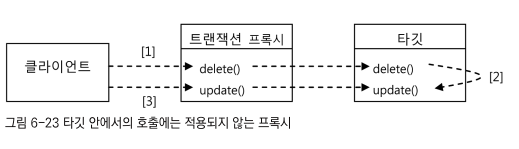
- 2의 경우 처럼 타깃 오브젝트 내로 들어와서 직접 호출차는 경우는 프록시를 거치지 않고 직접 타깃의 메소드가 호출됨!!!
- -> 따라서 클라이언트에서 1(delete())을 호출한 메소드 내에서 2(update())를 호출한 경우
- -> 타겟 내의 2(update())는 1(delete())의 전파속성에 참여할 뿐, 2(update())자체에 설정한 트랜잭션 전파 속성은 적용되지 않음!
- -> 이렇게 같은 타깃 오브젝트 안에서 메소드호출이 일어나는 경우 프록시 AOP를 통해 부여해준 부가기능이 적용되지 않는다는 점 주의!

### 트랜잭션 속성 적용

#### 트랜잭션 경계설정의 일원화 ***

- 일반적으로 특정 계층의 경계를 트랜잭션 경계와 일치시키는 것이 바람직함.
- -> 비즈니스 로직을 담고 있는 서비스 계층 오브젝트의 메소드가 트랜잭션 경계를 부여하기에 가장 적절함.
- -> 서비스 계층을 트랜잭션이 시작되고 종료되는 경계로 정했다면, 테스트 같은 특별한 경우가 아니면
- -> 다른 계층이나 모듈에서 DAO에 직접 접근하는 것은 차단해야함.
- --> 트랜잭션은 보통 서비스 계층의 메소드 조합을 통해 만들어지기에 DAO가 제공하는 주요 기능은 서비스 계층에 **위임메소드**를 만들어둘 필요가 있음.
- ex)
- -> UserService가 아니라면 UserDao에 직접접근하지않고 UserService의 메소드를 이용하는 편이 좋음
- -> 특히 둥록, 수정, 삭제가 포함된 작업이라면 다른 모듈의 DAO를 직접 이용하는 것은 지양
- -> 다른 모듈의 서비스 계층을 통해 접근해야함
- UserDao인터페이스에 정의된 6개의 메소드 중에서 이미 서비스 계층에 부가적인 로직을 담아 추가한 add() 제외한 나머지 5개가 새로 추가할 메소드 후보메소드
- -> 단순 레코드 개수 리턴 하는 getCount()제외 나머지 독자적인 트랜잭션을 가지고 사용될 가능성이 높음!

```java
public interface UserDao {
    void add(User user);

    User get(String id);

    List<User> getAll();

    void deleteAll();

    int getCount();

    public void update(User user1);
}
```

```java
public interface UserService {
    void add(User user); // DAO의 메소드와 1:1대응되는 CRUD메소드이지만 add()과 달리 단순 위임이상의 로직을 가질 수 있음.

    User get(String id);

    List<User> getAll();

    void delete(User user);

    void upgradeLevels();
}
```

```java
public class UserServiceImpl implements UserService { 
    //..
    public void add(User user) {
        if (user.getLevel() == null) {
            user.setLevel(Level.BASIC);
        }
        userDao.add(user);
    }
}
```