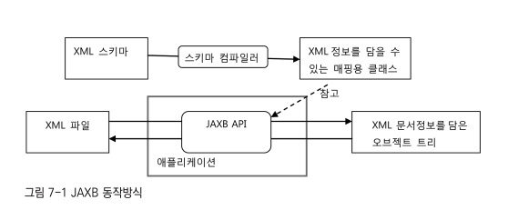
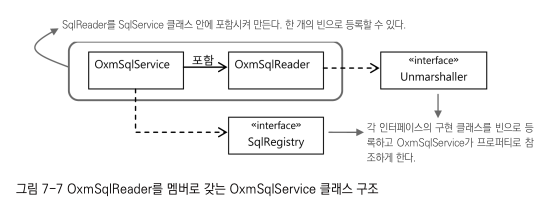
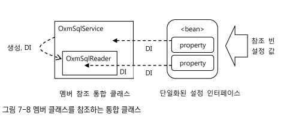
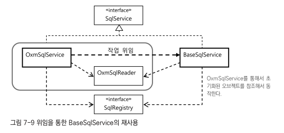
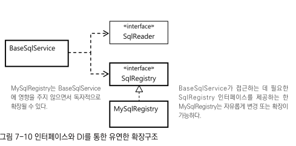
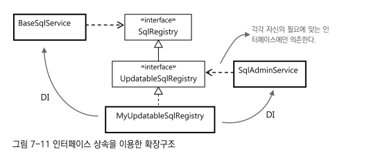

# 7장 스프링 핵심 기술의 응용
- 스프링 3대 핵심 기술 IoC/DI, 서비스 추상화, AOP

## SQL과 DAO의 분리
- DB테이블과 필드정보를 담고 있는 SQL 문장 분리하기

### XML 설정을 이용한 분리
- SQL은 문자열로 되어 있으니 설정파일에 프로퍼티 값으로 정의해서 DAO에 주입해줄 수 있음.
#### 개별 SQL 프로퍼티 방식
- UserDaoJdbc 클래스의 SQL 6개를 프로퍼티로 만들고 이를 XML에서 지정하도록 하기
- 이렇게하면 간단히 SQL을 코드에서 분리 가능
- add() 메소드의 SQL을 외부로 뺴는 작업
```java
class ex{
    public String sqlAdd;
    public void setSqlAdd(String sqlAdd){
        this.sqlAdd = sqlAdd;
    }

    public void add(User user) {
//        this.jdbcTemplate.update("insert into users(id, name, password, email, level, login, recommend) " +
//                        "values(?,?,?,?,?,?)",
        this.jdbcTemplate.update(
                this.sqlAdd,
                user.getId(), user.getName(), user.getPassword(), user.getEmail(),
                user.getLevel().intValue(),
                user.getLogin(),
                user.getRecommend());
    }
}
```
- 다음은 XML 설정의 userDao 빈에 다음과 같이 sqlAdd 프로퍼티를 추가하고 SQL을 넣어줌
```xml
<bean id="userDao" class="springbook.user.dao.UserDaoJdbc">
    <property name="dataSource" ref="dataSource" />
    <property name="sqlAdd" value="insert into users(id, name, password, email, level, login, recommend) values(?,?,?,?,?,?,?) "/>
</bean>
```
- 위 방법은 매번 새로운 SQL이 필요할 때마다 프로퍼티를 추가하고 DI를 위한 변수와 수정자 메소드도 만들어줘야함.
#### SQL 맵 프로퍼티 방식
- SQL을 하나의 컬렉션으로 담아두는 방식 -> 맵을 이용하면 키값을 이용해 SQL 문장을 가져올 수 있음
- 맵을 이용하면 프로퍼티는 하나만 만들어도 되기 때문에 DAO 코드는 더 간결해짐
```java
class ex{
    private Map<String, String> sqlMap;

    public void setSqlMap(Map<String, String> sqlMap) {
        this.sqlMap = sqlMap;
    }
    public void add(User user) {
        this.jdbcTemplate.update(
                this.sqlMap.get("add"),
                user.getId(), user.getName(), user.getPassword(), user.getEmail(),
                user.getLevel().intValue(),
                user.getLogin(),
                user.getRecommend());
    }
}
```
- xml 설정 -> Map은 하나 이상의 복잡한 정보를 담고 있기 때문에 \<property\> 태그의 value 애트리뷰트로는 정의해줄 수가 없음
- -> 스프링이 제공하는 \<map\>태그를 사용 -> 스프링은 외에도 다양한 컬렉션 타입 프로퍼티 태그 제공 
```xml
<bean id="userDao" class="springbook.user.dao.UserDaoJdbc">
    <property name="dataSource" ref="dataSource" />
    <property name="sqlMap">
        <map>
            <entry key="add" value="insert into users(id, name, password, email, level, login, recommend) values(?,?,?,?,?,?,?) "/>
        </map>
    </property>
</bean> 
```

### SQL 제공 서비스 
- -> 위 방식처럼 SQL과 DI 설정정보가 섞여 있으면 관리하기 좋지 않음.
- 스프링의 설정파일로부터 생성된 오브젝트와 정보는 애플리케이션을 다시 시작하기 전에는 변경이 매우 어렵다는 점도 문제
- -> 운영중에 동적으로도 갱신 가능한 SQL 서비스 만들기
#### SQL 서비스 인터페이스
- DAO가 사용할 SQL서비스 기능 : SQL에 대한 키 값을 전달하면 해당하는 SQL 돌려주기
```java
public interface SqlService {
    String getSql(String key) throws SqlRetrievalFailureException;
}
```
- SqlRetrievalFailureException의 서브 클래스 만들기 -> 예외의 원인을 구분하기
```java
public class SqlRetrievalFailureException extends RuntimeException{
    public SqlRetrievalFailureException(String message){
        super(message);
    }
    public SqlRetrievalFailureException(String message, Throwable cause){
        super(message, cause);
    }
}
```
```java
class UserDaoJdbc implements UserDao {
    private SqlService sqlService;

    public void setSqlService(SqlService sqlService) {
        this.sqlService = sqlService;
    }
    //..
}
```
```java
class ex{
    // ..
    public void add(User user) {
        this.jdbcTemplate.update(
                this.sqlService.getSql("userAdd"),
                user.getId(), user.getName(), user.getPassword(), user.getEmail(),
                user.getLevel().intValue(),
                user.getLogin(),
                user.getRecommend());
    }
}
```

#### 스프링 설정을 사용하는 단순 SQL 서비스 
- 가장 간단한 방법 
- 키와 SQL을 엔트리로 갖는 맵을 빈 설정에 넣었던 방법 그대로 적용
```java
public class SimpleSqlService implements SqlService {
    private Map<String, String> sqlMap;

    public void setSqlMap(Map<String, String> sqlMap) {
        this.sqlMap = sqlMap;
    }

    public String getSql(String key) throws SqlRetrievalFailureException {
        String sql = sqlMap.get(key);
        if (sql == null) {
            throw new SqlRetrievalFailureException(key + "에 대한 SQL을 찾을 수 없습니다.");
        } else {
            return sql;
        }
    }
}
```
```xml
<beans>
    <bean id="userDao" class="springbook.dao.UserDaoJdbc">
        <property name="dataSource" ref="dataSource"/>
        <property name="sqlService" ref="sqlService"/>
    </bean>
    <bean id="sqlService" class="springbook.user.sqlservice.SimpleSqlService">
        <property name="sqlMap">
            <map>
                <entry key="userAdd" value="insert into users(id, name, password, email, level, login, recommend) values(?,?,?,?,?,?,?)"/>
            </map>
        </property>
    </bean>
</beans>
```
- 이제 sqlService 빈에는 DAO에 영향을 주지 않은 채로 다양한 방법으로 구현된 SqlService 타입 클래스를 적용 가능

## 인터페이스의 분리와 자기참조 빈
- SqlService 인터페이스의 구현방법 고민해보기
- 인터페이스가 있으니 기계적으로 구현 클래스 하나만 만들면 될거라고 생각하면 오산
- 어떤 인터페이스는 **그 뒤에 숨어있는 방대한 서브 시스템의 관문에 불과할 수도 있음!!**
- 인터페이스로 대표되는 기능을 구현 방법과 확장 가능성에 따라 유연한 방법으로 재구성할 수 있도록 설계할 필요도 있음. 

### XML 파일 매핑
- 스프링 설정파일에서 SQL 정보를 넣지말고, SQL을 저장해두는 전용 포맷 파일을 이용하는 것이 바람직.
#### JAXB
- XML에 담긴 정보를 읽어오는 방법은 다양함
- 여기서는 간단하게 사용할 수있는 JAXB(Java Architecture for XML Binding)을 이용
- DOM과 같은 전통적인 XML API와 비교했을 떄 JAXB의 장점은 XML 문서 정보를 거의 동일한 구조의 오브젝트로 직접 매핑해준다는 것.
- -> DOM은 XML 정보를 마치 자바의 리플렉션 API을 이용해서 오브젝트를 조작하는 것처럼 간접적으로 접근 해야하는 불편
- JAXB은 XML의 정보를 그대로 담고 있는 오브젝트 트리 구조로 만들어주기 때문에 XML 정보를 오브젝트처럼 다룰 수 있어 편리함
- -> JAXB는 XML 문서의 구조를 정의한 스키마를 이용해서 매핑할 오브젝트의 클래스까지 자동으로 만들어주는 컴파일러도 제공
- -> 스키마 컴파일러를 통해 자동 생성된 오브젝트에는 매핑 정보가 애노테이션으로 담겨 있음
- -> JAXB API는 애노테이션에 담긴 정보를 이용해서 XML과 매핑된 오브젝트 트리 사이의 자동변환 작업을 수행해줌. 


#### SQL 맵을 위한 스키마 작성과 컴파일 
- SQL 정보는 키와 SQL의 목록으로 구성된 맵 구조로 만들면 편리함
```xml
<sqlmap>
    <sql key="userAdd">insert into users(...) ...</sql>
<!--    ... -->
</sqlmap>
```
- xml 문서 구조를 정의하고 있는 xml 스키마
```xml
<element name="sqlmap">
    <complexType>
        <sequence>
            <element name="sql" maxOccurs="unbounded" type="tns:sqlType" />
        </sequence>
    </complexType>
    <complexType name="sqlType">
        <simpleContent>
            <extension base="string">
                <attribute name="key" use="required" type="string" />
            </extension>
        </simpleContent>
    </complexType>
</element>
```
- -> 이렇게 만든 스키마 파일을 sqlmap.xsd라는 이름으로 프로젝트 루트에 저장하고 JAXB 컴파일러로 컴파일하기


#### 언마샬링
- XML문서를 읽어서 자바의 오브젝트로 변환하는 것을 JAXB에서 언마샬링이라고 부름
- 반대로 오브젝트를 XML으로 변환하는 것은 마샬링 
- -> 자바 오브젝트를 바이트 스트림으로 바꾸는 걸 직렬화라고 부르는 것과 비슷함.
#### JAXB 테스트
```xml
<sqlmap>
    <sql key="add">insert</sql>
    <sql key="get">select</sql>
    <sql key="delete">delete</sql>
</sqlmap>
```

```java
import org.junit.Test;

import javax.xml.bind.JAXBContext;
import java.io.IOException;

public class JaxbTest {
    @Test
    public void readSqlmap() throws JAXBException, IOException {
        String contextPath = Sqlmap.class.getPackage().getName();
        JAXBContext context = JAXBContext.newInstance(contextPath);
        Unmarshaller unmarshaller = context.createUnmarshaller();
        Sqlmap sqlmap = (Sqlmap) unmarshaller.unmarshal(
                getClass().getResourceAsStream("sqlmap.xml"));
        List<SqlType> sqlList = sqlmap.getSql();
        assertThat(sqlList.get(0).getKey(), is("add"));
        assertThat(sqlList.get(0).getValue(), is("insert"));
        assertThat(sqlList.get(1).getKey(), is("get"));
        assertThat(sqlList.get(1).getValue(), is("select"));
        assertThat(sqlList.get(2).getKey(), is("delete"));
        assertThat(sqlList.get(3).getValue(), is("delete"));
    }
}
```

### XML 파일을 이용하는 SQL 서비스
#### SQL 맵 XML 파일
- SQL은 DAO의 로직 일부라고 볼 수 있으므로 DAO와 같은 패키지에 두는 게 좋음

#### XML SQL 서비스
- 특별한 이유가 없는 한 XML 파일은 한 번만 읽도록
- -> XML 파일로부터 읽는 내용은 어딘가에 저장해두고 DAO에서 요청이 올 때 사용해야함.
- -> 생성자에서 JAXB를 이용해 XML로 된 SQL 문서를 읽어들이고, 변환된 Sql 오브젝트를 맵으로 옮겨서 저장해뒀다가,
- -> DAO요청에 따라 SQL을 찾아서 전달하는 방식으로 구현하기

```java
import org.user.sqlservice.SqlRetrievalFailureException;

import javax.xml.bind.JAXBContext;
import javax.xml.bind.JAXBException;

public class XmlSqlService implements SqlService {
    private Map<String, String> sqlMap = new HashMap<String, String>();

    public XmlSqlService() {
        String contextPath = Sqlmap.class.getPackage().getName();
        try {
            JAXBContext context = JAXBContext.newInstance(contextPath);
            Unmarshaller unmarshaller = context.createUnmarshaller();
            InputStream is = UserDao.class.getResourceAsStream("sqlmap.xml"); //UserDao와 같은 클래스 패스의 sqlmap.xml 파일을 변환하기
            Sqlmap sqlmap = (Sqlmap) unmarshaller.unmarshal(is);
            for (SqlType sql : sqlmap.getSql()) {
                sqlMap.put(sql.getKey(), sql.getValue());
            }
        } catch (JAXBException e) {
            throw new RuntimeException(e);
        }
    }

    public String getSql(String key) throws SqlRetrievalFailureException{
        String sql = sqlMap.get(key);
        if(sql == null){
            throw new SqlRetrievalFailureException(key + "를 이용해서 SQL을 찾을 수 없습니다.");
        }else{
            return sql;
        }
    }
}
```
- sqlService 설정 변경
```xml
<bean id="sqlService" class="springbook.user.sqlservice.XmlSqlService">
</bean> 
```

### 빈의 초기화 작업
- XmlSqlService 몇가지 개선점
- 생성자에서 예외 로직 다루는 것은 좋지 않음
- 파일의 위치와 이름이 코드에 고정되어 있는 것은 좋지 않음. -> 외부에서 DI 설정할 수 있게
- 파일이름을 외부에서 지정할 수 있도록 프로퍼티 추가
```java
public class XmlSqlService implements SqlService {
    //..
    private String sqlmapFile;

    public void setSqlmapFile(String sqlmapFile) {
        this.sqlmapFile = sqlmapFile;
    }

    public void loadSql() {
        String contextPath = Sqlmap.class.getPackage().getName();
        try {
            JAXBContext context = JAXBContext.newInstance(contextPath);
            Unmarshaller unmarshaller = context.createUnmarshaller();
            InputStream is = UserDao.class.getResourceAsStream(this.sqlmapFile); //UserDao와 같은 클래스 패스의 sqlmap.xml 파일을 변환하기
            Sqlmap sqlmap = (Sqlmap) unmarshaller.unmarshal(is);
            for (SqlType sql : sqlmap.getSql()) {
                sqlMap.put(sql.getKey(), sql.getValue());
            }
        } catch (JAXBException e) {
            throw new RuntimeException(e);
        }
    }
    //..
}
```
- 외부에서 파일 지정, SQL 읽어들이는 초기화 담당 메소드 만들어주었음
- sqlMapFile이라는 프로퍼티는 빈 설정의 \<property\> 태그를 이용해 지정
#### 스프링 빈 후처리기 활용
- 빈 후처리기는 스프링 컨테이너가 빈을 생성 한 뒤에 부가적인 작업 수행할 수 있음
- AOP를 위한 프록시 자동 생성기가 대표적인 빈 후처리기
- 그 중에서 애노테이션을 이용한 빈 설정을 지원해주는 몇가지 빈 후처리기가 있음
- \<context:annotation-config\> 태그를 만들어 설정파일에 넣어주면 빈 설정 기능에 사용할 수 있는
- -> 특별한 애노테이션 기능을 부여해주는 빈 후처리기들이 등록됨
- -> @PostConstruct
#### @PostConstruct
- 스프링은 @PostConstruct 애노테이션을 빈 오브젝트의 초기화 메소드를 지정하는데 사용함
- @PostConstruct를 초기화 작업을 수행할 메소드에 부여해주면
- -> 스프링은 XmlSqlservice 클래스로 등록된 빈의 오브젝트를 생성하고 DI 작업을 마친 뒤
- -> @PostConstruct가 붙은 메소드를 자동으로 실행해줌.
- -> 생성자와는 달리 프로퍼티 까지 모드 준비된 후 실행됨

```java
import org.user.sqlservice.SqlService;

public class XmlSqlService implements SqlService{
    @PostConstruct
    public void loadSql(){}
}
```
- -> sqlmapFile 프로퍼티의 값을 sqlService 빈의 설정에 넣어주기
- sqlmapFile 프로퍼티 값은 XML 파일의 클래스패스로, UserDao 인터페이스의 패키지로부터 상대적으로 지정 가능
```xml
<bean id="sqlService" class="springbook.user.sqlservice.XmlSqlService">
    <property name="sqlmapFile" value="sqlmap.xml"/>
</bean>
```

### 변화를 위한 준비 : 인터페이스 분리
- 현재 XmlSqlService는 특정 포맷의 XML에서 SQL 데이터를 가져오고, 이를 HashMap 타입의 맵 오브젝트에 저장해둠
- -> SQL을 가져오는 방법에 있어서 특정 기술에 고정되있음
- -> XML 대신 다른 포맷의 파일에서 SQL을 읽어 오게 하려면?
#### 책임에 따른 인터페이스 정의
- 독립적으로 변경 가능한 책임 두가지
- 1 SQL정보를 외부의 리소스로부터 읽어오는 것
- 2 SQL을 보관해두고 있다가 필요할 때 제공해주는 것
#### 구조
- SqlService 구현 클래스가 변경 가능한 책임을 가진
- SqlReader와 SqlRegistry 두가지 타입의 오브젝트를 사용하도록 만듬
- SqlRegistry 는 SqlUpdater가 sql을 런타임시에 변경하도록 사용할 수도 있음
- SqlReader에서 SqlRegistry로 전달하는 과정과 형식을 어떻게 할까?
- -> 구현방식이 다양한 두개의 오브젝트 사이에서 복잡한 정보를 전덜하기 위해서는 어떻게?
- -> 두 오브젝트 사이의 정보를 전달하는 것이 전부라면 SqlService가 중간 과정에서 아예 빠지는 방법을 생각해볼 수도 있음
- SqlService가 SqlReader에게 SqlRegistry전략을 제공해주면서
- -> 이를 이용해 SQL정보를 SqlRegistry에 저장하라고 요청하는 편이 나음
```
sqlReader.readSql(sqlRegistry); // SQL을 저장할 대상인 sqlRegistry 오브젝트를 전달
```
```java
interface SqlRegistry{
    void registerSql(String key, String sql);
    String findSql(String key) throws SqlNotFoundException;
}
```
- 이렇게 만들어두면 불필요하게 SqlService코드를 통해 특정 포맷으로 변환한 SQL정보를 주고 받ㅇ르 필요 없이
- SqlReader가 직접 SqlRegistry에 SQL 정보를 등록할 수 있음
- -> 이렇게 하면 SqlReader와 SqlRegistry는 각자의 구현 방식을 독립적으로 유지하면서 꼭 필요한 관계만 가지고 협력해서 일을 할 수 있는 구조가 됨
- SqlReader가 사용할 SqlRegistry오브젝트를 제공해주는건 SqlService의 코드가 담당
- SqlRegistry가 일종의 콜백 오브젝트처럼 사용됨

### 자기참조 빈으로 시작하기
- SqlService의 구현 클래스는 이제 SqlReader와 SqlRegistry 두 개의 프로퍼티를 DI 받을 수 있는 구조로 변경
- XmlSqlService 클래스 하나가 SqlService, SqlReader, SqlRegistry라는 세개의 인터페이스를 구현
- -> 같은 클래스의 코드이지만 책임이 다른 코드는 직접 접근하지 않고 인터페이스를 통해 간접적으로 사용하는 코드로 변경하기
#### 인터페이스를 이용한 분리
- 일단 XmlSqlService는 SqlService만을 구현한 독립적인 클래스라고 생각하기.
- -> SqlReader와 SqlRegistry 두 개의 인터페이스 타입 오브젝트에 의존하는 구조로 만들기
- DI 를 통해 이 두개의 인터페이스를 구현한 오브젝트 주입 받기
```java
public class XmlSqlService implements SqlService {
    private SqlReader sqlReader;
    private SqlRegistry sqlRegistry;

    public void setSqlReader(SqlReader sqlReader) {
        this.sqlReader = sqlReader;
    }

    public void setSqlRegistry(SqlRegistry sqlRegistry) {
        this.sqlRegistry = sqlRegistry;
    }
    //..
}
```
- 다음은 XmlSqlService가 Sqlregistry를 구현하도록 만들기

```java
import org.user.sqlservice.SqlRegistry;
import org.user.sqlservice.SqlService;

public class XmlSqlService implements SqlService, SqlRegistry {
    //..
    //SqlRegistry 구현 부분
    //sqlMap은 sqlRegistry구현의 일부가 되므로 외부에서 직접 접근 불가
    private Map<String, String> sqlMap = new HashMap<String, String>();

    public String findSql(String key) throws SqlNotFoundException {
        String sql = sqlMap.get(key);
        if (sql == null) throw new SqlNotFoundException(key +
                "에 대한 SQL을 찾을 수 없습니다.");
        else return sql;
    }
    public void registerSql(String key, String sql) {
        sqlMap.put(key, sql);
    }
    //..
}
```
- XmlSqlService 클래스가 SqlReader를 구현하도록 만들기
- -> xml파일을 어떻게 읽어오는지 SqlReader의 메소드 뒤로 숨기고
- -> 어떻게 저장해줄지 SqlRegistry타입 오브젝트가 알아서 처리하도록 수정하기
- SqlReader를 구현한 코드에서 XmlSqlService내의 다른 변수와 메소드를 직접 참조하거나 사용하면 안됨
- -> 필요한 경우만 적절한 인터페이스를 통해 접₩

```java
public class XmlSqlService implements SqlService, SqlRegistry, SqlReader{

    //sqlMapFile은 SqlReader구현의 일부가 되므로 SqlReader구현 메소드를 통하지 않고 접근하면 안됨
    private String sqlmapFile;
    public void setSqlmapFile(String sqlmapFile) {
        this.sqlmapFile = sqlmapFile;
    }
    // loadSql()에 있던 코드를 SqlReader 메소드로 가져옴 
    // 초기화를 위해 무엇을 할 것인가와 SQL을 어떻게 읽는지를 분리
    public void read(SqlRegistry sqlRegistry){
        String contextPath = Sqlmap.class.getPackage().getName();
        try{
            JAXBContext context = JAXBContext.newInstance(contextPath);
            Unmarshaller unmarshaller = context.createUnmarshaller();
            InputStream is = UserDao.class.getResourceAsStream(sqlmapFile);
            Sqlmap sqlmap = (Sqlmap)unmarshaller.unmarshal(is);
            for(SqlType sql : sqlmap.getSql()){
                //파라미터로 전달받은 구현코드는 사실 자기 자신이긴하지만
                //다른 오브젝트라고 생각하고 인터페이스에 정의된 메소드를 통해서만 사용해야함.
                sqlRegistry.registerSql(sql.getKey(), sql.getValue());
            }
        }catch (JAXBException e){
            throw new RuntimeException(e);
        }
    }
}
```
- 마지막으로 SqlServcie 인터페이스 구현을 마무리
- -> @PostConstruct가 달린 빈초기화 메소드와 
- -> SqlService인터페이스에 선언된 메소드인 getFinder()를 sqlReader와 sqlRegistry를 이용하도록 변경하기

```java
public class XmlSqlService implements SqlService, SqlRegistry, SqlReader{
    @PostConstruct
    public void loadSql(){
        this.sqlReader.read(this.sqlRegistry);
    }
    public String getSql(String key) throws SqlRetrievalFailureException{
        try{
            return this.sqlRegistry.findSql(key);
        }catch (SqlNotFoundException e){
            throw new SqlRetrievalFailureException(e);
        }
    }

//    @PostConstruct
//    public void loadSql(){
//        String contextPath = Sqlmap.class.getPackage().getName();
//        try {
//            JAXBContext context = JAXBContext.newInstance(contextPath);
//            Unmarshaller unmarshaller = context.createUnmarshaller();
//            InputStream is = UserDao.class.getResourceAsStream(this.sqlmapFile); //UserDao와 같은 클래스 패스의 sqlmap.xml 파일을 변환하기
//            Sqlmap sqlmap = (Sqlmap) unmarshaller.unmarshal(is);
//            for (SqlType sql : sqlmap.getSql()) {
//                sqlMap.put(sql.getKey(), sql.getValue());
//            }
//        } catch (JAXBException e) {
//            throw new RuntimeException(e);
//        }
//    }

//    public String getSql(String key) throws SqlRetrievalFailureException {
//        String sql = sqlMap.get(key);
//        if (sql == null) {
//            throw new SqlRetrievalFailureException(key + "를 이용해서 SQL을 찾을 수 없습니다.");
//        } else {
//            return sql;
//        }
//    }
}
```
- loadSql()은 XmlSqlService 구현 방법에 따른 메소드
- getSql()은 SqlService 인터페이스의 메소드
- loadSql() 초기화 메소드에서 sqlReader에게 sqlRegisry를 전달하면서 SQL을 읽어서 저장해두도록 요청
- 빈의 초기화를 담당하는 메소드인 loadSql()로 초기화 작업 때 이런 일을 한다는걸 보여주는 코드만 있으면 됨

#### 자기참조 빈 설정
- 같은 클래스 안에 구현된 내용이기는 하지만
- SqlService의 메소드에서 Sql을 읽을 때는 SqlReader인터페이스를 통해
- Sql를 찾을 때는 SqlRegistry인터페이스를 통해 간접적으로 접근하게 했음
- 빈 설정을 통해 실제 DI가 일어나도록 하기 
- 프로퍼티는 자기 자신을 참조할 수 있음. 수정자 메소드로 주입만 가능하면 됨
```xml
<bean id="sqlService" class="springbook.user.sqlservice.XmlSqlService">
    <property name="sqlReader" ref="sqlService" /> <!-- 자기자신 참조 -->
    <property name="sqlRegistry" ref="sqlService" />  <!-- 자기자신 참조 -->
    <property name="sqlmapFile" value="sqlmap.xml" />
</bean>
```
- -> 자기참조빈은 책임과 관심사가 복잡하게 얽혀있어서 확장이 힘들고 변경에 취약한 구조의 클래스를 
- -> 유연한 구조로 만들려고 할 때 처음 시도해볼 수 있는 방법임

### 디폴트 의존관계
- 확장가능한 인터페이스를 정의하고 그에 따라 메소드를 구분해서 DI가능하도록 코드 재구성함
- 다음은 이를 완전히 분리해두고 DI로 조합해서 사용하게 만드는 단계
#### 확장 가능한 기반 클래스
```java
public class BaseSqlService implements SqlService{
    // BaseSqlService는 상속을 통해 확장해서 사용하기에 적합함
    // 서브클래스 필요한경우 접근할 수 있도록 protected로 선언
    protected SqlReader sqlReader;
    private SqlRegistry sqlRegistry;

    public void setSqlReader(SqlReader sqlReader) {
        this.sqlReader = sqlReader;
    }

    public void setSqlRegistry(SqlRegistry sqlRegistry) {
        this.sqlRegistry = sqlRegistry;
    }
    
    @PostConstruct
    public void loadSql(){
        this.sqlReader.read(this.sqlRegistry);
    }

    @Override
    public String getSql(String key) throws SqlRetrievalFailureException {
        return null;
    }
}
```
- SQL을 저장해두고 찾아주는 기능을 담당했던 코드를 SqlRegistry를 구현하는 독립클래스로 분리
```java
public class HashMapSqlRegistry implements SqlRegistry {
    private Map<String, String> sqlMap = new HashMap<>();

    @Override
    public String findSql(String key) throws SqlNotFoundException {
        String sql = sqlMap.get(key);
        if (sql == null) {
            throw new SqlNotFoundException(key + "를 이용해서 SQL을 찾을 수 없습니다");
        } else {
            return sql;
        }
    }

    @Override
    public void registerSql(String key, String sql) {
        sqlMap.put(key, sql);
    }
}
```
- JAXB를 이용해 XML 파일에서 SQL 정보를 읽어오는 코드를 SqlReader인터페이스의 구현클래스로 독립
- 의존관계 독립적인 빈 설정
```xml
<beans>
    <bean id="sqlService" class="springbook.user.sqlservice.BaseSqlService">
        <property name="sqlReader" ref="sqlReader" />
        <property name="sqlRegistry" ref="sqlRegistry" />
    </bean>
    <bean id="sqlReader" class="springbook.user.sqlservice.JaxbXmlSqlReader">
        <property name="sqlmapFile" value="sqlmap.xml" />
    </bean>
    <bean id="sqlRegistry" class="springbook.user.sqlservice.HashMapSqlRegistry">
    </bean>
</beans>
```

#### 디폴트 의존관계 갖는 빈 만들기 
- 특정 의존 오브젝트가 대분의 환경에서 거의 디폴트라고 해도 좋을만큼
- 기본적으로 사용될 가능성이 있다면, 디폴트 의존관계를 갖는 빈을 만드는 것을 고려해볼 필요가 있음
- **디폴트 의존관계란 외부에서 DI 받지 않는 경우 기본적으로 자동 적용되는 의존관계**를 말함

```java
public class DefaultSqlService extends BaseSqlService {
    public DefaultSqlService() {
        // 생성자에서 디폴트 의존 오브젝트를 직접 만들어서 스스로 DI해줌
        setSqlReader(new JaxbXmlSqlReader());
        setSqlRegistry(new HashMapSqlRegistry());
    }
}
```
- DI설정이 없을 경우 디폴트로 적용하고 싶은 의존 오브젝트를 생성자에서 넣어줌
- DI란 클라이언트 외부에서 의존 오브젝트를 주입해주는 것이지만
- 이렇게 자신이 사용할 디폴트 의존 오브젝트를 스스로 DI하는 방법도 있음
- 코드를 통해 의존관계의 오브젝트를주입해주면 특별히 DI가 필요한 상황이 아닌경우 편리하게 사용 가
```xml
<bean id="sqlService" class="springbook.user.sqlservice.DefaultSqlService" />
```
- -> 그러나 테스트 실패
- -> DefaultSqlService 내부에서 생성하는 JaxbXmlSqlReader의 sqlmapFile 프로퍼티가 비어 있기 떄문
- -> sqlmapFile이 없으면 SQL을 읽어올 대상을 알 수 없으므로 예외가 발생함
- JaxbXmlSqlReader를 디폴트 의존 오브젝트로 직접 넣어줄 때는 프로퍼티를 외부에서 직접 지정할 수가 없음
- -> sqlmapFile을 DefaultSqlService의 프로퍼티로 정의하는 방법 있지만 좋은 방법 아님
- -> sqlmapFile의 경우도 JaxbXmlsSqlReader에 의해 기본적으로 사용될 만한 디폴트값을 가질 수 있지 않을까?
- 디폴트 값을 갖는 JaxbXmlSqlReader
```java
public class JaxbXmlSqlReader implements SqlReader {
    //    private String sqlmapFile;
    private static final String DEFAULT_SQLMAP_FILE = "sqlmap.xml";
    private String sqlmapFile = DEFAULT_SQLMAP_FILE;

    public void setSqlmapFile(String sqlmapFile) {
        this.sqlmapFile = sqlmapFile;
    }
}
```
- -> DI를 사용한다고 해서 항상 모든 프로퍼티 값을 설정에 넣고 모든 의존 오브젝트를 빈으로 일일이 지정할 필요는 없음
- -> BaseSqlService와 같이 의존 오브젝틀를 DI 해줌으로써 기능의 일부를 자유롭게 확장할 수 있는 기반을 만들어야하지만,
- -> DefaultSqlService처럼 자주 사용되는 의존 오브젝트는 미리 지정한 디폴트 의존 오브젝트를 설정 없이도 사용할 수 있게 만드는 것도 좋은 방법
- DefaultSqlService는 SqlService를 바로 구현한 것이 아니라 BaseSqlService를 상속했다는 점이 중요함
- DefaultSqlService는 BaseSqlService의 sqlReader와 sqlRegistry 프로퍼티를 그대로 갖고 있있고 다른 구현 오브젝트를 빈설정으로 등록 가능
```xml
<bean id="sqlService" class="springbook.user.sqlservice.DefaultSqlService">
    <property name="sqlRegistry" ref="ultraSuperFastSqlRegistry"/>
</bean>
```

## 서비스 추상화 적용
- JaxbXmlSqlReader 개선하기
- 1 JAXB 외 다양한 xml과 자바 오브젝트 매핑 기술로 손쉽게 바꿔서 사용할 수 있어야함
- 2 XML파일을 좀 더 다양한 소스에서 가져올 수 있게 만들기

### OXM 서비스 추상화
- 스프링이 제공하는 OXM 추상화 서비스 인터페이스에는 자바 오브젝트를 XML로 변환하는 Marshaller와 반대로 XML을 자바 오브젝트로 변환하는 Unmarshaller가 있음

```java
package org.springframework.oxm;

import javax.xml.transform.Source;
import java.io.IOException;

public interface Unmarshaller {
    boolean supports(Class<?> clazz);

    Object unmarshal(Source source) throws IOException, XmlMappingException;
}
```
- JAXB 언마살러 등록한 빈설정
```xml
<bean id="unmarshaller" class="org.springframework.oxm.jaxb.Jaxb2Marshaller">
    <property name="contextPath" value="springbook.user.sqlservice.jaxb"/>
</bean>
```
- Castor에서 사용할 매필 정보 담을 xml 따로 생성하기
- unmarshaller 빈의 클래스를 Castor용 구현 클래스로 변경하기 -> mappingLocation 프로퍼티에 준비된 Caster용 매핑 파일의 위치를 지정해주기
```xml
<bean id="unmarshaller"
    class="org.springframework.oxm.caster.CastorMarshaller">
    <property name="mappingLocation"
              value="springbook/learningtest/spring/oxm/mapping.xml"/>
</bean>
```

### OXM 서비스 추상화 적용 
- 스프링의 OXM 추상화 기능을 이용하는 SqlService 만들기
- OxmSqlService라고 하고 SqlRegistry는 DI 받을 수 있게 하지만 SqlReader는 스프링 OXM언마샬러를 이용하도록 OxmSqlService내 고정하기
- -> SQL을 읽는 방식을 OXM으로 제한해서 사용성을 극대화하는게 목적
- -> SQL을 가져오는 방법이 스프링의 OXM 추상화 방식으로 고정된다면 OxmSqlService 클래스 내에 OXM 코드를 넣어도 될까?
- -> 그럴 수 있지만 OxmSqlService가 OXM 기술에 의존적이라고 꼭 OXM 코드를 직접 갖고 있을 필요는 없음
- -> 이미 SqlReader와 SqlRegistry라는 두 개의 전략을 활용하는 구조를 적용해봤으므로
- -> 이를 유지하되 SqlReader 구현 오브젝트에 대한 의존관계를 고정시켜버리는 방법을 생각해볼 수 있음. 
- -> 구현 클래스를 OxmSqlService가 내장하게 만들기..

#### 멤버 클래스를 참조하는 통합 클래스
- OxmSqlService는 BaseSqlService와 유사하게 SqlReader 타입의 의존 오브젝트를 사용하되
- -> 이를 **스태틱 멤버 클래스로 내장하고 자신만이 사용**할 수 있도록 만들기. 
- --> **의존 오브젝트를 자신만이 사용하도록 독점하는 구조**로 만드는 방법
- -> 내장된 SqlReader 구현을 외부에서 사용하지 못하도록 제한하고 스스로 최적화된 구조로 만들어두기
- -> **밖에서 볼 땐 하나의 오브젝트로 보이지만 내부에서는 의존관계를 가진 두개의 오브젝트가 깔끔하게 결합**되서 사용됨
- -> 유연성을 조금 손해보더라도 내부적으로 낮은 결합도를 유지한 채로 응집도가 높은 구현 만들 때 유용

- -> SqlRader를 SqlService 클래스 안에 포함시켜만들기 -> 하나의 빈으로 등록 
- 언마샬러 빈은 스프링이 제공해주니 구현필요x
- SqlRegistry는 일단 가장 단순한 HashMapSqlRegistry를 디폴트 의존 오브젝트로 등록 -> 필요하면 DI로 교체
- OxmSqlService와 OxmSqlReader는 **구조적으로 강하게 결합되어 있지만 논리적으로 명확하게 분리되는 구조**
- -> **자바의 스태틱 멤버 클래스를 이런 용도로 쓰기 적합**함.

```java
import org.user.sqlservice.SqlReader;

public class OxmSqlService implements SqlService {
    //final이므로 변경 불가능. -> OxmSqlService와 OxmSqlReader는 강하게 결합되서 하나의 빈으로 등록되고 한 번에 설정 할 수 있음
    private final OxmSqlReader oxmSqlReader = new OxmSqlReader();

    private class OxmSqlReader implements SqlReader{ //private 멤버 클래스로 정의. 톱레벡 클래스인 OxmSqlService만 사용가능함.
        //..
    }
    //..
}
```
- OxmSqlReader는 private 멤버 클래스이므로 외부에서 접근하거나 사용할 수 없음
- 또한 OxmSqlService는 이를 final로 선언하고 직접 오브젝트를 생성하기 때문에 OxmSqlReader를 DI하거나 변경할 수 없음
- -> 이렇게 두 개의 클래스를 강하게 결합하고 더 이상의 확장이나 변경을 제한해두는 이유는 무엇?
- -> OXM을 이용하는 서비스 구조로 최적화하기 위해서 -> 하나의 클래스로 만들어두기 때문에 빈의 등록과 설정은 단순해지고 쉽게 사용가능.
- -> 디폴트 의존 오브젝트 방식은 디폴트 오브젝트 내부에서 값은 주입받기가 힘들다는 점이 문제
- -> OXM을 적용하는 경우는 언마샬러를 비롯해서 DI 설정해줄게 많아지기 때문에 SqlReader 클래스를 단순 디폴트 오브젝트 방식으로 제공할 수 없음 
- -> 이런 경우에는 하나의 빈 설정만으로 SqlService와 SqlReader의 필요한 프로퍼티 설정을 모두 가능하도록 만들 필요가 있음
- --> SqlService의 구현이 SqlReader의 구체적인 구현 클래스가 무엇인지도 알고, 자신의 프로퍼티를 통해 필요한 설정정보도 넘겨주고, 심지어 멤버 클래스로 소유도 하고 있는 강한 결합 구조를 만드는 방법을 사용하는 것임
 

- 위는 하나의 빈 설정으로  두개의 오브젝트를 설정하는 구조를 보여줌
- -> OxmSqlService로 등록한 빈의 프로퍼티 일부는 OxmSqlService 내부의 OxmSqlReader 프로퍼티를 설정해주기 위한 창구역할을 함.
- OxmSqlReader는 외부에 노출되지 않기 때문에 OxmSqlService에 의해서만 만들어지고 스스로 빈으로 등록될 수 없음
- -> 자신이 DI통해 제공받아야하는 프로퍼티가 있으면 이를 OxmSqlService의 공개된 프로퍼티를 통해 간접적으로 DI 받아야함!
```java
public class OxmSqlService implements SqlService {
    //final이므로 변경 불가능. -> OxmSqlService와 OxmSqlReader는 강하게 결합되서 하나의 빈으로 등록되고 한 번에 설정 할 수 있음
    private final OxmSqlReader oxmSqlReader = new OxmSqReader();
    //..
    public void setUnmarshaller(Unmarshaller unmarshaller) {
        this.oxmSqlReader.setUnmarshaller(unmarshaller);
    }

    public void setSqlmapFile(String sqlmapFile) {
        this.oxmSqlReader.setSqlmapFile(sqlmapFile);
    }
    //private 멤버 클래스로 정의. 톱레벡 클래스인 OxmSqlService만 사용가능함.
    private class OxmSqlReader implements SqlReader {
        private Unmarshaller unmarshaller;
        private String sqlmapFile;
        //setter 메소드 생략
    }
    //..
}
```
- 위의 방식은 UserDaoJdbc안에서 JdbcTemplate을 직접 만들어서 사용한 것과 비슷
- -> UserDaoJdbc는 스스로 DataSource 프로퍼티가 필요하지 않지만, 자신의 프로퍼티로 DataSource 등록해두고,
- -> 이를 DI 받아서 JdbcTemplate을 생성하면서 전달해줌
```
public void setDataSource(DataSource dataSource) {
    this.jdbcTemplate = new JdbcTemplate(dataSource);
}
```
- 차이점 : JdbcTemplate은 그 자체로 독립된 빈으로 만들수도 있고, 여러 DAO 사용가능
- -> OxmSqlReader는 OxmSqlService에서만 사용하도록 제한한 멤버 클래스라는 점에서 차이가 있음
```java
public class OxmSqlService implements SqlService {
    //final이므로 변경 불가능. -> OxmSqlService와 OxmSqlReader는 강하게 결합되서 하나의 빈으로 등록되고 한 번에 설정 할 수 있음
    private final OxmSqlReader oxmSqlReader = new OxmSqReader();

    private SqlRegistry registry = new HashMapSqlRegistry();

    public void setSqlRegistry(SqlRegistry sqlRegistry) {
        this.sqlRegistry = sqlRegistry;
    }

    public void setUnmarshaller(Unmarshaller unmarshaller) {
        this.oxmSqlReader.setUnmarshaller(unmarshaller);
    }

    public void setSqlmapFile(String sqlmapFile) {
        this.oxmSqlReader.setSqlmapFile(sqlmapFile);
    }

    @PostConstruct
    public void loadSql() {
        this.oxmSqlReader.read(this.sqlRegistry);
    }

    public String getSql(String key) throws SqlRetrievalFailureException {
        try {
            return this.sqlRegistry.findSql(key);
        } catch (SqlNotFoundException e) {
            throw new SqlRetrievalFailureException(e);
        }
    }


    //private 멤버 클래스로 정의. 톱레벡 클래스인 OxmSqlService만 사용가능함.
    private class OxmSqlReader implements SqlReader {
        private Unmarshaller unmarshaller;
        private final static String DEFAULT_SQLMAP_FILE = "sqlmap.xml";
        private String sqlmapFile = DEFAULT_SQLMAP_FILE;

        public void setUnmarshaller(Unmarshaller unmarshaller) {
            this.unmarshaller = unmarshaller;
        }

        public void setSqlmapFile(String sqlmapFile) { //디폴트 사용하지 않을 경우 사용
            this.sqlmapFile = sqlmapFile;
        }

        public void read(SqlRegistry sqlRegistry) {
            try {
                Source source = new StreamSource(
                        UserDao.class.getResourceAsStream(this.sqlmapFile));
                Sqlmap sqlmap = (Sqlmap) this.unmarshaller.unmarshal(source);
                for(SqlType sql : sql.getSql()){
                    sqlRegistry.registerSql(sql.getKey(), sql.getValue());
                }
            } catch (IOException e) {
                throw new IllegalArgumentException(this.sqlmapFile + "을 가져올 수 없습니다.", e);
            }
        }
    }
}
```
```xml
<beans>
    <bean id="sqlService" class="springbook.user.sqlservice.OxmSqlService">
        <property name="unmarshaller" ref="unmarshaller" />
    </bean>
    <bean id="unmarshaller" class="org.springframework.oxm.jaxb.Jaxb2Marshaller">
        <property name="contextPath" value="springbook.user.sqlservice.jaxb"/>
    </bean>
</beans>
```

#### 위임을 이용한 BaseSqlService의 재사용
- 위의 OxmSqlService는 SqlReader는 스태틱 멤버 클래스로 고정시켜서 OXM에 특화된 형태로 재구성했기 때문에 
- -> 설정은 간결해지고 의도되지 않는 방식으로 확장될 위험이 없ㅇ므
- 꺼림칙한 부분 : loadSql()과 sqlSql()이라는 SqlService의 핵심 메소드 구현 코드가 BaseSqlService와 동일하다는 점
- -> 프로퍼티 설정을 통한 초기화 작업을 제외하면 두 가지 작업의 코드는 BaseSqlService와 OxmSqlService 양쪽에 중복됨
- -> BaseSqlService 코드를 재사용한다고 이를 상속해서 OxmSqlService를 만들면 멤버 클래스로 통합시킨
- -> OxmSqlReader를 생성하는 코드를 넣기가 애매함
- -> 중복을 제거하기 위해 loadSql()과 getSql() 메소드를 추출해서 슈퍼클래스로 분리할 수도 있겠으나 이정도 코드로 복잡한 계층구조 만들기 부담스러움
- -> 이런 경우는 간단한 코드 중복쯤은 허용하고 BaseSqlService와 독립적으로 OxmSqlService를 관리해나가도 문제는 없을 것..
- 그런데 loadSql()과 getSql()의 작업이 복잡한 경우는? 코드 양이 많고 변경도 자주 일어난다면? 
- -> 중복된 코드를 제거할 방법 -> **위임 구조를 이용해 코드의 중복을 제거**
- -> loadSql()과 getSql()의 구현 로직은 BaseSqlService에만 두고, 
- -> **OxmSqlService는 일종의 설정과 기본 구성을 변경해주기 위한 어댑터 같은 개념**으로 BaseSqlService 앞에 두는 설계가 가능함
- -> OxmSqlService의 외형적인 틀은 유지한채로 SqlService 기능 구현은 BaseSqlService로 위임하는 것.
#### 위임 구조
- 프록시 만들 때 위임구조 사용해 봄
- 위임을 위해서는 두개의 빈을 등록하고 **요청을 직접 받는 빈이 중요 내용을 뒤의 빈에 전달해주는 구조**로 만들어야함
- -> 하지만 OxmSqlService와 BaseSqlService를 위임 구조로 만들기 위해 두 개의 빈으로 등록하는 것은 불편한 일임.
- -> 부가기능 프록시처럼 많은 타깃에 적용할 것도 아니고 ,특화된 서비스를 위해 한 번만 사용할 것이므로 유연한 DI는 포기
- -> OxmSqlService와 BaseSqlService를 한 클래스로 묶는 방법을 생각해보기

- -> 의존관계가 복잡해보일 수 있지만 OxmSqlService 자체는 OXM에 최적화된 빈 클래스를 만들기 위한 틀이라고 생각하면 이해하기 쉬움
- OxmSqlService는 OXM 기술에 특화된 SqlReader를 멤버로 내장하고 있고, 그에 필요한 설정을 한 번에 지정할 수 있는 확장구조만을 갖고 있음.
- 실제 SqlReader아 SqlService를 이용해 SqlService의 기능을 구현하는 일은 내부에 BaseSqlService를 만들어서 위임하기.
```java
public class OxmSqlService implements SqlService {
    // SqlService의 실제 구현 위임할 대상인 BaseSqlService를 인스턴스 변수로 정의
    private final BaseSqlService baseSqlService = new BaseSqlService();
    //..
    @PostConstruct
    public void loadSql(){
        // OxmSqlService의 프로퍼티를 통해서 초기화된 SqlReader와 SqlRegistry를 실제 작업을 위임할 대상인 baseSqlService에 주입
        this.baseSqlService.setSqlReader(this.oxmSqlReader);
        this.baseSqlService.setSqlRegistry(this.sqlRegistry);
        this.baseSqlService.loadSql(); //SQL을 등록하는 초기화 작업을 baseSqlService에 위임
    }
    public String getSql(String key) throws SqlRetrievalFailureException{
        return this.baseSqlService.getSql(key);
    }
    //..
}
```
- 위임 구조를 이용하여 OxmSqlService에 있던 중복 코드를 제거


### 리소스 추상화 
- 지금까지 만든 OxmSqlReader나 XmlSqlReader에는 공통적인 문제점
- -> SQL 매핑 정보가 담긴 XML 파일 이름을 프로퍼티로 외부에서 지정할 수 있지만 UserDao클래스와 같은 클래스패스에 존재하는 파일로 제한됨
- 기존 OxmSqlReader는 클래스패스로부터 리소스 가져오기 위해 ClassLoader 클래스의 getResourceAsStream()을 사용함. 
- -> 파일 시스템이나 웹상의 http를 통해 접근 가능한 파일로 바꾸려면 url클래스를 사용하도록 코드를 변경해야함
- -> 또한 서블릿 컨텍스트 내의 리소스를 가져오려면 ServletContext의 getResrouceAsStream()을 사용해야함. 
- -> 사실 리소스를 가져오면 최종적으로 InputStream 형태로 변환해서 사용해야겠지만, 리소스의 위치와 종류에 따라서 다른 클래스와 메소드를 사용해야한다는 점이 불편함.
- -> 이것도 목적은 동일하지만 사용법이 각기 다른 여러 기술이 존재하는 것으로 생각할 수 있음
- -> 여러가지 종류의 리소스를 어떻게 단일 인터페이스와 메소드로 추상화할지 고민.

#### 리소스
- 스프링은 자바에 존재하는 일관성 없는 리소스 접근 API를 추상화해서 Resource라는 추상화 인터페이스를 정의함.

```java
package org.springframework.core.io;

import java.io.IOException;

public interface Resource extends InputStreamSource {
    // 리소스의 존재나 읽기 가능 여부를 확인할 수 있음. 현재 리소스에 대한 입력 스트림이 열려있는지도 확인 가능
    boolean exists();
    booean isReadable();
    boolean isOpen();

    // JDK의 URL, URI, File 형태로 전한 가능한 리소스에 사용됨. 
    URL getURL() throws IOException;
    URI getURI() throws IOException;
    File getFile() throws IOException;
    Resource createRelative(String relatvicePath) throws IOException;

    // 리소스에 대한 이름과 부가적인 정보를 제공함.
    long lastModified() throws IOException;
    String getFilename();
    String getDescription();
}

public interface InputStreamSource { // 모든 리소스는 InputStream 형태로 가져올 수 있음.
    InputStream getInputStream() throws IOException;
}
```
- 애플리케이션 컨텍스트가 사용할 설정 정보 파일을 지정하는 것부터 시작해서
- **스프링의 거의 모든 API는 외부의 리소스 정보가 필요할 때 항상 이 Resource 추상화를 이용**함.
- -> 어떻게 임의의 리소스를 Resource 인터페이스 타입의 오브젝트로 가져올 수 있을까? 
- -> 다른 서비스 추상화 오브젝트와 달리, **Resource는 스프링에서 빈이 아니라 값으로 취급**
- -> 리소스는 OXM이나 트랜잭션처럼 서비스를 제공해주는 것이 아니라, 단순한 정보를 가진 값으로 지정됨.
- --> 빈으로 등록한다면 리소스 타입에 따라 각기 다른 Resource 인터페이스 구현 했겠지만,
- --> 빈으로 등록하지 않으니 기껏해서 property의 value 애트리뷰트에 넣는 방법 밖에 없음 -> **단순 문자열**만 넣을 수 있음..

#### 리소스 로더
- 스프링에는 URL 클래스와 유사하게 **접두어를 이용해 Resource 오브젝트를 선언하는 방법**이 있음
- -> 문자열 안에 리소스의 종류와 리소스의 위치를 함께 표현하게 해주는 것.
- -> 이렇게 **문자열로 정의된 리소스를 실제 Resource 타입오브젝트로 변환해주는 ResourceLoader를 제공**함. 
- -> ResourceLoader도 구현 다양할 수 있으므로 아래와 같은 인터페이스를 스프링이 정의해둠
```java
package org.springframework.core.io;

public interface ResourceLoader {
    Resource getResource(String location); // location에 담긴 스트링 정보를 바탕으로 그에 적절한 Resource로 변환해줌.
    //..
}
```
##### 문자열 예시
- 아래는 ResourceLoader가 인식하는 접두어와 이를 이용해 리소스를 표현한 예시
- 접두어가 없는 경우에는 리소스 로더의 구현 방식에 따라 리소스를 가져오는 방식이 달라짐. 
- 접두어를 붙여주면 리소스 로더의 종류와 상관없이 **접두어가 의미하는 위치와 방법을 이용해 리소스 읽어옴**
- ex)
- file: -> file:/C:/temp/file.txt 
- classpath: -> classpath:file.txt 
- 없음 -> WEB-INF/test.dat -> 접두어가 없는 경우 ResourceLoader 구현에 따라 리소스 위치가 결정됨. ->ServletResouceLoader라면 서블릿컨텍스트의 루트를 기준으로 해석함
- http: -> http://www.myserver.com/test.dat -> http 프로토콜을 사용해 접근할 수 있는 웹 상의 리로스 지정. ftp도 사용 가능

##### 예시 - 스프링 애플리케이션 컨텍스트
- ResourceLoader의 대표적인 예는 스프링 애플리케이션 컨텍스트
- **애플리케이션 컨텍스트가 구현해야하는 인터페이스인 ApplicationContext는 ResourceLoader 인터페이스를 상속함**
- -> 따라서 모든 애플리케이션 컨텍스트는 리소스 로더이기도 함!
- -> 스프링 컨테이너는 리소스 로더를 다양한 목적으로 사용하고 있기 때문 
- -> 예를들어, 애플리케이션 컨텍스트가 사용할 스프링 설정정보가 담긴 XML 파일도 리소스 로더를 이용해 Resource 형태로 읽어옴!
- -> 그 밖에도 애플리케이션 컨텍스트가 외부에서 읽어오는 모든 정보는 리소스 로더를 사용하게 되어있음. 
- -> 또한 빈의 프로퍼티 값을 변환할때도 리소스 로더가 자주 사용됨. 
- --> 스프링이 제공하는 빈으로 등록 가능한 클래스에 파일을 지정해주는 프로퍼티가 존재한다면 거의 모두 Resource 탕비
- --> Resource 타입은 빈으로 등록하지 않고 property 태그의 value를 사용해 문자열로 값을 넣는데,
- --> 이 과정에서 문자열로 된 리소스 정보를 Resource 오브젝트로 변환해서 프로퍼티에 주입할 때도 애플리케이션 컨텍스트 자신이 리소스 로더로서 변환과 로딩 기능을 담당함.
- ex) myFile이라는 이름의 프로퍼티가 Resource 타입이라면 아래와 같이 다양하게 지정 가능
```
<property name="myFile" value="classpath:com/epril/myproject/myfile.txt" />
<property name="myFile" value="file:/data/myfile.txt" />
<property name="myFile" value="http://www.myserver.com/test.dat" />
```
- -> myFile 프로퍼티 입장에서는 추상화된 Resource 타입의 오브젝트로 전달 받기 때문에 리소스가 실제 어디로 존재하는지, 어떤 종류인지 상관없이 동일 방법으로 리소스 내용 읽어옴

#### Resource 이용해 XML 파일 가져오기. 
- OxmSqlService에 Resource를 적용해서 SQL매핑정보가 담긴 파일을 다양한 위치에서 가져올 수 있게 만들기
- 일단 스트링으로 되어 있던 sqlmapFile 프로퍼티를 모두 Resource 타입으로 바꾸기 
- -> 이름도 sqlmap으로 변경. 꼭 파일에서 읽어오는 것은 아닐 수 있기 때문
- Resource 타입은 실제 소스가 어떤 것이든 상관없이 getInputStream()을 이용해 스트링으로 가져올 수 있음. 
- -> 이를 StreamSource 클래스를 이용해서 OXM 언마살러가 필요하는 Source타입으로 만들어주면 됨.

```java
public class OxmSqlService implements SqlService {
    public void setSqlmap(Resource sqlmap) {
        this.oxmSqlReader.setSqlmap(sqlmap);
    }

    //..
    private class OxmSqlReader implements SqlReader {
        private Resource sqlmap = new ClassPathResource("sqlmap.xml", UserDao.class);

        public void setSqlmap(Resource sqlmap) {
            this.sqlmap = sqlmap;
        }

        public void read(SqlRegistry sqlRegistry) {
            try {
                Source source = new StreamSource(sqlmap.getInputStream());
                //..
            } catch (IOException e) {
                throw new IllegalArgumentException(this.sqlmap.getFilename() + " 을 가져올 수 없습니다.");
            }
        }
    }
}
```
- Resource를 사용할 때는 Resource 오브젝트가 실제 리소스는 아니라는 점을 주의
- -> Resource는 단지 리소스에 접근할 수 있는 추상화된 핸들러 -> 오브젝트가 만들어졌따고 해도 실제 리소스 존재 안할 수도 있음 
- sqlmap 리소스 코드에서 디폴트로 설정. -> 클래스패스 리소스 바로 지정하고 싶다면 ClassPathResource 사용해오브젝트 만들 수 있음
- -> 문자열로 패스 주입할 떄는 리소스 로더가 인식할 수 있는 문자열로 표현해주면 됨 -> classpath: 
```xml
<bean id="sqlService" class="springbook.user.sqlservice.OxmSqlService">
    <property name="unmarshaller" ref="unmarshaller"/>
    <!-- classpath:는 디폴트이므로 생략가능. 클래스 패스 위치를 지정할 떄는 클래스패스 루트부터 절대위치를 적어야함.    -->
    <property name="sqlmap" value="classpath:springbook/user/dao/sqlmap.xml"/> 
</bean>
```
- 클래스패스 대신 파일 시스템의 특정 위치에 있는 파일 읽어오고 싶은 경우
```xml
<bean id="sqlService" class="springbook.user.sqlservice.OxmSqlService">
    <property name="unmarshaller" ref="unmarshaller"/>
    <!-- file:을 사용하면 파일 시스템의 루트 디렉토리부터 시작하는 파일 위치를 나타냄  -->
    <property name="sqlmap" value="file:/opt/resources/sqlmap.xml"/>
</bean>
```
- HTTP 프로토콜로 접근 가능한 웹 리소스 가져올 수도 있음
```xml
<bean id="sqlService" class="springbook.user.sqlservice.OxmSqlService">
    <property name="unmarshaller" ref="unmarshaller"/>
    <!-- file:을 사용하면 파일 시스템의 루트 디렉토리부터 시작하는 파일 위치를 나타냄  -->
    <property name="sqlmap" value="http://www.epril.com/resources/sqlmap.xml"/>
</bean>
```
- -> 이렇게 스프링의 리소스 추상화를 이용하면 리소스의 위치와 접근 방법에 독립적인 코드를 쉽게 만들 수 있음
- -> **스프링 애플리케이션에서 파일을 참조하는 기능을 만들 때는 Resource 타입의 추상화 기능을 사용하기.** 

## 인터페이스 상속을 통한 안전한 기능확장
- 원칙적으로 권장되진 않지만, 서버를 재시작하지 않고 긴급하게 사용 중인 SQL을 변경해야할 수도 있음
- -> 지금까지 만든 SqlService 구현 클래스들은 **초기에 리소스로부터 SQL 정보를 읽어오면** 이를 메모리에 두고 그대로 사용함.
- --> 이 장에서는 기존에 설계하고 개발했던 기능이 발전돼야 할 경우에 스프링 답게 접근하는 방법이 무엇인지 살펴봄. 

### DI와 기능의 확장
- DI의 가치를 제대로 얻으로면 먼저 DI에 적합한 오브젝트 설계가 필요함

#### DI를 의식하는 설계
- **객체지향 설계를 잘 하는 방법 -> DI를 의식하면서 설계하기 !!! **
- DI를 적요하려면 커다란 오브젝트 하나만 존재해서는 안됨. -> 최소한 두 개 이상의, 의존관계를 가지고 서로 협력해서 일하는 오브젝트가 필요함.
- -> 적절한 책임에 따라 오브젝트를 분리해줘야함. -> 항상 의존 오브젝트는 자유롭게 확장될 수 있다는 점을 염두
- -> DI는 런타임 시에 의존 오브젝트를 다이나믹하게 연결해줘서 유연한 확장을 꾀하는 게 목적이기 때문에 항상 확장을 염두해두고 오브젝트 사이의 관계 생각하기.
- -> DI란 미래를 프로그래밍 하는 것...

#### DI와 인터페이스 프로그래밍
- DI를 DI답게 만들려면 두 개의 오브젝트가 인터페이스를 통해 느슨하게 연결돼야함. 
- -> 인터페이스 사용하는 첫 번째 이유는 다형성을 얻기 위해서. 
- --> 의존 오브젝트가 가진 핵심 로직 바꿔서 적용하는 것 외에도, 프록시, 데코레이터, 어댑터 ,테스트 대역 등 다양한 목적을 위해 다형성이 활용됨.
- -> 단지 DI 목적이 다형성을 편하게 적용하는 것때문이라면, 제약이 많고 불편한 점이 있다고해도 클래스를 사용가능.
- --> 상속이 불가능한 final 클래스만 아니면 상속을 통해 여러 방식으로 구현 확장 가능 -> 1장에서 본 템플릿 메소드 패턴..
- ---> 그래도 **인터페이스 사용해야하는 이유가 있따면 그것은 인터페이스 분리원칙을 통해 클라이언트와 의존 오브젝트 사이의 관계 명확하게 해줄 수 있기 때문.**
- ex)
- B가 B1, B2 인터페이스를 구현
- A -> B1 사용 => B --> A는 B1이라는 창을 통해서만 B를 봄
- C -> B2 사용 => B --> C는 B2라는 창을 통해서만 B를 봄
- -> 인터페이스는 하나의 오브젝트가 여러 개를 구현할 수 있으므로, 하나의 오브젝트를 바라보는 창이 여러 가지 일 수도 있다는 뜻. 
- --> 각기 다른 관심과 목적을 가지고 어떤 오브젝트에 의존하고 있을 수 있다는 의미. --> 인터페이스라는 창을 통해 필요한 것만 보겠다..
- --> 굳이 B2라는 인터페이스에 정의된 내용에는 아무런 관심이 없는 A오브젝트가 B2인터페이스의 메소드까지 모두 노출되어 있는 B라는 클래스에 직접 의존할 필요가 없다!
- --> 게다가 B2 인터페이스의 메소드에 변화가 발생하면 A 오브젝트에 영향을 줄 수도 있음
- -> 인터페이스를 이렇게 클라이언트 종류에 따라 적절하게 분리해서 오브젝트를 구현하면 매우 유용함 
#### 인터페이스 분리 원칙
- 오브젝트가 그 자체로 충분히 응집도가 높은 작은 단위로 설계됐더라고 해도, 
- 목적과 관심이 다른 클라이언트가 있다면 인터페이스를 통해 이를 적절하게 분리해줄 필요가 있음
- -> 인터페이스 분리원칙
- --> 인터페이스 사용하지 않고 클래스 직접 참조 DI를 하면 클라이언트에 특화된 의존관계를 만들어낼 방법이 없음. 

### 인터페이스 상속
- 하나의 오브젝트가 구현하는 인터페이스를 여러 개 만들어서 구분하는 이유 중 하나는
- -> 오브젝트의 기능이 발전하는 과정에서 다른 종류의 클라이언트가 등장하기 떄문
- -> 떄로는 인터페이스 여러개 만드는 대신 기존 인터페이스를 상속을 통해 확장하는 방법도 사용됨.
- **인터페이스 분리 원칙이 주는 장점**
- -> 모든 클라이언트가 자신의 관심에 따른 접근 방식을 불필요한 간섭없이 유지할 수 있다. 
- -> 기존 클라이언트에 영향을 주지 않은 채로 오브젝트의 기능을 확장하거나 수정할 수 있음. 
- --> 기존 클라이언트는 자신이 사용하던 인터페이스를 통해 동일한 방식으로 접근할 수만 있다면 오브젝트 변경에 영향 받지 않음. 

- 인터페이스를 사용해 DI를 만들었기 때문에 SqlRegistry 구현클래스인 MySqlRegistry는 오브젝트가 또 다른 제 3의 클라이언트를 위한 인터페이스를 가질 수 있다는 점
- 새로운 클라이언트가 생겨나면 SqlRegistry를 확장시키거나 다른 인터페이스가 필요할 수도 있음
- 현재 SqlRegistry 인터페이스는 초기에 새로운 SQL 을 등록하는 기능과 이렇게 등록된 SQL을 다시 검색해오는 두 가지 메소드를 갖고 있음.
```java
public interface SqlRegistry{
    void registerSql(String key, String sql);
    String findSql(String key) throws SqlNotFoundException;
}
```
- 이미 등록된 SQL을 변경할 수 있는 기능을 넣어 확장하고 싶음
- -> BaseSqlService 오브젝트는 SqlRegistry가 제공하는 기능이면 충분하기 때문에 SqlRegistry 자체를 수정하는건 바람직하지 않음 -> SqlRegistry는 조회 기능
- -> 새로운 인터페이스 선언 -> SQL 관리 기능 => 업데이트 뿐 아니라 등록이나 검색 같은 기본적인 기능도 필요.
- -> 기존의 SqlRegistry 인터페이스를 상속하고 메소드를 추가해서 새로운 인터페이스로 정의돼야함/

```java
// SQL 수정기능을 가진 확장 인터페이스
public interface UpdatableSqlRegistry extends SqlRegistry {
    public void updateSql(String key, String sql) throws SqlUpdateFailureException;
    public void updateSql(Map<String, String> sqlmap) throws SqlUpdateFailureException;
}
```
- -> 새로운 인터페이스를 BaseSqlService가 사용하도록 해야할까? --> 그렇지 않음!
- -> BaseSqlService 클라이언트는 초기화를 통한 SQL 등록과 조회만을 목적으로하므로 기존 SqlRegistry로 접근하면 충분함
- -> 반면 SQL 업데이트 작업이 필요한 새로운 클라이언트 오브젝트는 UpdatableSqlRegistry 인터페이스르 통해 SQL 레지스트리 오브젝트에 접근하도록 만들어야함!

- -> SQL 변경 요청 담당 관리하는 클래스 SqlAdminService가 있다고 할 때 -> UpdatableSqlRegistry라는 인터페이스르 통해 SQL레지스트리 오브젝트에 접근해야함.
- --> 하지만 실제 오브젝트 사이에 일어나는 DI 결과만 보자면 BaseSqlService와 SqlAdminService 오브젝트는 **동일한 MyUpdatableSqlRegistry 오브젝트를 DI 받아서 사용함.** 
- -> xml 설정을 보자면 동일한 빈을 참조하도록 설정됨
```xml
<beans>
    <bean id="sqlRegistry" class="springbook.user.sqlservice.MyUpdatableSqlRegistry"/>
    <bean id="sqlService" class="springbook.user.sqlservice.BaseSqlService">
        ...
        <propertry name="sqlRegistry" ref="sqlRegistry" />
    </bean>
    <bean id="sqlAdmainService" class="springbook.user.sqlservice.SqlAdminService">
        ...
        <propertry name="updatableSqlRegistry" ref="sqlRegistry" />
    </bean>
</beans>
```
- -> 오브젝트 의존관계를 보자면 DI를 통해 **동일한 오브젝트에 의존**하고 있지만 설계와 코드에서는 각각SqlRegistry와 UpdatableSqlRegistry라는 **각기 다른 인터페이스에 의존**하고 있음
```java
public class SqlAdminService implements AdminEventListener{
    private UpdatableSqlRegistry updatableSqlRegistry;
    public void setUpdatableSqlRegistry(UpdatableSqlRegistry updatableSqlRegistry){
        this.updatableSqlRegistry = updatableSqlRegistry;
    }
    public void updateEventListener(UpdateEvent event){
        this.updatableSqlRegistry.updateSql(event.get(KEY_ID), event.get(SQL_ID));
    }
}
```
- BaseSqlService와 SqlAdminService는 동일한 오브젝트에 의존하고 있지만 각자의 관심과 필요에 따라서 다른 인터페이스를 통해 접근함
- -> 인터페이스를 사용하는 DI 이기에 가능한 일. 
- -> SQL 수정기능만 처리하는 클라이언트가 필요했다면 기존 SqlRegistry 인터페이스를 상속하지 않고 새로운 인터페이스를 추가했을 수도 있음
- -> **정말 중요한 것은 클라이언트가 정말 필요한 기능을 가진 인터페이스를 통해 오브젝트에 접근하도록 만들었는가**

## DI를 이용해 다양한 방법 구현 적용하기. 
- sql수정 시 수시로 접근하는 SQL레지스트리 정보를 잘못 수정하다 어느순간 깨진 SQL이 아나탈 수도 있음
- -> 간단한 방식으로 어느정도 안전한 업데이트가 가능한 SQL 레지스트리를 구현해보기

### ConcurrentHashMap을 이용한 수정가능 SQL 레지스트리
- 지금까지 디폴트로 써온 HashMapRegistry는 HashMap을 사용함
- -> HashMap으로는 멀티스레드 환경에서 예상치 못한 결과 발생 가능
- -> 멀티스레드 환경에서 안정하게 HashMap을 조작하려면 Collections.synchronizedMap() 등을 이용해서 외부에서 동기화 해줘야함
- -> 하지만 이렇게 HashMap에 대한 전 작업을 동기화하면 SqlService처럼 DAO의 요청이 많은 고성능 서비스에서는 성능 문제 발생
- -> 그래서 동기화된 해시 데이터 조작에 최적화되도록 만들어진 ConcurrentHashMap을 사용하는 것이 일반적으로 권장됨 
- -> ConcurrentHashMap은 데이터 조작 시 전체 데이터에 대해 락을 걸지 않고 조회는 락을 아예 사용하지 않음.
- -> 어느정도 안전하면서 성능이 보장되는 동기화된 HashMap으로 이용하기에 적당함. 

#### 수정 가능 SQL 레지스트리 테스트
- 일단 ConcurrentHashMap을 이용해 UpdatableSqlRegistry 구현해보기 -> 테스트 먼저 작성

#### 수정 가능 SQL 레지스트리 구현
- 기존 HashMapSqlRegistry에서 ConcurrentHashMap으로 변경하고 UpdatableSqlRegistry에 추가된 메소드 구현 
```java
public class ConcurrentHashMapSqlRegistry implements UpdatableSqlRegistry {
    private Map<String, String> sqlMap = new ConcurrentHashMap<>();

    @Override
    public String findSql(String key) throws SqlNotFoundException {
        String sql = sqlMap.get(key);
        if (sql == null) {
            throw new SqlNotFoundException(key + "을 이용해서 SQL을 찾을 수 없습니다.");
        }
        return sql;
    }

    @Override
    public void registerSql(String key, String sql) {
        sqlMap.put(key, sql);
    }

    @Override
    public void updateSql(String key, String sql) throws SqlUpdateFailureException {
        if (sqlMap.get(key) == null) {
            throw new SqlUpdateFailureException(key + "에 해당하는 SQL을 찾을 수 없습니다.");
        }
        sqlMap.put(key, sql);
    }

    @Override
    public void updateSql(Map<String, String> sqlmap) throws SqlUpdateFailureException {
        for(Map.Entry<String, String> entry : sqlmap.entrySet()){
            updateSql(entry.getKey(), entry.getValue());
        }
    }
}
```
- OxmSqlService의 디폴트 설정을 ConcurrentHashMapSqlRegistry로 변경하기 위해 빈설정 변경
```xml
<beans>
    <bean id="sqlService" class="springbook.user.sqlservice.OxmSqlService">
        <property name="unmarshaller" ref="unmarshaller" />
        <property name="sqlRegistry" ref="sqlRegistry" />
    </bean>
    <bean id="sqlRegistry" class="springbook.user.sqlservcice.updatable.ConcurrentHashMapSqlRegistry">
    </bean>
</beans>
```

### 내장형 데이터베이스를 이용한 SQL 레지스트리 만들기
- ConcurrentHashMap이 멀티스레드 환경에서 최소한의 동시성을 보장해주고 성능도 그리 나쁜편은 아니지만 저장되는 데이터 양이 많아지고 잦은 조회와 변경이 일어나는 환경이라면 한계가 있음
- -> 인덱스를 이용한 최적화된 검색을 지원하고 동시에 많은 요청을 처리하면서 안정적인 변경 작업이 가능한 기술은 바로 데이터베이스
- -> SQL 레지스트리를 DB를 이용해서 만들기 -> 배보다 배꼽이 더 크지 않도록 주의 
- -> 별도로 설치하고 셋업하는 번거로움이 없음 내장형 DB가 적당함.
- -> 내장형 DB는 애플리케이션에 내장되서 애플리케이션과 함께 시작되고 종료되는 DB를 말함. 
- -> Map이나 컬렉션이나 오브젝트를 이용해 메모리에 데이터를 저장해두는 방법에 비해 매우 효과적으로 등록, 수정, 검색 가능
- -> 최적화된 락킹, 격리수준, 트랜잭션을 적용 가능. 

#### 스프링의 내장형 DB 지원 기능
- 스프링에서 일종의 내장형 DB를 위한 서비스 추상화 기능 존재
- -> 별도의 레이어와 인터페이스 제공하지 않음 -> 어차피 DB 엑세스 할 떄 JDBC와 DataSource를 이용하면 됨.
- -> 스프링은 내장형 DB를 초기화하는 작업을 지원하는 편리한 내장형 DB 빌더를 제공함. 
- -> 내장형 DB 인스턴스는 보통 고유한 JDBC 접속 URL을 통해 연결을 시도하면 JDBC 드라이버 내에서 이를 생성해줌. 
- -> 스프링 내장형 DB 빌더는 내장형 DB 사용할 떄 필요한 URL과 드라이버 등을 초기화해주는 기능이 있음
- -> 또한 데이터 초기화를 위해 테이블 등을 생성하거나 초기 데이터를 삽입하는 SQL을 실행해주기도 함
- -> 모든 준비가 끝나면 내장형 DB에 대한 DataSource 오브젝트를 돌려줌 -> DataSource를 통해 일반적인 DB처럼 사용가능. 
- --> 다만 내장형 DB는 애플리케이션 안에서 직접 DB 종료 요청을 할 수도 있어야함
- -> 스프링은 DataSource 인터페이스를 상속해서 shutdonw()이라는 내장형 DB용 메소드를 추가한 EmbeddedDatabase 인터페이스를 제공함 (인터페이스 상속을 통한 확장)

#### 내장형 DB 빌더 학습 테스트
- 내장형 DB는 시작될 떄마다 매번 테이블 새롭게 생성 -> 지속적으로 사용 가능한 테이블 생성 SQL 스크립트 준비
```sql
CREATE TABLE SQLMAP(
    KEY_ VARCHAR(100) PRIMARY KEY,
    SQL_ VARCHAR(100) NOT NULL
)
```

- 내장형 DB 빌더는 DB 엔진을 생성하고 초기화 스크립트를 실행해서 테이블과 초기 데이터를 준비한 뒤에
- DB에 접근할 수 있는 Connection을 생성해주는 DataSource 오브젝트를 돌려주게 된다. 
- 정확히는 DB 셧다운 기능을 가진 EmbeddedDatabase 타입 오브젝트. 
- 테스트에서 내장형 DB 빌더를 사용해 DB 초기화하고 EmbeddedDatabase를 가져오게 하고,
- 스프링의 JDBC용 템플릿을 이용해 초기 데이터를 가져오는 것과 데이터를 추가로 등록하는 것을 검증하기.
- -> 스프링이 제공하는 내장형 DB 빌더는 EmbeddedDatabaseBuilder 
```
// EmbeddedDatabaseBuilder 사용 방법
new EmbeddedDatabaseBuilder() // 빌더 오브젝트 생성
    .setType(내장형 DB종류) 
    .addScript(초기화에 사용할 DB 스크립트의 리소스) //sql 스크립트 하나 이상 지정
    ...
    .build();
```
- EmbeddedDatabaseBuilder 빌더가 최종적으로 만들어주는 오브젝트는 DataSource 인터페이스를 상속한 EmbeddedDatabase 타입
- -> 따라서 DataSource의 일반적인 사용 방법을 그대로 적용 가능 
- -> 예를 들어 DataSource를 DI 받는 JdbcTemplate을 사용할 수 있음.

#### 내장형 DB를 이용한 SqlRegistry 만들기 -> 팩토리빈 사용
- EmbddedDatabaseBuilder는 직접 빈으로 등록한다고 바로 사용할 수 있는 게 아님
- -> 적절한 메소드를 호출해주는 초기화 코드가 필요함 
- --> 초기화 코드가 필요하다면 팩토리 빈으로 만드는 것이 좋음 
- EmbeddedDatabaseBuilder 오브젝트는 한 번 초기화를 거쳐서 내장형 DB를 가동하고 이에 접근할 수 있는 EmbeddedDatabase를 만들어주면 그 이후로 사용할 일 없음
- -> EmbeddedDatabaseBuilder를 활용해서 EmbeddedDatabase 타입의 오브젝트를 생성해주는 팩토리 빈을 만들어야함. 
- -> 스프링에는 팩토리 빈을 만드는 번거로운 작업을 대신 해주는 전용 태그가 있음 -> 내장형 DB와 관련된 빈을 설정하고 등록해주는 기능이 있는 태그들은 jdbc 스키마에 정의됨
```xml
<jdbc:embedded-database id="embeddedDatabase" type="HSQL">
    <jdbc:script location="classpath:schema.sql"/>
</jdbc:embedded-database>
```
- -> 등록된 내장형 DB의 DataSource를 DI 받아서 UpdatableSqlRegistry를 구현하기
```java
public class EmbeddedDbSqlRegistry implements UpdatableSqlRegistry {
    SimpleJdbcTemplate jdbc;

    public void setDataSource(DataSource dataSource) {
        jdbc = new SimpleJdbcTemplate(dataSource);
    }

    @Override
    public void registerSql(String key, String sql) {
        jdbc.update("insert into sqlmap(key_, sql_) values(?,?)", key, sql);
    }

    @Override
    public String findSql(String key) throws SqlNotFoundException {
        try {
            return jdbc.queryForObject("select sql_ from sqlmap where key_ = ?",
                    String.class, key);
        } catch (EmptyResultDataAccessException e) {
            throw new SqlNotFoundException(key + "에 해당하는 SQL을 찾을 수 없습니다.", e);
        }
    }

    @Override
    public void updateSql(String key, String sql) throws SqlUpdateFailureException {
        // update는 실행 결과로 영향을 받은 레코드의 개수를 리턴함
        // 이를 이용하면 주어진 키를 가진 SQL이 존재했는지를 간단히 확인 가능
        int affected = jdbc.update("update sqlmap set sql_ = ? where key_ = ?", sql, key);
        if(affected == 0){
            throw new SqlUpdateFailureException(key + "에 해당하는 SQL을 찾을 수 없습니다.");
        }
    }

    @Override
    public void updateSql(Map<String, String> sqlmap) throws SqlUpdateFailureException {
        for(Map.Entry<String, String> entry : sqlmap.entrySet()){
            updateSql(entry.getKey(), entry.getValue());
        }
    }
}
```
- 내장형 DB를 사용하기위해 DataSource 타입의 오브젝트를 주입 받도록 수정자를 만든 부분에 주목
- 내장형 DB의 빈 타입은 서브인터페이스인 EmbeddedDatabase인데 위 코드에선 그냥 DataSource 타입으로 DI 받음
- -> 인터페이스 분리 원칙
- -> 물론 다른 인터페이스는 아니고, 상속관계에 있을 뿐. 
- --> 그럼에도 중요한 것은 **클라이언트가 자신이 필요하는 기능의 인터페이스를 통해 DI 받아야한다는 것!!**
- -> SQL 레지스트리는 JDBC를 이용해 DB만 접근하면 되고 DB종료기능을 가진 EmbeddedDatabase 사용 하지 않아도 충분함.

#### UpdatableSqlRegistry 테스트 코드의 재사용 
- ConcurrentHashMapSqlRegistry와 EmbeddedDbSqlRegistry 둘 다 UpdatableSqlRegistry 인터페이스를 구현하고 있으므로
- -> 테스트 내용이 중복될 가능성이 높음
- -> 일반적으로는 인터페이스 같은 클래스라고 하더라도 구현 방식에 따라 검증이나 테스트 방법이 달라질 수도 있고
- -> 의존 오브젝트의 구성에 따라 목이나 스텁을 사용하기도 함
- -> 하지만 ConcurrentHashMapSqlRegistry는 의존 오브젝트가 아예없고 
- -> EmbeddedDbSqlRegistry의 경우에도 내장형 DB의 DataSource 빈을 의존하고 있기는 하지만 대역으로 대체하긴 어려움
- -> DAO 테스트를 단위 테스트로 만든다고 DataSource를 대체하기는 매우 힘듬
- -> DAO는 DB까지 연동하는 테스트를 하는 편이 효과적 
- -> EmbeddedDbSqlRegistry도 뒤의 내장형 DB까지 연동되서 테스트 되는 게 훨씬 간편함
- -> ConcurrentHashMapSqlReigstry와 EmbeddedDbSqlRegistry의 테스트 방법은 특별히 차이날 것이 없음
- --> 테스트를 상속하기
- ConcurrentHashMapSqlRegistryTest 코드 중 테스트 대상 클래스인 ConcurrentHashMapSqlRegistry에 직접 의존하는 코드는 딱 한 줄

```java
public class ConcurrentHashMapSqlRegistryTest {
    UpdatableSqlRegistry sqlRegistry;
    @Before
    public void setUp() {
        sqlRegistry = new ConcurrentHashMapSqlRegistry(); // 이곳에서만 ConcurrentHashMapSqlRegistry라는 특정 클래스에 의존함
        //..
    }
    //..
}
```
- UpdatableSqlRegistry 구현 클래스의 오브젝트를 생성하는 부분만 분리하면 나머지 모두 공유 가능
- -> **바뀌는 부분만 별도의 메소드로 분리하고 추상메소드로 전환**
```java
public abstract class AbstractUpdatableSqlRegistryTest {
    //UpdatableSqlRegistry 인터페이스를 구현한 모든 클래스에 대해 테스트를 만들 때 사용할 수 있는 추상 테스트 클래스
    UpdatableSqlRegistry sqlRegistry;
    @Before
    public void setUp(){
        sqlRegistry = createUpdatableSqlRegistry();
        sqlRegistry.registerSql("KEY1", "SQL1");
        sqlRegistry.registerSql("KEY2", "SQL2");
        sqlRegistry.registerSql("KEY3", "SQL3");
    }
    // 테스트 픽스처를 생성하는 부분만 추상 메소드로 만들고 서브클래스에서 이를 구현하도록 하기
    abstract protected UpdatableSqlRegistry createUpdatableSqlRegistry();
    
    //..
}
```
- 추상 테스트 클래스 상속하는 것으로 변경
```java
public class ConcurrentHashMapSqlRegistryTest extends AbstractUpdatableSqlRegistryTest {
    @Override
    protected UpdatableSqlRegistry createUpdatableSqlRegistry() {
        return new ConcurrentHashMapSqlRegistry();
    }
}
```
- 같은 방식으로 EmbeddedDbSqlRegistry 테스트 만들기 -> 내장 DB 초기화&종료 때문에 추가 코드 필요
- -> SQLMAP 테이블을 생성하는 SQL 스크립트는 sqlRegistrySchema.sql 파일에 저장해두고
- -> 내장형 DB 빌더가 사용할 수 있게 해주기
- -> 초기화 작업중에 생성된 EmbeddedDatabase는 인스턴스 변수에 저장헀다가 @After 메소드에서 DB 중지 시킬 때 사용
```java
public class EmbeddedDbSqlRegistryTest extends AbstractUpdatableSqlRegistryTest {
    EmbeddedDatabase db;
    @Override
    protected UpdatableSqlRegistry createUpdatableSqlRegistry() {
        db = new EmbeddedDatabaseBuilder()
                .setType(HSQL).addScript(
                        "classpath:springbook/user/sqlservice/updatable/sqlRegistrySchema.sql")
                .build();
        EmbeddedDbSqlRegistry embeddedDbSqlRegistry = new EmbeddedDbSqlRegistry();
        embeddedDbSqlRegistry.setDataSource(db);

        return embeddedDbSqlRegistry;
    }
    @After
    public void tearDown() {
        db.shutdown();
    }
}
```
```xml
<beans>
    <bean id="sqlService" class="springbook.user.sqlservice.OxmSqlService">
        <property name="unmarshaller" ref="unmarshaller" />
        <property name="sqlRegistry" ref="sqlRegistry" />
    </bean>
    <bean id="sqlRegistry" class="springbook.user.sqlservcice.updatable.EmbeddedDbSqlRegistry">
        <property name="dataSource" ref="embeddedDatabase" />
    </bean>
</beans>
```

### 트랜잭션 적용
- 맵으로 SQL 키와 쌍을 전달받는 updateSql()에 에러가 발생하면 트랜잭션 적용되어 있지 않으므로, 에러 이후 SQL등록 작업이 적용되지 않음
- -> 기본적으로 HashMap과 같은 컬렉션은 트랜잭션 개념을 적용하기가 매우 힘듬
- -> 여러개의 엘리먼트를 트랜잭션과 같은 원자성이 보장된 상태에서 변경하려면 매우 복잡한 과정이 필요
- -> 내장형 DB 사용하는 경우 트랜잭션 적용이 쉬움 
- -> SQL 레지스트리라는 제한된 오브젝트 내에서 서비스에 특화된 간단한 트랜잭션이 필요한 경우라면 AOP 보단 간단히 트랜잭션 추상화 API 직접 사용하는 게 편리

#### 다중 SQL 수정에 대한 트랜잭션 테스트
- -> 트랜잭션이 적용되면 성공, 아니라면 실패되는 테스트를 만들기
```java
class EmbeddedDbSqlRegistryTest extends AbstractUpdatableSqlRegistryTest {
    //..
    @Test
    public void transactionUpdate(){
        checkFind("SQL1", "SQL2", "SQL3"); // 초기상태확인 -> 롤백 후 상태가 처음과 동일하다는 것 비교 목적

        Map<String, String> sqlmap = new HashMap<String, String>();
        sqlmap.put("KEY1", "Modified1");
        sqlmap.put("KEY9999!@#$", "Modified9999"); // 존재하지 않는 키 -> 에러 발생 -> 롤백 여부 확인

        try{
            sqlRegistry.updateSql(sqlmap);
            fail(); // 예외가 발생되지 않으면 테스트 실해
        }catch (SqlUpdateFailureException e){
            checkFind("SQL1", "SQL2", "SQL3");
        }
    }   
}
```

### 코드를 이용한 트랜잭션 적용
- EmbeddedDbSqlRegistry의 updateSql()에 트랜잭션 기능 추가하기
- -> SimpleJdbcTemplate을 통해 JDBC 처리를 하고 있으므로 스프링 트랜잭션 추상화 서비스를 적용할 수 있음.
- -> PlatformTransactionManager를 직접 사용해서 트랜잭션 처리 코드를 만들어도 되지만 
- -> 그보다 간결하게 트랜잭션 적용 코드에 템플릿/콜백 패턴을 적용한 TransactionTemplate을 쓰는 편이 나음
- EmbeddedDbSqlRegistry가 DataSource를 DI 받아서 트랜잭션 매니저와 템플릿을 만들게 하기
- -> 일반적으로는 트랜잭션 매니저를 싱글톤 빈으로 등록해서 사용하는데, AOP를 통해 만들어지는 트랜잭션 프록시가 같은 트랜잭션 매니저를 공유해야하기 때문
- 반면에 EmebeddedDbsqlRegistry가 사용할 내장형 DB에 대한 트랜잭션 매니저는 공유할 필요가 없음
- -> 번거롭게 빈으로 등록하는 대신 EmebeddedDbSqlRegistry 내부에서 직접 만들어서 사용하는 게 나음
- 사실 PlatformTransactionManager 오브젝트가 아니라 TransactionTemplate을 이용해 트랜잭션 기능을 사용할 것이므로
- -> 트랜잭션 매니저 오브젝트는 트랜잭션 템플릿을 만들기 위해서만 사용하고, 따로 저장해두지 않아도 상관없음
- TransactionTemplate은 멀티스레드 환경에서 공유해도 안전하게 만들어졌으므로 처음 만들 떄 인스턴스 변수에 저장하고 사용하기
```java
public class EmbeddedDbSqlRegistry implements UpdatableSqlRegistry {
    SimpleJdbcTemplate jdbc;
    TransactionTemplate transactionTemplate; //JdbcTemplate과 트랜잭션을 동기화해주는 트랜잭션 템플릿. 멀티스레드 환경에서 공유 가능

    public void setDataSource(DataSource dataSource) {
        jdbc = new SimpleJdbcTemplate(dataSource);
        //transactionTemplate 추가
        //dataSource로 TransactionManager를 만들고 이를 이용해 TransactionTemplate을 생성하기
        transactionTemplate = new TransactionTemplate(new DataSourceTransactionManager(dataSource));
    }
    //..
    @Override
    public void updateSql(final Map<String, String> sqlmap) throws SqlUpdateFailureException {
        // sqlmap은 익명 내부 클래스로 만들어지는 콜백 오브젝트 안에서 사용되는 것이라 final로 선언해줘야함.
        // 트랜잭션 템플릿이 만드는 트랜잭션 경계 안에서 동작할 코드를 콜백형태로 만들고 TransactionTemplate의 execute()에 전달
        transactionTemplate.execute(new TransactionCallbackWithoutResult() {
            @Override
            protected void doInTransactionWithoutResult(TransactionStatus status) {
                for(Map.Entry<String, String> entry : sqlmap.entrySet()){
                    updateSql(entry.getKey(), entry.getValue());
                }
            }
        });
    }
}
```
- -> 트랜잭션 테스트 성공
- -> 더이상 쪼개지면 안되는 작업의 최소 단위인 트랜잭션은 이 정도의 테q스트라면 충분히 확인 가능 


### 스프링의 3.1의 DI
- 스프링 자체가 객체지향 DI를 충실히 지켜가며 개발됨 -> 유연성 & 확장성

#### 자바 언어의 변화와 스프링
- DI원리는 변하지 않았지만 DI 적용된 코드 작성할 때 사용 하는 핵심 도구인 자바 언어에는 변화가 있었음 -> 스프링 사용방식에 영향
- -> 대표적인 두가지 변화 : **애노테이션 & 정책과 관례를 이용한 프로그래밍**

##### 애노테이션과 메타정보의 활용
- 변화 첫째는 자바 코드의 메타정보를 이용한 프로그래밍 방식.
- 자바는 소스코드가 컴파일된 후 클래스 파일에 저장됐다가, JVM에 의해 메모리로 로딩 실행됨
- -> 때로는 자바 코드가 실행되는 것이 목적이 아니라 다른 자바 코드들에 의해 데이터처럼 취급되기도 함.
- -> 자바 코드의 일부를 **리플렉션 API등을 이용해 어떻게 만들었는지 살펴보고 그에 따라 동작하는 기능**이 많이 사용되고 있음
- --> 자바 클래스나 인터페이스, 필드, 메소드 등의 메타정보를 살펴보거나 조작하기 위해 
- --> java.lang 패키지 아래 있는 리플렉션 API를 사용하는 방식은 초기 바다부터 있었음
- --> 원래 리플렉션 API는 자바 코드나 컴포넌트를 작성하는데 사용되는 툴을 개발할 떄 이용하도록 만들어졌느넫,
- --> **자바코드의 메타정보를 데이터로 활용하는 스타일의 프로그래밍 방식**에 더 많이 활용되고 있음!
- -> 이런 프로그래밍 방식의 절정이 애노테이션
- -> 자바 클래스나 인터페이스, 필드, 메소드 등은 그 자체로 실행 가능하고 상속하거나 참조하거나 호출하는 방식 등으로 직접 이용 가능.
- -> 반면 애노테이션은 기존의 자바 프로그래밍 방식으로는 활용할 수 없음
- 애노테이션은 옵션에 따라 컴파일된 클래스에 존재하거나 애플리케이션이 동작할 때 메모리에 로딩되기도 하지만
- -> **자바 코드가 실행되는데 직접 참여하짐 못함 !!**
- -> 복잡한 리플렉션 API를 이용해 애노테이션의 메타정보를 조회하고, 애노테이션 내에 설정된 값을 가져와 참고하는 방법이 전부. 
- 애노테이션 자체가 클래스 타입에 영향을 주지도 못하고, 일반 코드에 활용되지도 못하기 때문에 
- -> 일반적인 객체지향 프로그래밍 스타일의 코드나 패턴 등에 적용할 수도 없음.
- 애노테이션 활용이 늘어난 이유?
- -> 애플리케시션 핵심 로직을 담은 자바코드 & 이를 지원하는 IoC 프레임워크 & 프레임워크가 참조하는 메타정보
- -> 위처럼 구성되는 스프링 방식에 잘 어울림 
- **애노테이션은 프레임워크가 참조하는 메타정보로 사용되기에 여러가지 유리한 점이 많음!**
- -> 애노테이션은 XML 이나 다른 외부 파일과 달리 자바 코드의 일부로 사용됨
- -> 코드의 동작에 직접 영향을 주지는 못하지만 메타정보로 활용되는데 XML에 비해 유리한 점이 많음
```java
// 애노테이션 예시
@Special
public class Myclass{
    //...
}
```
- -> @Special 이라는 간단한 애노테이션 하나를 클래스 선언 위에 넣었을 뿐
- -> 이렇게 하는 것만으로도 여러 가지 정보를 추가로 얻을 수 있음
- -> 가장 먼저 @Special 애노테이션이 타입 레벨, 즉 클래스에 부여됐다는 사실을 알 수 있음
- -> **애노테이션은 정의하기에 따라서 타입, 필드, 메소드, 파라미터, 생성자, 로컬 변수의 판 군데 이상 적용 가능**
- 만약 @Special 애노테이션이 여러 위치에 적용 가능하도록 정의되어 있다면 위의 코드에선 클래스 레벡에 적용한다는 정보를 얻을 수 있음
- -> 애노테이션이 위치한 MyClass 클래스의 메타 정보도 얻을 수 있음
- -> @Special 애노테이션이 부여된 클래스의 패키지, 클래스 이름, 접근 제한자, 상속한 클래스나 구현 인터페이스가 무엇인지 알 수 있음
- -> 원한다면 클래스의 필드나 메소드 구성도 확인할 수 있음
- -> 이렇게 단순한 애노테이션 하나를 자바 코드에 넣는 것만으로도, 애노테이션을 참고하는 코드에서는 이렇게 다양한 부가정보를 얻어낼 수 있음. 
- --> 애노테이션은 xml과 달리 자바 코드에 존재하므로 변경할 떄마다 매번 클래스를 새로 컴파일해줘야함.
- -> 스프링 3.1 부터는 xml이 제외되고 핵심로직을 담은 자바코드와 DI 프레임워크, 그리고 DI를 위한 메타데이터로서의 자바 코드로 재구성되고 있음. 

##### 정책과 관례를 이용한 프로그래밍 
- 애노테이션과 같은 메타정보를 활용하는 프로그래밍 방식은 코드를 이용해 명시적으로 동작 내용을 기술하는 대신
- -> 코드 없이도 미리 약속한 규칙 또는 관계를 따라서 프로그램이 동작하도록 만드는 프로그래밍 스타일을 적극적으로 포용하게 만들어옴. 
- -> 미리 정의된 많은 규칙과 관례를 기억해야하고, 메타정보를 보고 프로그램이 어떻게 동작할지 이해해야하는 부담을 주기도 함. -> 학습 비용 높아짐!
- -> 애노테이션은 작성하는 코드의 양에 비해 부가적으로 얻을 수 있는 정보가 많기 때문에 
- -> 일정한 패턴을 따르는 경우 관례를 부여해 명시적인 설정을 최대한 배제하여 코드를 간략화. 

### 자바 코드를 이용한 빈 설정
- -> 애노테이션과 자바 코드로 XML을 대체하기 
- -> 스프링 프레임워크와 DI 정보를 이용해 테스트 하는 UserDaoTest와 UserServiceTest 두가지만 신경쓰면 됨. 

#### 테스트 컨텍스트의 변경
- -> @ContextConfigutraion이 XML 대신에 DI 정보를 담고 있는 자바 클래스를 이용하게 만들기
- DI 정보로 사용될 자바 클래스 만들기
- -> DI 설정 정보를 담은 클래스는 평범한 자바 클래스에 @Configuration애노테이션을 달아주면 만들 수 있음
```java
@Configuration
public class TestApplicationContext {
}
```
- DI 정보가 XML에 담겨 있다고 정의한 부분 찾아 수정
```java
@RunWtih(SpringJUnit4ClassRunner.class)
//@ContextConfiguration(locations="test-applicationContext.xml")
@ContextConfiguration(classes = TestApplicationContext.class)
public class UserDaoTest {
}
```
- XML로 정의된 설정정보를 한 번에 다 옮기기 어려우면 @ImportResource
```java
@Configuration
@ImportResource("/test-applicationContext.xml")
public class TestApplicationContext {
}
```

#### <context:annotation-config /> 제거
- @PostConstruct를 붙인 메소드가 빈이 초기화된 후 자동으로 실행되기 위한 목적
- @Configuration 설정 클래스를 사용하는 컨테이너는 직접 @PostConstruct 를 처리하는 빈후처리기를 등록해줌
#### <bean>의 전환 - 메소드 리턴값 주의 (인터페이스 지향)
- @Bean이 붙은 public 메소드로 만들어주기 -> 메소드 이름은 \<bean\>의 id 값으로 하기
- 메소드의 리턴값 주의하기. 
- -> 많은 경우 class 애트리뷰트의 클래스 그대로 사용하지만, 정확히 하려면 빈을 주입받아서 사용하는 다른 빈이 어떤 타입으로 이 빈의 존재를 알고 있는 지 확인 필요
```xml
<bean id="dataSource" class="org.springframework.jdbc.datasource.SimpleDriverDataSource">
    <property name="driverClass" value="com.mysql.jdbc.Driver" />
    <property name="url" value="jdbc:mysql://localhost/springbook?characterEncoding=UTF-8" />
    <property name="username" value="pring" />
    <property name="password" value="book" />
</bean> 
```
- 위처럼 dataSource 빈은 UserDao 등에서 DataSource 타입의 프로퍼티를 통해 주입받아 사용함
- -> SimpleDriverDataSource 클래스는 DataSource의 한 가지 구현일 뿐
- -> 구현 클래스를 변경하더라도 해당빈의 의존하는 코드가 수정되어서는 안됨
- -> 빈을 정의하는 dataSource() 메소드의 리턴값을 SimpleDriverDataSource를 해버리면
- -> 받는곳에서 SimpleDriverDataSource를 타입으로 주입받을 위험이 있음.  --> DataSource 인터페이스로 리턴값 설정
- --> 하지만 @Bean 메소드 내부에서 변수의 타입은 구현클래스로 선언하기!
```
// DataSource dataSource = new SimpleDriverDataSource(); 이렇게 빈등록하면 안됨!
SimpleDriverDataSource dataSource = new SimpleDriverDataSource();
```
- -> 프로퍼티 주입 시 setUrl()이나 setUsername() 같은 수정자 메소드가 필요한데 DataSource에는 이런 메소드가 존재하지 않음
- -> DataSource는 DB 커넥션을 가져오는 기능만 정의함

```java
@Configuration
class configEx() {
    @Bean
    public DataSource dataSource() { //인터페이스로 반환 주의
        SimpleDriverDataSource dataSource = new SimpleDriverDataSource(); //구현체 클래스로 선언 주의
        dataSource.setDriverClass(Driver.class);
        dataSource.setUrl("jdbc:mysql://localhost/springbook?characterEncoding=UTF-8");
        dataSource.setUsername("spring");
        dataSource.setPassword("book");
        return dataSource;
    }
}
```
- testUserService 빈을 자바 코드로 옮기다 보면 TestUserService 클래스를 찾을 수 없다는 에러를 만나게 됨 
- TestUserService 클래스는 테스트 용도로 만든 것이므로 UserServiceTest의 **스태틱 멤버 클래스**로 정의함
- \<bean\>에서 class로 지정해서 잘 사용했던 TestUserService 클래스르 자바 코드에서는 왜 찾을 수 없을까?
- -> 그것은 TestUserService가 public 접근 제한자를 갖고 있지 않기 때문
- -> 스프링의 \<bean\>에 넣는 클래스는 굳이 public이 아니어도 됨.
- -> **xml설정은 내부적으로는 리플렉션 API를 이용하기 때문에 private 접근을 제한해도 빈의 클래스로 사용할 수 있음**
- -> 자바 코드에서 참조할 때 패키지가 다르면 public으로 접근 제한자를 바꿔줘야함!
- xml에 설정한 빈을 자바 코드에서 주입 받을 때? -> @Autowired

```java
import org.springframework.beans.factory.annotation.Autowired;
import org.user.sqlservice.SqlService;

class configEx() {
    @Autowired
    SqlService sqlService;
    @Bean

    public UserDao userDao() {
        UserDaoJdbc dao = new UserDaoJdbc();
        dao.setDataSource(dataSource());
        dao.setSqlService(this.sqlService()); // 아직 xml에 있을 때 컴파일 에러 어떻게 ?
        return dao;
    }
}
```
```
@Resource DataSource embeddedDatabase;
```
- @Resource 애노테이션은 @Autowired와 유사하게 필드에 빈을 주입 받을 때 사용함
- -> 차이점은 **@Autowired는 필드의 타입**을 기준으로 빈을 찾고
- -> **@Resource는 필드 이름**을 기준으로 한다는 점 !! --> DataSource 타입 중복이므로 이름으로 찾기!!

#### 전용 태그 전환 
```
<jdbc:embedded-database id="embeddedDatabase" type="HSQL">
    <jdbc:script location = "classpath:springbook/user/sqlservice/updatable/sqlRegistrySchema.sql"/>
</jdbc:embedded-database>
<tx:annotatoin-driven />
```
- 전용태그도 \<bean\>과 마찬가지로 빈을 등록하는데 사용됨
- -> 내부에 실제로 어떤 빈이 만들어지는지 파악하기 쉽지 않음
- SQL 서비스에서 사용하는 내장형 DB를 생성하는 jdbc:embedded-database 전용태그는 type에 지정한 내장형 DB를 생성하고
- jdbc:script로 지정한 스크립트로 초기화한 뒤에 DataSource타입 DB의 커넥션 오브젝트를 빈으로 등록해줌. 빈의 타입ㅇs DataSource 
- -> EmbeddedDatabaseBuilder 이용하기
- \<tx:annotation-driven \> 대체하기
- -> 스프링은 이런 전용 태그 대체하는 어노테이션을 제공해줌
- -> @EnableTransactionManagement

### 빈 스캐닝과 자동 와이어링
#### @Autowired를 이용한 자동 와이어링
- 스프링은 @Autowired가 붙은 수정자 메소드가 있으면 파라미터 타입을 보고 주입 가능한 타입의 빈을 모두 찾음. 
- -> 두개 이상 존재하면 그 중에서 프로퍼티와 동일한 이름의 빈이 있는지 찾음.
- **필드의 접근 제한자가 private인 것도 문제가 되지 않음**
- -> 스프링은 리플렉션 API를 이용해 제약조건을 우회해서 값을 넣어줌. 
- -> @Autowired와 같은 자동 와이어링은 빈 설정정보를 보고 다른 빈과 의존관계가 어떻게 맺어져 있는지 한눈에 파악하기 힘들다는 단점
#### @Componenet를 이용한 자동 빈 등록 
- @Component는 클래스에 부여되어 빈스캐너를 통해 자동으로 빈으로 등록됨. 
- @Component 또는 @Component를 메터 애노테이션으로 갖고 있는 애노테이션이 붙은 클래스가 자동 빈등록 대상이됨. 
- @Component로 등록된 빈을 사용하는 빈등록 메소드가 컴파일에러나는 경우 -> @Autowired로 주입
- @Component 애노테이션이 달린 클래스를 자동으로 찾아서 빈을 등록해주게 하려면
- -> 빈 스캔 기능을 사용하겠다는 애노테이션 정의가 필요함. 
- -> 특정 패키지 아래서만 찾도록 기준이 되는 패키지를 지정해줄 필요가 있음. -> @ComponentScan
```java
@Configuration
//@ImportResource("/test-applicationContext.xml") 완전 대체함
@EnableTransactionManagement
@ComponentScan(basePackages="springbook.user")
public class TestApplicationContext {
    //    @Autowired
//    SqlService sqlService;
    @Autowired
    UserDao userDao;
    //..
}
@Component
public class UserDaoJdbc implements UserDao {}
```
- 기준패키지는 여러개 넣어도 됨 -> 지정한 패키지 아래 모든 서브패키지를 다 검색하므로 springbook.user.dao 패키지 아래에 있는 UserDaoJdbc 클래스도 검색 대상이 됨
- @Component가 붙은 클래스가 발견되면 새로운 빈 자동 추가 -> 빈의 아이디는 따로 지정하지 않았으면 클래스 이름의 첫글자를 소문자로
- -> 위는 userDao 빈이 아니라 userDaoJdbc 빈이 아닐까? 
- -> 괜찮을 수도 있고 아닐수도 있음 -> UserDaoJdbc클래스를 빈으로 주입받는 빈에서 UserDaoJdbc가 아닌 UserDao로 주입받기 떄문
- -> @Autowired UserDao 타입으로 필드 선언 
- -> userDaoJdbc빈은 UserDao 인터페이스를 구현하고 있으니 @Autowired에 의해 자동와이어링 대상이됨.
- -> @Component가 붙은 클래스의 이름 대신 다른 빈 아이디로 설정 -> @Component("anotherId")
- 빈 자동등록에 @Component 애노테이션만 사용할 수 있는 것은 아니고 @Component 애노테이션을 메타 애노테이션으로 갖고 있는 애노테이션도 사용할 수 있음. 
- 애노테이션은 @interface 키워드를 이용해 정의함.
- @Component애노테이션은 아래와 같이 정의되어 있음
```java
public @interface Component{
    //..
}
```
- 스프링은 @Component 외에도 자동 빈등록이 가능하게 해줌
- -> 빈스캔 검색 대상으로 만드는것 외에도 **부가적인 용도의 마커로 사용**하게 하기 위함
- AOP에서 포인트컷 작성할 때도 애노테이션을 사용 가능
- -> 애노테이션 포인터컷을 이용하면 패키지나 클래스 이름 패턴 대신 애노테이션 기준으로 어드바이스 적용 대상을 선별 가능.
- ex) @Transactional
- 애노테이션은 상속할 수 없고, 인터페이스를 구현할 수도 없음
- -> 여러개의 애노테이션에 공통적인 속성을 부여하려면 메타 애노테이션을 이용함. 
- -> **메타 애노테이션은 애노테이션 정의에 부여된 애노테이션을 말함.** 
- ex) SNS서비스 접속 기능 제공 빈에 AOP 포인트컷 지정할수 있도록 구분이 필요 -> @SnsConnector 애노테이션 생성하기
- -> @SnsConnector 애노테이션을 정의할 때 **메타 애노테이션으로 @Component를 부여**해주면 클래스마다 @Component를 딸 ㅗ붙여주지 않아도 자동 빈 등록 대상으로 만듬

```java
@Component
public @interface SnsConnector{}
```
```java
@SnsnConnector // 자동 빈 등록 대상이 됨
public class FacebookConnector{}
```
- 스프링은 DAO빈을 자동등록 대상으로 만들 때 사용하도록 @Repository 애노테이션을 제공. -> @Component를 메타애노테이션으로 갖고 있음. 

### 컨텍스트 분리와 @Import
- 어플리케이션 동작 DI 정보와 테스트를 위한 DI정보가 지금은 하난의 파일에 혼재되어 있음 -> DI 정보 분리!
#### 테스트용 컨텍스트 분리
- 자동 빈 등록 적용한 userDao와 userService는 운영과 테스트에 필요
- DB연결(dataSource())과 트랜잭션관리(transactionManager()), SQL 서비스(sqlService())도 항상 필요
- testUserService는 테스트. mailSender빈은 애매하지만 테스트로 생각. -> 따로 옮기기
- DI 설정 정보 분리 방법 -> DI설정 클래스 추가, 관련 빈설정 애노테이션, 필드, 메소드 옮기기
```java
@Configuration
public class TestAppContext {
    @Bean
    public UserService testUserService() {
        return new UserServiceTest.TestUserService();
    }

    @Bean
    public MailSender mailSender() {
        return new DummyMailSender();
    }
}
```
- TestUserService에 @Component 붙이고 @ComponentScan이용해 자동등록 되게하는 것은 지양..
- -> 테스트용 빈과 애플리케이션 빈의 설정정보 클래스를 분리해서 만들었다면 스캔 대상 위치도 분리될 필요가 있음.

```java
@RunWith(SpringJUnit4ClassRunner.class)
@ContextConfiguration(classes = {TestAppContext.class, AppContext.class})
public class UserDaoTest{
    //..
}
```
- AppContext의 SQL 서비스용 빈은 다른 빈 설정과 성격이 다름
- -> SQL 서비스 그자체로 독립적인 모듈처럼 취급하는게 나아 보임.. 
- -> SqlService의 구현 클래스와 이를 지원하는 보조 빈들은 다른 애플리케이션을 구성하는 빈과 달리 독립적으로 개발되거나 변경될 가능성이 높음
- -> Configuration 클래스 하나 더 만들기
```java
@Configuration
public class SqlServiceContext {
    //..
}
```
- 설정 클래스가 추가되었으니까 또 테스트 코드의 @ContextConfiguration의 내용을 수정?
- -> SQL 서비스와 관련된 빈 정보는 분리하기 했지만 애플리케이션 동작 시 항상 필요한 정보 
- -> AppContext와 분리하긴 했어도 긴밀하게 연결해주는 게 좋음 
- DI설정 정보로 TestApplicationContext만 지정하고, XML 설정정보는 TestApplicationContext에서 @ImportResource를 이용해 가져왔었음
- -> 같은 방법은 DI 설정 클래스에도 적용하기 
- AppContext가 메인 설정정보가 되고 SqlServiceContext는 AppContext에 포함되는 보조 설정정보로 사용.. 
- -> 자바 클래스로 된 설정정보 가져올 때는 @ImportResource 대신 @Import 사용!!
```java
@Configuration
@EnableTransactionManagement
@ComponentScan(basePackages="springbook.user")
@Import(SqlServiceContext.class)
public class AppContext {
    //..
}
```

### 프로파일 (profile)
- 테스트 환경환경은 외부나 서버 영향 안받도록 DummyMailSender라는 테스트용 클래스 만들어서 사용했음. 
- 운영 시스템에서는 실제 동작하는 메일 서버를 통해 메일을 발송하는 기능이 있는 메일 발송 서비스빈이 필요..
- 현재 MailSender 빈은 TestAppContext에만 존재..
- -> AppContext에서 실제 애플리케이션이 동작할 때 사용될 MailSender 타입 빈설정 넣어주기. 
```java
@Configuration
public class ProductionAppContext{
    //..
    @Bean
    public MailSender mailSender(){
        JavaMailSenderImpl mailSender = new JavaMailSenderImpl();
        mailSender.setHost("localhost");
        return mailSender;
    }
}
```
- UserServiceTest 실행 시 AppContext, TestAppContext 에서 각각 mailSender() 빈이 생성되어 충돌.
- **테스트 환경과 운영환경에서 각기 다른 빈 정의가 필요한 경우가 있음!!**
- 운영환경에서는 반드시 필요하지만 테스트 실행중에 배제돼야 하는 빈 설정을 별도의 설정 클래스로 만들어 따로 관리..
- -> 운영환경에서는 AppContext와 ProductionAppContext 두개의 클래스가 DI 사용하게 하면 됨.
- -> 이런식의 파일 조합을 이용한 DI 설정은 불편함.. 

### @Profile과 ActiveProdfles 
- **실행환경에 따라 빈 구성이 달라지는 내용을 프로파일로 정의**해서 만들어두고, 실행 시점에 어떤 프로파일의 빈 설정을 사용할지 지정하는 것
- 프로파일은 간단한 이름과 빈 설정으로 구성됨
- 프로파일을 적용하면 하나의 설정 클래스만 가지고 환경에 따라 다른 빈 설정 조합을 만들어낼 수 있다.
- 프로파일은 설정 클래스 단위로 지정한다.

```java
@Configuration
@Profile("test")
public class TestAppContext{}
@Configuration
@Profile("production")
public class ProductionAppContext{}
```
- 프로파일 지정하지 않은 설정클래스는 디폴트 프로파일로 항상 적용됨.
- -> 모든 설정 클래스를 부담없이 메인 설정 클래스에서 @Import할 수 있다는 장점이 있음!
```java
@Configuration
@EnableTransactionManagement
@ComponentScan(basePackages="springbook.user")
@Import({SqlServiceContext.class, TestAppContext.class, ProductionAppContext.class})
public class AppContext {}
```
- @Profile이 붙은 설정 클래스는 @Import로 가져오든 @ContextConfigutration에 직접 명시하든 
- -> 현재 컨테이너의 활성 프로파일 목록에 자신의 프로파일 이름이 들어 있지 않으면 무시됨!
- -> 활성 프로파일이란 스프링 컨테이너를 실행할 때 추가로 지정해주는 속성
- Test클래스에서 실행 시 @ActiveProfiles 애노테이션 사용가능
```java
@RunWith(SpringJUnit4ClassRunner.class)
@ActiveProfiles("test")
@ContextConfiguration(classes = AppContext.class)
public class UserServiceTest {
    //..
}
```
- 프로파일이 일종의 필터처럼 적용되서 해당 프로파일이 아닌 설정은 무시됨


#### 컨테이너의 빈 등록 정보 확인
- 스프링 컨테이너에 등록된 빈 정보를 조회하는 방법
- **스프링 컨테이너는 모두 BeanFactory라는 인터페이스를 구현**하고 있음
- -> 1장에서 직접 만들어본 DaoFactory 같은 역할을 범용적으로 해주는 **오브젝트 팩토리**
- BeanFactory 구현 클래스 중 **DefaultListableBeanFactory**가 있는데
- -> 거의 대부분의 스프링 컨테이너는 이 클래스를 이용해 빈을 등록하고 관리함
- -> 스프링은 DefaultListableBeanFactory 오브젝트를 @Autowired로 주입 받아서 이용하게 해줌
- -> DefaultListableBeanFactory에는 getBeanDefinitionNames()가 있음
- --> 컨테이너에 등록된 모든 빈 이름을 가져올 수 있고, 빈 이름을 이용해 실제 빈과 빈클래스 정보 등도 조회가능.

```java
class testEx {
    @Autowired
    DefaultListableBeanFactory bf;
    @Test
    public void beans(){
        for(String n : bf.getBeanDefinitionNames()){
            System.out.println(n + "\t " + bf.getBean(n).getClass().getName());
        }
    }
}
```
#### 중컵 클래스를 이용한 프로파일 적용 
- 프로파일에 따라 분리했던 설정 정보를 하나으 ㅣ팡리로 모아보기.. 
- -> 프로파일이 지정된 독립된 설정 클래스의 구조는 그대로 유지한 채로 소스코드의 위치만 통합하기
- --> **스태틱 중첩 클래스** 이용!
- ProdcutionAppContext와 TestAPpContext를 AppContext의 중첩 클래스로 만들기 
- -> **각각 독립적으로 사용될 수 있게 스태틱 클래스**로 만들어줘야함 !
```java
@Configuration
@EnableTransactionManagement
@ComponentScan(basePackages="springbook.user")
//@Import({SqlServiceContext.class, AppContext.TestAppContext.class, AppContext.ProductionAppContext.class})
@Import(SqlServiceContext.class)
public class AppContext {
    //..
    @Configuration
    @Profile("production")
    public static class ProductionAppContext {
     //..
    }
    @Configuration
    @Profile("test")
    public static class TestAppContext {
      //..
    }
}
```
- -> 중첩 멤버 클래스로 프로파일 설정 클래스 포함시키면 -> @Import에 지정했던 두 개의 프로파일 설정 클래스를 아예 제거해도 됨
- -> 스태틱 중첩 클래스로 넣은 @Configuration 클래스는 스프링이 자동으로 포함해주기 때문

### 프로퍼티 소스 
- 프로파일을 이용해 테스트, 운영 환경에서 각각 다른 빈 설정 적용함
- -> 아직 AppContext에 테스트 환경 종속되는 정보 남아 있음
- --> dataSource의 DB 연결정보 !! (프로파일에 속하지 않은 빈 설정 정보..)
- DB드라이버 클래스나, 접속 URL, 로그인 계정 정보 등은 개발환경이나 테스트환경, 운영환경에 따라 달라짐
- AppContext에 정의된 dataSource 빈은 프로파일에 속하지 않은 빈 설정정보이므로 테스트와 운영 시점 모두 동일한 DB 연결정보를 가진 빈이 만들어짐.
- 빈 오브젝트 생성과 초기화 방법 자체가 달라질 수 있으니 여러개의 dataSource빈을 만들어두는 게 이상적, 여기서는 스프링 3.1의 기능 설명위해서 dataSource 빈 클래스 모든 환경 동일한 것 사용한다는 가정..
- -> 문제는 SimpleDriverDataSource 오브젝트를 만든 뒤 DB 연결정보를 프로퍼티 값으로 넣어주는 부분임. 
- -> 적어도 외부서비스 연결 정보 같은 DB 연결 정보는 환경에 따라 다르게 설정될 수 있어야함. -> 빌드 작업이 필요 없는 xml이나 프로퍼티 같은 텍스트 파일에 저장하는 편이 나음

#### @PropertySource - 환경 오브젝트 Environment
- 프로퍼티에 들어갈 DB 연결 정보는 텍스트로 된 이름과 값의 쌍으로 구성됨
- 프로퍼티 파일의 확장자는 보통 properties이고 내부에 키=값 형태로 프로퍼티를 정의
```
//database.properties
db.driverClass=com.mysql.jdbcDriver
db.url=jdbc:mysql://localhost/springbook?characterEncoding=UTF-8
db.username=spring
db.password=book
```
- AppContext의 dataSource()가 database.properties파일의 내용을 가져와 DB연결정보를 프로퍼티에 넣어주도록 만들기
- -> 스프링은 **빈 설정 작업에 필요한 프로퍼티 정보를 컨테이너가 관리하고 제공**
- -> 스프링 컨테이너가 저장된 정보 소스로부터 프로퍼티 값을 수집하고 이를 빈 설정 작업중에 사용할 수 있게 해줌. 
- -> 컨테이너가 프로퍼티 값을 가져오는 대상을 프로퍼티 소스라고 함
- 환경변수나 시스템 프로퍼티처럼 디폴트로 프로퍼티 정보를 끌어오는 프로퍼티 소스도 있고, 프로퍼티 파일이나 리소스의 위치를 지정해서 사용되는 프로퍼티 소스도 있음
- DB 연결정보는 database.properties라는 특정 파일에서 프로퍼티 값을 가져와야 하므로 프로퍼티 소스를 등록해줘야함. 
- 프로퍼티 소스 등록엔 @PropertySource 애노테이션
```java
@Configuration
@EnableTransactionManagement
@ComponentScan(basePackages="springbook.user")
@Import(SqlServiceContext.class)
@PropertySource("/database.properties")
public class AppContext {
    //..
}
```
- @PropertySource로 등록한 리소스로부터 가져오는 프로퍼티 값은 **컨테이너가 관리하는 Environment 타입의 환경 오브젝트에 저장됨**.
- 환경 오브젝트는 빈처럼 @Autowired를 통해 필드로 주입 받을 수 있음
- 주입받은 Environment 오브젝트의 getProperty() 메소드를 이용하면 프로퍼티 값을 가져올 수 있음. 
- dataSource()메소드에서 DB 연결정보 프로퍼티 값을 넣어줄 때 환경 오브젝트로부터 프로퍼티 값을 가져오도록 수정 
```java
//..
public class AppContext{
    @Autowired
    Environment env;

    @Bean
    public DataSource dataSource() { //인터페이스로 반환 주의
//        SimpleDriverDataSource dataSource = new SimpleDriverDataSource(); //구현체 클래스로 선언 주의
//        dataSource.setDriverClass(Driver.class);
//        dataSource.setUrl("jdbc:mysql://localhost/springbook?characterEncoding=UTF-8");
//        dataSource.setUsername("spring");
//        dataSource.setPassword("book");
//        return dataSource;
        SimpleDriverDataSource ds = new SimpleDriverDataSource();
        try {
            ds.setDriverClass((Class<? extends java.sql.Driver>) Class.forName(env.getProperty("db.driverClass")));
        } catch (ClassNotFoundException e) {
            throw new RuntimeException(e);
        }
        ds.setUrl(env.getProperty("db.url"));
        ds.setUsername(env.getProperty("db.username"));
        ds.setPassword(env.getProperty("db.password"));
        return ds;
    }
}
```
- driverClass 프로퍼티의 경우 DB 연결 드라이버의 클래스로 클래스의 이름이 아니라 Class 타입의 클래스 오브젝트를 넘겨야함
- -> 그래서 getProperty로 가져온 드라이버 클래스 이름을 Class.forName() 메소드의 도움으로 Class 타입으로 변환한뒤 사용해야함.

#### PropertySourcePlaceholderConfigurer - @Value
- Environment 오브젝트 대신 프로퍼티 값을 직접 DI 받는 방법도 가능.
- dataSource 빈의 프로퍼티는 빈 오브젝트가 아니므로 @Autowired를 사용할 수 없음
- 대신 @Value 애노테이션을 이용하면 됨. -> 값을 주입받을 떄 사용
- @Value의 사용방법은 여러가지가 있는데, 여기서는 프로퍼티 소스로부터 값을 주입받을 수 있게 치환자를 이용함. 
- 컨테이너가 제공하는 프로퍼티 값을 주입받을 필드를 선언하고 앞에 @Value 애노테이션을 붙여줌
- @Value에는 프로퍼티 이름을 ${}안에 넣은 문자열을 디폴트 엘리먼트 값으로 지정함.
```java
//..
public class AppContext{
    @Value("${db.driverClass}") Class<? extends Driver> driverClass;
    @Value("${db.url}") String url;
    @Value("${db.username}") String username;
    @Value("${db.password}") String pasword;
    // 프로퍼티 소스를 이용한 치환자 설정용 빈
    @Bean
    public static PropertySourcesPlaceholderConfigurer placeholderConfigurer(){
        return new PropertySourcesPlaceholderConfigurer();
    }
    @Bean
    public DataSource dataSource() { //인터페이스로 반환 주의
        SimpleDriverDataSource ds = new SimpleDriverDataSource();
        ds.setDriverClass(this.driverClass);
        ds.setUrl(this.url);
        ds.setUsername(this.username);
        ds.setPassword(this.pasword);
        return ds;
    }
    //..
}
```
- @Value와 치환자를 이용해 프로퍼티 값 필드 주입하려면 특별한 빈을 하나 선언해야함. 
- PropertySourcesPlaceholderConfigurer -> 빈 팩토리 후처리기로 사용되는 빈을 정의해주는 것 반드시 스태틱 메소드로 선언..


### 빈 설정의 재사용과 @Enable*
- SqlServiceContext는 SQL서비스와 관련된 빈 설정정보가 여타 빈 설정정보와 성격이 다르다고 보기에 분리함.
- SQL 서비스 빈은 서비스 인터페이스, 즉 API인 SqlService만 DAO에 노출하면 되고 나머지 구현 기술이나 방법은 내부에 감춰두고 필요에 따라 자유롭게 변경할 수 있어야함.
- OXM과 내장형 DB 등을 활용해 만든 SQL 서비스를 적용하려면 네 개의 빈 설정ㅇ ㅣ필요
- -> 클래스와 인터페이스, 스키마 파일 등은 패키지를 독립적으로 바뀐 뒤에 jar 파일로 묶어서 제공하면 되지만 빈 설정은 프로젝트마다 다시 해줘야하는 번거오룸이 있다. 
- --> 다행이 이번 절에서 SQL 서비스 관련 빈 설정을 독립적인 자바 클래스로 만들어뒀기 때문에 **빈 설정정보도 라이브러리에 함꼐 패키징해서 제공할 수 있게 됐다.**
- -> SQL 서비스를 사용하고 싶은 프로젝트라면 다음과 같이 @Import 한 줄만 추가해주면 SQL서비스 관련 빈 등록을 한 번에 끝낼 수 있다. 

#### 빈 설정자
- SQL 서비스를 재사용 가능한 독립적인 모듈료 만들려면 해결할 문제가 아직 한 가지 남음
- SQL 매필 내역을 담은 sqlmap.xml 파일 위치 지정하는 부분 -> 직접 지정해야하는데, UserDao인터페이스가 위치한 클래스패스로부터 sqlmap.xml을 가져오게 되어있음
```java
public class OxmSqlService implements SqlService {
    //..
    private class OxmSqlReader implements SqlReader {
        private Unmarshaller unmarshaller;
        private Resource sqlmap = new ClassPathResource("sqlmap.xml", UserDao.class);
    }
}
```
- -> 디폴트 파일이름과 위치를 따르겠다면 설정을 아예 생략할 수도 있게 만드는 것도 나쁘지 않음
```
private Resource sqlmap = new ClassPathResource("/sqlmap.xml");
```
- -> SQL 매핑파일 이름이나 위치한 패키지를 변경할수도 있고 클래스패스가 아니라 서블릿 컨텍스트나 파일시스템 HTTP를 통해 접근할 수 있는 리소스로 만들고 싶을 수도 있음
- -> 현재 외부 주입은 SqlSerivceContext까지만 가능
- --> DI 설정용 클래스인 SqlServiceContext까지 독립적인 모듈로 분리하면 코드에 남아있는 UserDao 의존성을 제거해야함. 
- --> JDBC 쿼리를 실행하는 템플릿 코드는 SQL과 같이 매번 달라지는 내용을 콜백 형태로 만들어서 전달하는 방법을 썼음 
- --> 그에 반해 sqlmap 리소스의 위치는 바뀔일이 없으니 **초기에 한 번 지정**해주면 됨 -> 이런 경우는 **탬클릿/콜백 패턴보다는 기본적인 DI를 이용!!**
- -> 1장에서 처음 UserDao로부터 DB 커넥션 책임을 분리해내던것과 유사한 작업 하면 됨
- 일단 인터페이스와 구현 클래스 생성
```java
public interface SqlMapConfig {
    Resource getSqlMapResource();
}
public class UserSqlMapConfig implements SqlMapConfig{
    @Override
    public Resource getSqlMapResource() {
        return new ClassPathResource("sqlmap.xml", UserDao.class);
    }
}
```
- -> 다음으로 SqlServiceContext가 변하지 않는 SqlMapConfig 인터페이스에만 의존학 ㅔ만들고 SqlMapConfig 클래스는 
- -> 빈으로 정의해 런타임 시 주입되게 만드는 것

```java
@Configuration
public class SqlServiceContext {
    @Autowired
    SqlMapConfig sqlMapConfig;
    @Bean
    public SqlService sqlService() {
        OxmSqlService sqlService = new OxmSqlService();
        sqlService.setUnmarshaller(unmarshaller());
        sqlService.setSqlRegistry(sqlRegistry());
        sqlService.setSqlmap(this.sqlMapConfig.getSqlMapResource());
        return sqlService;
    }
//..
}
//..
public class AppContext{
    //..
    @Bean
    public SqlMapConfig sqlMapConfig(){
        return new UserSqlMapConfig();
    }
}
```
- -> 지금까지 별도의 모듈로 분리할 SqlServiceContext를 제외하고 나머지 빈 설정은 AppContext로 통합함
- SQL매핑파일 리소스위치도 애플리케이션의 빈 설정에 관련된 정보인데, 이때분에 새로운 클래스를 하나 추가한 것이 좀 못마땅
- **UserSqlMapConfig 클래스와 관련 빈 설정을 아주 간단히 만들 수 있는 방법**이 있음. 
- @Configuration 애노테이션이 달린 빈 설정으로 사용되는 AppContext 같은 클래스도 스프링에선 하나의 빈으로 취급됨
- -> @Autowired 이용 가능
- UserSqlMapConfig는 빈으로 만들어져서 SqlMapConfig 타입 빈에 의존하는 SqlServiceContext에 주입됨
- SqlServiceContext가 필요로하는 빈은 SqlMapCofig 인터페이스를 구현하고 있기만 하면 됨
- -> AppContext가 SqlMapConfig를 직접 구현하게 하면 어떨까 ?
- --> AppContext는 빈을 정의하고 DI 정보를 제공하는 설정용 클래스이면서 스스로 빈으로도 사용됨
- -> AppContext에는 @Configuration이 달려있는데, @Configuration은 @Compoenent를 메타애노테이션으로 갖고 있는 자동 빈 등록용 애노테이션

##### 빈의 인터페이스 타입 지정
- 하나의 빈이 꼭 한가지 타입일 필요는 없음 (ex-자기참조빈)
- -> 빈을 DI 받아서 사용하는 쪽은 **빈이 특정 인터페이스를 구현하고 있는지**만 관심
- -> 코드의 양이 많지 않고, 같은 그룹으로 묶을 수 있는 여러개의 빈을 하나의 클래스로 만들기도함.
- AppContext도 원하면 얼마든지 인터페이스를 구현하게 만들 수 있음
- -> AppContext가 직접 SqlMapConfig 인터페이스를 구현하게 만들면 어떻게 될까? 
- -> AppContext ==> SqlServiceContext에 주입되어 사용될 수 있음..
- AppContext가 SqlMapConfig를 구현한 빈이 되게 만들어주면 번거롭게 UserSqlMapConfig 클래스를 추가할 필요가 없고, 
- 빈으로 만들기 위해 sqlMapConfig()메소드를 넣을 필요도 없음 -> 코드 간결해지고, 애플리케이션관련 빈설정이 모두 AppContext로 통합됨
- -> SqlMapConfig를 DI해두었기 때문에 SqlServiceContext는 수정하지 않아도 됨! 

#### @Enable* 애노테이션
- 스프링은 SqlServiceContext처럼 모듈화된 빈 설정을 가져올 때 사용하는 @Import를 다른 애노테이션으로 대체할 수 있는 방법을 제공함.
- -> @Import 애노테이션과 빈 설정 클래스 값을 메타 애노테이션으로 넣어서 아래와같이 애노테이션을 생성

```java
@Import(value = SqlServiceContext.class)
public @interface EnableSqlService{}
```
##### @Enable... 애노테이션 이해하기.. -> 모듈화된 빈설정을 @Import 메타애노테이션으로 갖기..
- @Enable로 시작하는 애노테이션은 이미 앞에서 한 번 사용해봄..
- @EnableTransactionManagement
```java
@Import(TransactionManagementConfigurationSelector.class)
public @interface EnableTransactionManagement {
    //..
}
```
- @EnableTransactionManagerment를 사용한다는 것은 
- -> 결국 TransactionManagementConfigurationSelector **설정 클래스를 @Import** 하는 셈
```java
@Configuration
@EnableTransactionManagement
@ComponentScan(basePackages = "springbook.user")
@EnableSqlService //@Import를 메타애노테이션으로 갖는 커스텀 (모듈)빈설정용 애노테이션
@PropertySource("/database.properties")
public class AppContext implements SqlMapConfig{
    //..
}
```
- -> @EnableSqlService("classpath:/springbook/user/sqlmap.xml)로 간결하게 변경 가능